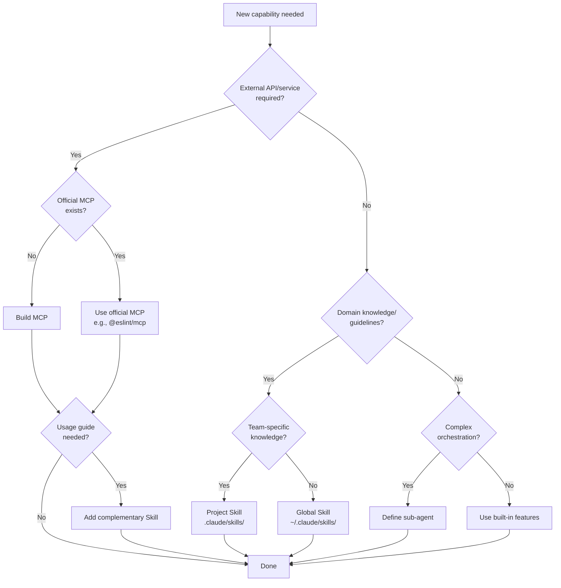
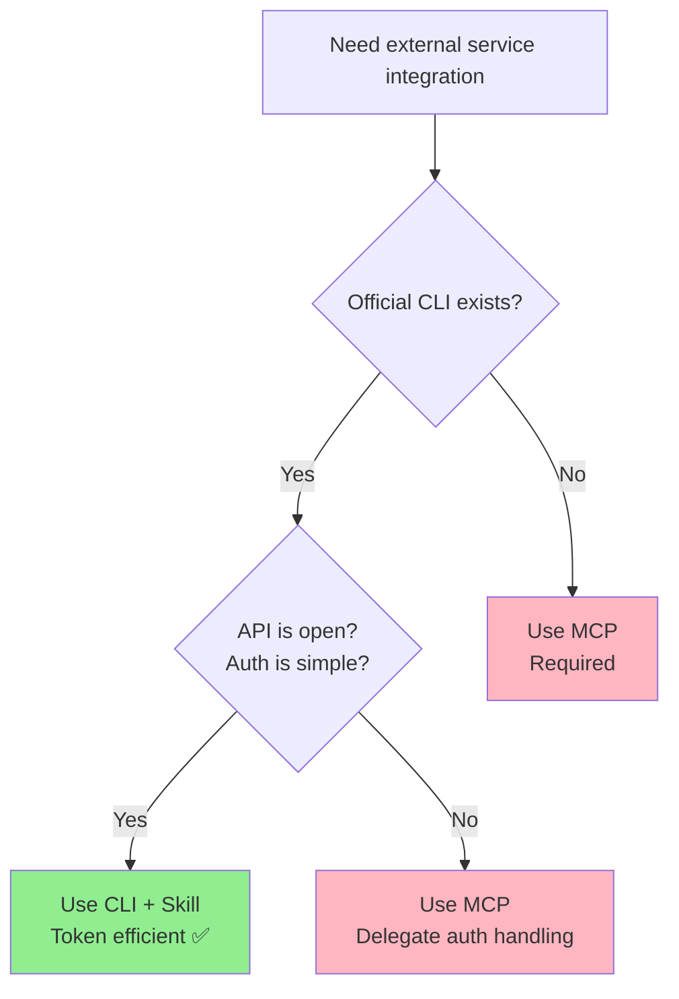

# MCP vs Skills: Fundamental Differences and Selection Criteria

[日本語版 (Japanese)](/ja/skills/vs-mcp)

## Overview Comparison Table

The following table provides a side-by-side comparison of the core attributes distinguishing MCPs from Skills across various operational and strategic dimensions.

| Aspect | MCP | Skills |
| ------ | --- | ------ |
| **Definition** | Model Context Protocol - Standard for external tool and API integration | Agent Skills - Standard for domain knowledge and execution patterns |
| **Primary Use** | Providing access to external systems | Extending agent knowledge and execution capabilities |
| **Implementation Location** | Server process (independent) | Within agent (integrated) |
| **Update Frequency** | Low (stable operation) | High (task and feedback driven) |
| **Operational Responsibility** | Provider (DevOps) | Agent owner (AI/ML team) |

## Fundamental Differences

### MCP: Declares "What Can Be Done"

MCPs act as a bridge between external systems and the agent by exposing their capabilities as callable tools and services. Here is the basic flow:

```
[External System]
    ↓
[MCP Server]
    ↓ (Tool Definition)
[Claude/Agent]
```

MCP **transforms external system capabilities into tools**.

**Example**: Providing RFC search engine to Claude

- MCP Server: IETF RFC full-text search and analysis
- Tools: `search_rfc()`, `get_rfc_details()`
- Usage: "Look up the URI specification in RFC 3986"

### Skills: Teaches "How to Execute"

Skills embed domain knowledge and execution patterns directly into the agent, allowing it to apply best practices and guidelines when making decisions. The following diagram shows how knowledge flows into the agent's decision-making process:

```
[Domain Knowledge]
    ↓
[Skill Representation]
    ↓ (Learn/Execute)
[Claude/Agent]
```

Skills **embed execution patterns and best practices within the agent**.

**Example**: React Frontend Design Skill

- Metadata: Design principles and recommended patterns
- Learning Content: File structure, component hierarchy, testing strategy
- Execution: Agent automatically applies these to new projects

## Selection Decision Flow

### Decision Flowchart

Use this flowchart to navigate the decision process when determining whether a new capability should be implemented as an MCP or a Skill:



### Specific Decision Examples

The following table provides concrete use case examples demonstrating how the decision logic applies in real-world scenarios:

| Use Case | Decision | Reason |
|----------|----------|--------|
| Want to translate using DeepL API | MCP | Requires external API call |
| Want to define translation quality standards | Skill | Domain knowledge and guidelines |
| Want to follow SOLID principles | Skill | Static knowledge |
| Want to check code with ESLint | MCP (official) | @eslint/mcp exists |
| Team coding conventions | Skill (project) | Team-specific knowledge |
| Want to search RFC specifications | MCP | Requires external data retrieval |
| Automate translation → quality evaluation → correction | Sub-agent | Complex orchestration |

### Quick Decision Diagram

Here is a visual representation of the fundamental decision point between MCP and Skills:

```
┌─────────────────────────────────┐
│  What capability is needed?     │
└─────────────────────────────────┘
           ↓
    ┌──────────────┬──────────────┐
    ↓              ↓
┌─────────────┐ ┌──────────────────┐
│ Access to   │ │ Internal knowledge │
│ external    │ │ and patterns       │
│ services    │ │ (team know-how)    │
└─────────────┘ └──────────────────┘
    ↓                    ↓
  ┌──────┐           ┌──────────┐
  │ MCP  │           │ Skills   │
  └──────┘           └──────────┘
```

### When to Choose MCP

Choose MCP when the capability requires access to or interaction with external systems. The following characteristics indicate MCP is the right choice:

✅ **Use MCP when:**

- External API or tool integration is needed
- Real-time data retrieval is required
- Integration with third-party systems
- Authentication and token management is necessary

**Examples**:

- `rfcxml-mcp`: IETF RFC search
- `deepl-mcp`: DeepL Translation API
- `github-mcp`: GitHub repository operations

### When to Choose Skills

Choose Skills when you need to embed static domain knowledge, best practices, and execution guidelines into the agent. The following characteristics indicate Skills is the right choice:

✅ **Use Skills when:**

- Sharing best practices within the team
- Standardizing implementation patterns and design principles
- Agent needs to learn "how to do" something and execute it
- Continuous improvement and feedback cycles

**Examples**:

- `frontend-design`: React/Next.js optimal design
- `doc-coauthoring`: Document co-authoring guidelines
- `testing-strategy`: Testing strategy and coverage requirements

## Anti-Patterns: Over-Allocation

### Over-MCPization: Excessive Use of MCP

This anti-pattern occurs when team knowledge or static information is implemented as an MCP server instead of being defined as a Skill. Here is a concrete example:

❌ **Anti-pattern example**:

```
// ❌ This should be implemented as Skills, not MCP
- MCP: "Fetch company-wide coding standards"
- Reason: This is team knowledge, not an external system
- Correct approach: Provide a "Coding Standards Skill"
```

**Problems**:

- MCP server responsibilities become bloated
- Increased operational costs
- Difficult to customize on the agent side

### Over-Skillization: Excessive Use of Skills

This anti-pattern occurs when external API integration or real-time data retrieval is described in a Skill instead of being implemented as an MCP. Here is a concrete example:

❌ **Anti-pattern example**:

```
// ❌ This should be implemented as MCP
- Skill: "This business process uses DeepL translation"
- Reason: This is an external API, not team knowledge
- Correct approach: Use `deepl-mcp`
```

**Problems**:

- Skills become bloated and complex
- Difficult to respond to external system updates
- Confusion in authentication and token management

## Combined Usage Patterns

In actual operations, MCP and Skills are **used complementarily**.

### Pattern 1: Providing Translation Functionality

This pattern shows how a Skill and MCP work together to provide comprehensive translation functionality combining knowledge and execution capability:

```
[Translation Guidelines Skill]
           ↓
[DeepL API] ←─── deepl-mcp
           ↓
[Agent]
    ↓
"Translate customer service email" → Learn "tone and style" from Skill
                                   → Execute "accurate translation" via MCP
```

### Pattern 2: Frontend Development

In frontend development, a Skill provides design standards while an MCP offers access to the component library, creating a synergistic workflow:

```
[Design Standards Skill] + [Component Library MCP]
           ↓
[Agent]
    ↓
"Create new UI component"
    → Learn "design principles" from Skill
    → Reference "existing components" via MCP
```

### Pattern 3: Code Quality Check

This pattern demonstrates how a Skill encoding best practices pairs with an MCP that provides the actual analysis and detection tools for comprehensive code quality checking:

```
[SOLID Principles Skill]
    ├─ Definition and purpose of 5 principles
    ├─ Identifying violation patterns
    └─ Refactoring guidelines

    → Knowledge of "what to adhere to"
           ↓
[ESLint Official MCP (@eslint/mcp)]
    ├─ Run lint
    ├─ Auto-fix
    └─ Detect rule violations

    → Tool that "actually detects" issues
```

**Key Point**: No need to build a custom SOLID principles MCP

- Knowledge and principles → Define in Skill
- Detection and correction → Leverage official MCP

### Usage Summary

The following table summarizes how Skills and MCPs divide responsibilities in three common scenarios:

| Area | Skill (Knowledge) | MCP (Tool) |
| ---- | ----------------- | ---------- |
| **Translation** | Translation guidelines | DeepL official + xCOMET |
| **Code Quality** | SOLID principles | ESLint official |
| **RFC Compliance** | Implementation checklist | rfcxml-mcp |

> **Principle**: Use official MCPs when available. Define knowledge and principles in Skills.

## Operational Considerations

| Operational Activity | MCP | Skills |
| -------------------- | --- | ------ |
| **Deployment** | Server-side (DevOps) | Agent-side (AI team) |
| **Version Control** | Semantic versioning | Task/Feedback driven |
| **Testing** | Integration tests (API compatibility) | Use case tests (execution quality) |
| **Documentation** | API reference | Execution guides and knowledge base |

## Best Practices

### 1. **Clear Separation of Responsibilities**

Establish clear boundaries between what MCPs and Skills handle:

- MCP: Focus on declaring "what can be done"
- Skills: Focus on guidelines for "how to use it"

### 2. **Gradual Adoption**

Introduce MCPs and Skills progressively, building competency at each phase:

- Phase 1: Implement external integrations with MCP
- Phase 2: Systematize internal knowledge with Skills
- Phase 3: Mutual complementation of MCP and Skills

### 3. **Continuous Improvement**

Keep your MCP and Skill implementations aligned with operational needs and team feedback:

- Maintain stable MCP server operations
- Evolve Skills through feedback-driven development

## CLI vs MCP: When CLI is Enough

Before building an MCP, check if a dedicated CLI already exists.

### Why This Matters

| Factor | CLI + Skill | MCP |
|--------|-------------|-----|
| **Token consumption** | Low (command only) | High (loads all tool definitions) |
| **Purpose-built** | ✅ (CLI is specialized) | △ (generic interface) |
| **Startup cost** | None (already installed) | Server process required |
| **Auth handling** | Local (already configured) | MCP manages credentials |

### Decision Flow

Before building an MCP, evaluate whether an existing CLI can serve the purpose more efficiently. This flowchart helps determine the best approach:



### Decision Criteria

Use these criteria to determine whether to use a CLI with a Skill or build a full MCP:

| Check | CLI + Skill | MCP |
|-------|-------------|-----|
| Official CLI exists | ✅ | - |
| API is open/documented | ✅ | - |
| Simple auth (local) | ✅ | - |
| Complex auth (OAuth) | - | ✅ |
| No CLI available | - | ✅ |

### Examples

Here are practical examples of services and whether a CLI-based approach or MCP is recommended:

| Service | CLI | Recommendation |
|---------|-----|----------------|
| GitHub | `gh` | CLI + Skill |
| AWS | `aws` | CLI + Skill |
| Google Cloud | `gcloud` | CLI + Skill |
| PostgreSQL | `psql` | CLI + Skill |
| Linear | ❌ | MCP |
| Greptile | ❌ | MCP |
| Slack | Partial | MCP (for full features) |

### Pattern: CLI + Skill

When using a CLI instead of MCP, follow this pattern to maximize clarity and effectiveness:

1. **Skill defines**: How to use the CLI effectively
2. **Tool calls**: Direct CLI commands (e.g., `gh pr list`)
3. **Auth**: Handled locally (already authenticated)

```markdown
<!-- Example: GitHub Skill using gh CLI -->
## Tools Available

The following CLI tools and their most common operations are available for GitHub interactions:

Use `gh` CLI for GitHub operations:
- `gh pr list` - List pull requests
- `gh pr create` - Create PR
- `gh issue list` - List issues

## When to Use

- Checking PR status: `gh pr status`
- Creating issues: `gh issue create --title "..." --body "..."`
```

### Key Insight

> **CLI exists → CLI + Skill (token efficient)**
> **No CLI → MCP (required)**

This pattern emerged from community discussion on r/ClaudeAI and reflects real-world usage patterns where MCPs can be "token hungry" for services that already have well-designed CLIs.

## Related Documentation

- [Skills Overview](./overview.md) - Skills overview
- [MCP Catalog](../mcp/catalog.md) - Pre-built MCP catalog
- [Architecture](../concepts/03-architecture.md) - MCP/Skills/Agent architecture
