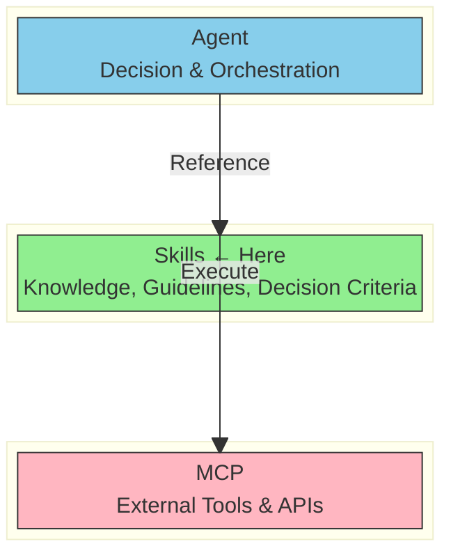
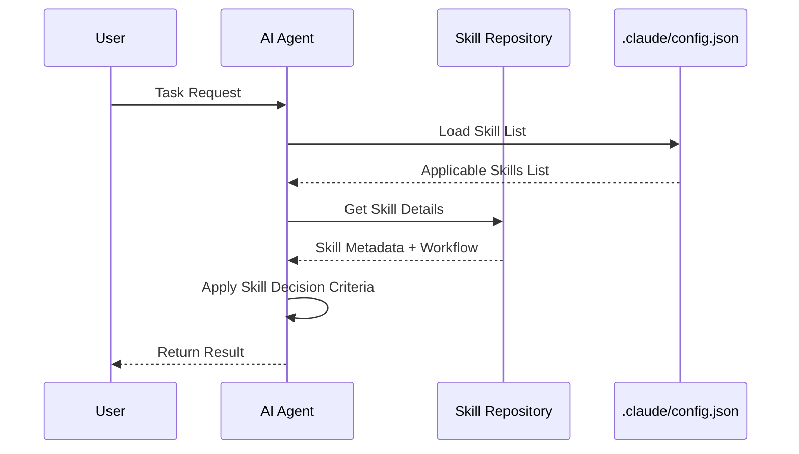
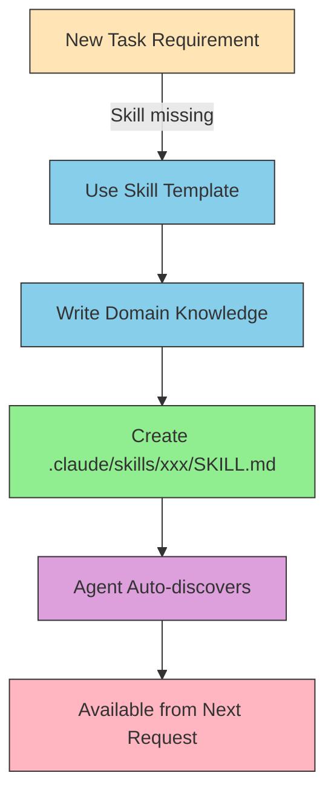

# What are Skills?

> A static knowledge layer that provides AI agents with domain expertise, guidelines, and decision criteria.

## About This Document

This document explains the fundamental concepts, types, benefits, and limitations of Skills. For instructions on creating Skills, refer to [creating-skills.md](./creating-skills.md).

## What are Skills?

**Vercel Skills** is a standardized framework for expressing domain knowledge designed for AI agents.

Unlike MCPs, Skills enable agents to acquire and leverage **executable know-how specific to a domain or task**.

### Key Information

Here is a summary of Skills' essential details.

- **Specification**: Agent Skills Specification (https://agentskills.io)
- **Format**: Markdown file (`SKILL.md`)
- **Location**:
  - Project-level: `.claude/skills/xxx/SKILL.md`
  - User-level: `~/.claude/skills/xxx/SKILL.md`
- **One-line description**: "A mechanism to teach AI **what it should know**"

### Four Key Characteristics of Skills

The core characteristics of Skills are the following four points.

- **Knowledge Base**: Structures domain expertise and best practices that AI should reference
- **Executable Guidelines**: Clarifies decision criteria and procedures—not abstract rules
- **Scoped Management**: Organize knowledge at the project or team level
- **Evolutionary Learning**: Continuously updatable based on feedback

## Why Separate "Knowledge"?

### The Problem

AI agents have broad general knowledge, but lack:

- Rules specific to your project
- Your team's quality standards and decision criteria
- Domain-specific expertise
- Your organization's best practices

### The Solution

By structuring knowledge as Skills and exposing it to your AI agent, the agent can make **project-specific decisions**.

### How Skills Differ from MCPs

The following table compares Skills and MCPs side by side.

| Perspective    | MCP                               | Skills                                          |
| -------------- | --------------------------------- | ----------------------------------------------- |
| Provides       | "What can be done" (tools & APIs) | "What should be known" (knowledge & guidelines) |
| Implementation | Server (dynamic)                  | Markdown or JSON (static)                       |
| Use Case       | External service integration      | Internal knowledge alignment                    |

### Architecture Diagram

The diagram below illustrates how Agent, Skills, and MCP interact as three layers. Skills serve as the intermediate knowledge layer.



## Types of Skills

Skills can be classified by their purpose:

| Type                | Description                      | Examples                                                   |
| ------------------- | -------------------------------- | ---------------------------------------------------------- |
| Workflow Definition | Defines procedures and processes | Translation workflow, code review process                  |
| Quality Criteria    | Defines thresholds and standards | Translation quality score ≥ 0.85, test coverage thresholds |
| Guideline           | Best practices and principles    | Coding conventions, naming rules                           |
| Template            | Defines standard output formats  | Documentation templates, PR description templates          |

You can combine these types to create more sophisticated Skills.

## Skill Components

### Metadata (YAML Front Matter)

Skill files begin with metadata in YAML format. Below is an example from the translation quality Skill.

```yaml
name: translation-quality
version: 1.0.0
description: Translation Quality Assessment Guidelines
author: @shuji-bonji
tags:
  - translation
  - quality-assurance
  - deepl
agent-support:
  - claude-code
  - cursor
```

### Required Sections

Following the metadata, the following sections are recommended in the body of the Skill document.

| Section               | Content                                    | Example                                                                |
| --------------------- | ------------------------------------------ | ---------------------------------------------------------------------- |
| **Purpose**           | Purpose, background, and rationale         | "Ensure consistent translation quality with a minimum score of 0.85"   |
| **Inputs / Outputs**  | Input and output definitions               | Input: source text / Output: translated text + quality score           |
| **Constraints**       | Constraints using MUST / SHOULD / MUST NOT | MUST: score ≥ 0.85 / MUST NOT: rely on automated translation alone     |
| **Workflow**          | Concrete steps and procedures              | "1. Perform machine translation, 2. Native review, 3. Calculate score" |
| **Decision Criteria** | Decision thresholds and criteria           | Score formula, quality metric definitions                              |
| **Examples**          | Concrete use cases and examples            | Good examples, anti-examples                                           |
| **Anti-Patterns**     | Examples of what not to do                 | "Literal translation ignoring context"                                 |

## Benefits

Skills adoption provides the following advantages:

- ✅ **Low Context Overhead**: Loaded only when referenced; doesn't run constantly like MCPs
- ✅ **Editable by Anyone**: Markdown format allows updates without coding knowledge
- ✅ **Immediate Effect**: Changes apply on the next interaction after saving
- ✅ **Knowledge Consolidation**: Makes implicit, often-siloed knowledge explicit and visible
- ✅ **Standards Compliance**: Interoperability based on Agent Skills Specification
- ✅ **Version Control**: Easy history tracking with Git

## Drawbacks and Limitations

Skills have the following constraints:

- ❌ **No Dynamic Processing**: Cannot call external APIs or perform computations (MCPs required)
- ❌ **Static Content**: Cannot reference real-time data
- ❌ **Manual Updates**: Cannot automatically follow external specification changes
- ❌ **Scope Limited**: Project or user level only (global sharing is managed via Git, not npm)

> **Note**: If you need capabilities beyond Skills' scope, refer to [what-is-mcp.md](../mcp/what-is-mcp.md).

## Supported Agents

Skills are available in the following AI agents:

| Agent               | CLI Argument     | Project Path          |
| ------------------- | ---------------- | --------------------- |
| Claude Code         | `claude-code`    | `.claude/skills/`     |
| Cursor              | `cursor`         | `.cursor/skills/`     |
| Codex               | `codex`          | `.codex/skills/`      |
| OpenCode            | `opencode`       | `.opencode/skills/`   |
| GitHub Copilot      | `github-copilot` | `.github/skills/`     |
| Windsurf            | `windsurf`       | `.windsurf/skills/`   |
| Cline               | `cline`          | `.cline/skills/`      |
| Roo Code            | `roo-code`       | `.roo/skills/`        |
| Gemini CLI          | `gemini-cli`     | `.gemini/skills/`     |
| Continue            | `continue`       | `.continue/skills/`   |
| Aide                | `aide`           | `.aide/skills/`       |
| Cosine              | `cosine`         | `.cosine/skills/`     |
| Bolt.new            | `bolt`           | `.bolt/skills/`       |
| Claude.dev          | `claude-dev`     | `.claude-dev/skills/` |
| BasedHardware Agent | `based-hw`       | `.based/skills/`      |
| val-town Agent      | `val-town`       | `.val-town/skills/`   |

Details: https://github.com/vercel-labs/skills#supported-agents

## Integration with Vercel Skills CLI

The Vercel Skills CLI makes it easy to find, add, and manage Skills.

### Finding Skills

Use the `npx skills` command to search the Skill registry.

```bash
npx skills find "code review"
npx skills search "translation"
```

### Adding Skills

Once you find a Skill, add it to your project with the following commands.

```bash
# Add a specific Skill
npx skills add vercel-labs/agent-skills --skill frontend-design

# Add for multiple agents
npx skills add vercel-labs/agent-skills -a claude-code -a cursor

# Register a local Skill
npx skills add ./local-skill
```

### Skill Discovery Flow

The following sequence diagram shows how an agent discovers and applies a Skill.



### Skill Dynamic Extension Flow

When existing Skills don't cover a new task requirement, the extension flow below shows how to add one.



## Implementations in This Repository

This repository implements and maintains the following Skills:

### Implemented Skills

| Skill                 | Lines | Description                                                               |
| --------------------- | ----- | ------------------------------------------------------------------------- |
| `translation-quality` | 279   | Translation Quality Assessment Guidelines (with xCOMET score integration) |

### Templates

We provide templates to help you create new Skills quickly.

- `templates/skill/SKILL.ja.md.template` - Template for creating new Skills
- `templates/skill/SKILL.en.md.template` - English version template

### Goals

- **Phase 1**: Define 3+ Skills/Agent implementations (currently 1, planned expansion)
- **Next Skill Candidates**:
  - `translation-workflow` - Translation process definition
  - `rfc-compliance` - RFC specification compliance checks
  - `code-review` - Code review guidelines

## What to Read Next

To learn more about Skills, explore the following documents.

| Purpose                        | Document                                             |
| ------------------------------ | ---------------------------------------------------- |
| Want to create a Skill         | [creating-skills.md](./creating-skills.md)           |
| Deciding between MCP vs Skills | [vs-mcp.md](./vs-mcp.md)                             |
| Anti-patterns                  | [anti-patterns.md](./anti-patterns.md)               |
| Learn about MCPs               | [what-is-mcp.md](../mcp/what-is-mcp.md)              |
| Overall architecture           | [03-architecture.md](../concepts/03-architecture.md) |
| English overview               | [overview.md](./overview.md)                         |

**Last Updated**: February 2025

**Related Resources**:

- [Agent Skills Specification](https://agentskills.io)
- [Vercel Labs Skills GitHub](https://github.com/vercel-labs/skills)
- [Skill Creation Guide](./creating-skills.md)
