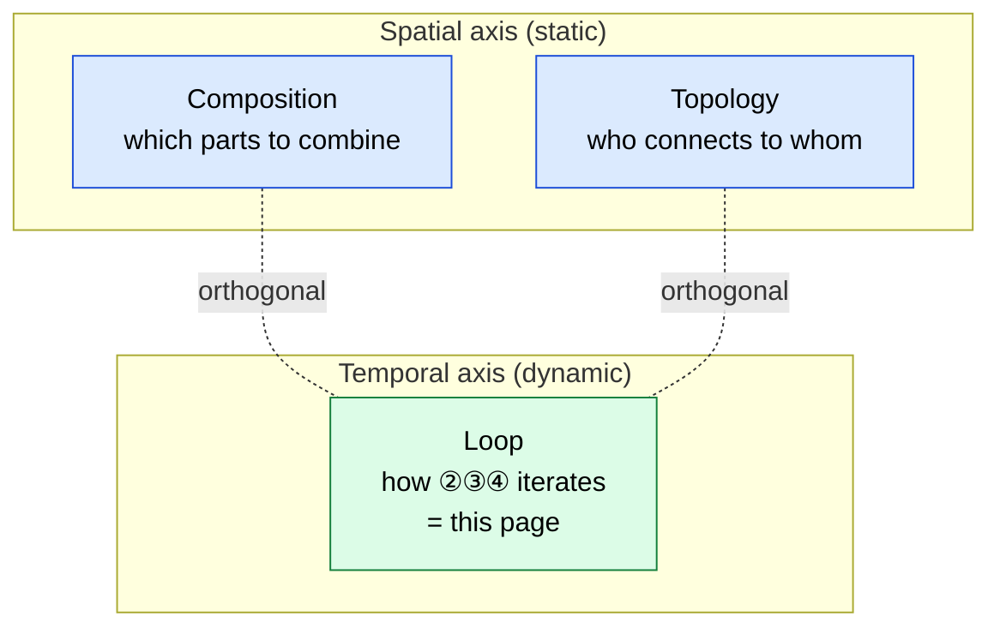
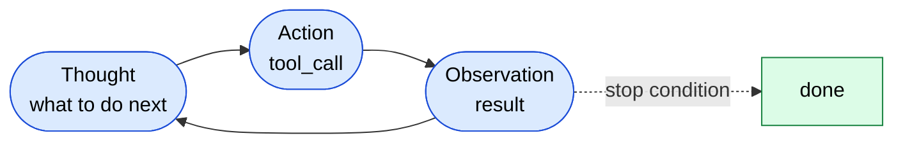
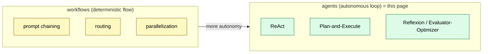

# Agent Loop Patterns — How the Harness Drives ②③④

> Neither a "composition pattern" nor a "workflow" — a third axis. This page organizes the **loop-driving patterns** of a single agent.

## About This Document

> [!NOTE]
> This page covers the "contents" of the **Orchestration (loop control) → Agent layer** mapping from [Harness Engineering Mapping](./harness-engineering-mapping). It catalogs the patterns (ReAct / Plan-and-Execute / Reflexion / Evaluator-Optimizer) by which the harness **iterates** the loop `① tool_call → ② real I/O → ③ result → ④ feed back into context`.

The name "harness pattern" is not standard terminology, but the content it would hold is well established. The literature calls these **agent patterns / single-agent patterns / agentic reasoning patterns**.

> [!TIP]
> **In three lines**
>
> - "Pattern" on this site has three axes: **composition** (which parts to combine), **topology** (how multiple agents connect), and **loop** (how a single agent iterates). This page is the third.
> - The loop types are **ReAct** (tight iteration), **Plan-and-Execute** (separating planning from execution), **Reflexion** (self-critique), and **Evaluator-Optimizer** (separating generator from evaluator).
> - In Anthropic's "**workflows (deterministic flow) vs agents (autonomous loop)**" dichotomy, this page sits on the **agents** side.

## Don't Conflate the Three "Pattern" Axes

When people say "pattern" in agent design, they actually mean three things at different layers.

| Axis | Question | Nature | Page on This Site |
| --- | --- | --- | --- |
| **Composition pattern** | Which **parts** to combine statically | Spatial, static | [Composition Patterns](./composition-patterns) (MCP + Skill, etc.) |
| **Topology (design pattern)** | How **multiple agents** connect | Spatial, static | [Agent Taxonomy](../agents/agent-taxonomy) (Orchestrator-Worker / Swarm) |
| **Loop pattern** | How a **single agent** iterates ②③④ | Temporal, dynamic | **This page** |

> [!IMPORTANT]
> `Orchestrator-Worker` and `Swarm` are topologies of "**who connects to whom**," not loop types of "**how to iterate**." The two are orthogonal. For example, each Worker in an Orchestrator-Worker setup can run ReAct internally.

## Catalog of Loop Patterns

### 1. ReAct — Tight Iteration Loop

Iterate `Thought → Action (tool call) → Observation (result)` one step at a time, feeding each observation back into the next thought. The most basic and adaptive form. Because it rethinks the next move after every `② real I/O`, it excels at dynamic, exploratory tasks.

- **Strengths**: Can correct course at every step. Simple to implement.
- **Weaknesses**: Each step pushes an observation into context, increasing token consumption. Prone to drift and runaway on long tasks (→ an upper-bound guard is mandatory).

### 2. Plan-and-Execute / ReWOO — Separating Planning from Execution

**Plan all steps first**, then commit to executing the plan. Split into a Planner (plans, never calls tools) and an Executor (executes). ReWOO is a variant that decouples observations from reasoning to cut token consumption.

- **Strengths**: The steps are auditable and reproducible. Efficient for long research and report generation.
- **Weaknesses**: Brittle when the planning assumptions break (course correction during execution is weak).

> [!TIP]
> In practice, the common combination is **Plan-and-Execute on the outside, ReAct inside each step.** This keeps a predictable skeleton while adapting within steps.

### 3. Reflexion — Self-Critique Loop

Extends ReAct: after each cycle, the agent **critiques its own output** and **stores** that insight to apply next time. An outer loop that turns failure into learning.

- **Strengths**: Self-correction raises success rates on hard tasks.
- **Weaknesses**: Each critique-and-retry adds cost. With a loose stop condition, it keeps looping.

### 4. Evaluator-Optimizer — Separating Generator from Evaluator

Split a generator (Optimizer) from an evaluator (Evaluator); if the evaluation judges the output "insufficient," regenerate. This site's [quality gate](../agents/subagent-quality-gate) and the xcomet gate for translation are this pattern.

- **Strengths**: The evaluation criteria are made explicit, stabilizing quality.
- **Weaknesses**: The evaluation overhead becomes a cost ceiling (counterproductive once it exceeds the savings).

> [!NOTE]
> Whereas Reflexion has the agent **critique itself**, Evaluator-Optimizer has **a separate role evaluate** it. The former is in-loop self-reflection; the latter is role separation. In implementation they often blend.

## Positioning in the Workflows-vs-Agents Dichotomy

Anthropic's "Building Effective Agents" distinguishes fixed control flow = **workflows** from autonomously looping = **agents**.

This site's [Workflow Patterns](../workflows/patterns) is a domain-by-domain catalog of **deterministic flow (the workflows side)**. This page covers the loop-driving types of **autonomous loops (the agents side)**. The two are complementary.

## Selection Guide

| Situation | Recommended Pattern |
| --- | --- |
| Dynamic, exploratory task requiring a decision at every step | **ReAct** |
| Predictable steps requiring audit and reproducibility (long research, reports) | **Plan-and-Execute** |
| Want to cut token consumption (decouple observation from reasoning) | **ReWOO** |
| Want learning from failure to raise success rates | **Reflexion** |
| Want explicit quality criteria and stable output | **Evaluator-Optimizer** |
| Want to dispatch by kind at the entrance | routing (→ [Routing vs Cascading](./routing-vs-cascading)) |

> [!WARNING]
> Whatever the type, an **upper-bound guard (max rounds / recursionLimit)** is mandatory. Since the model keeps looping even when a tool returns an error, the absence of convergence guidance and a cutoff invites runaway and cost overruns.

## Mapping to the Four Harness Responsibilities

| Loop Pattern | Primary Harness Responsibility |
| --- | --- |
| ReAct / Plan-and-Execute | **Orchestration (loop control)** |
| Reflexion / Evaluator-Optimizer | **Orchestration + feedback (evaluation)** |
| All patterns | **Guardrails (upper-bound guard, cutoff)** |

→ For the full picture of responsibilities, see [Harness Engineering Mapping](./harness-engineering-mapping); for autonomous correction via evaluation, see [Sub-agent Quality Gate](../agents/subagent-quality-gate).

## 🔗 Go Deeper: Why Autonomous Loops Need "Evaluation" and an "Upper-Bound Guard"

This page covers the **types (What/How)** of loops. For **why** self-critique, evaluation gates, and upper-bound guards are necessary in terms of LLM structural constraints, see the sister site.

- [understanding-llm / Part 1: Structural Problems](https://shuji-bonji.github.io/understanding-llm-through-claude-code/01-llm-structural-problems/) — because the model cannot trust its own confidence (Sycophancy / Knowledge Boundary), external evaluation is required
- [understanding-llm / Appendix: Harness and LLM Structural Constraints](https://shuji-bonji.github.io/understanding-llm-through-claude-code/appendix/harness-and-llm-constraints) — harness elements ⇔ 8 problems mapping

## Related Documents

- [Harness Engineering Mapping](./harness-engineering-mapping) — the parent of this page (the contents of loop control = Orchestration)
- [Workflow Patterns](../workflows/patterns) — domain-by-domain catalog on the deterministic-flow side
- [Agent Taxonomy](../agents/agent-taxonomy) — topology (Orchestrator-Worker / Swarm)
- [Routing vs Cascading](./routing-vs-cascading) — the model-dispatch axis
- [Sub-agent Quality Gate](../agents/subagent-quality-gate) — an implementation of Evaluator-Optimizer

## References

- Anthropic (2024). "Building Effective Agents." Anthropic Engineering. [anthropic.com/engineering](https://www.anthropic.com/engineering/building-effective-agents) — the workflows-vs-agents dichotomy, definitions of Evaluator-Optimizer and others
- Yao, S. et al. (2022). "ReAct: Synergizing Reasoning and Acting in Language Models." arXiv. [arXiv:2210.03629](https://arxiv.org/abs/2210.03629) — the origin of the Thought-Action-Observation loop
- Shinn, N. et al. (2023). "Reflexion: Language Agents with Verbal Reinforcement Learning." arXiv. [arXiv:2303.11366](https://arxiv.org/abs/2303.11366) — self-critique and verbal reinforcement
- Xu, B. et al. (2023). "ReWOO: Decoupling Reasoning from Observations for Efficient Augmented Language Models." arXiv. [arXiv:2305.18323](https://arxiv.org/abs/2305.18323) — decoupling observations from reasoning to cut tokens

---

> **Previous**: [Routing vs. Cascading](./routing-vs-cascading.md)
> **Next**: [Loop Engineering](./loop-engineering.md)

**Last updated**: June 2026
