# Composition Patterns

> Organize combination patterns and design guidelines for MCP × Skill × Agent.

[日本語](/ja/strategy/composition-patterns)

## About This Document

While MCPs and Skills have value individually, there is **value that emerges only through combination**. This document defines 4 composition patterns and organizes the design guidelines, trigger contexts, and use cases for each.

For the MCP construction strategy, see [mcp-roadmap.md](./mcp-roadmap.md). For the Skill construction strategy, see [skill-roadmap.md](./skill-roadmap.md).

## 4 Composition Patterns

| Pattern           | Composition                     | Core Concept                       | Difficulty |
| ----------------- | ------------------------------- | ---------------------------------- | ---------- |
| **MCP + Skill**   | 1 MCP + 1 Skill                 | Data retrieval + Judgment criteria | ★★☆        |
| **MCPs**          | Multiple MCPs                   | Data integration & comparison      | ★★☆        |
| **Skills**        | Multiple Skills                 | Knowledge layering                 | ★☆☆        |
| **MCPs + Skills** | Multiple MCPs + Multiple Skills | Complete workflow                  | ★★★        |

## Pattern 1: MCP + Skill

A composition where "raw data" retrieved by MCP from external sources is evaluated using "judgment criteria" held by Skills. The basic form of **hybrid composition**.

### Design Principle

MCP returns "what is written," and Skill determines "whether it is good or bad." This separation is important.

### Concrete Examples

#### Electronic Signature Act Compliance Check

| Element               | Role                                                              |
| --------------------- | ----------------------------------------------------------------- |
| `hourei-mcp`          | Retrieve Electronic Signature Act article text (MCP)              |
| `rfcxml-mcp`          | Retrieve RFC 3161 technical requirements (MCP)                    |
| E-Signature Act Skill | Mapping criteria between legal and technical requirements (Skill) |

#### OAuth/JWT Implementation Review

| Element         | Role                                                          |
| --------------- | ------------------------------------------------------------- |
| `rfcxml-mcp`    | Retrieve RFC 6749 (OAuth 2.0) / RFC 7519 (JWT) specifications |
| OAuth/JWT Skill | Token management best practices, implementation patterns      |

### Design Guidelines

- **Write Skills independent of MCP output**: Avoid implementation-dependent descriptions like "look at the `article_text` field in hourei-mcp's JSON response." Instead, use abstract descriptions like "verify whether the legal text contains the following requirements"
- **Make Skill judgment criteria verifiable**: Clearly define the 3 states: "compliant," "non-compliant," and "cannot determine (additional information needed)"

### Candidate List

| Theme                               | MCP                            | Skill                      | Status                        |
| ----------------------------------- | ------------------------------ | -------------------------- | ----------------------------- |
| Electronic Signature Act            | hourei-mcp + rfcxml-mcp        | Implementation guidelines  | ⚡ MCP side already available |
| Personal Information Protection Act | hourei-mcp                     | Compliance checklist       | ⚡ MCP side already available |
| Electronic Books Preservation Act   | hourei-mcp                     | Storage requirements check | ⚡ MCP side already available |
| GDPR                                | Regulatory text MCP (planned)  | DPIA checklist             | 🔲 Not started                |
| OWASP                               | Vulnerability DB MCP (planned) | Security review criteria   | 🔲 Not started                |
| OAuth/JWT                           | rfcxml-mcp                     | Implementation patterns    | ⚡ MCP side already available |

## Pattern 2: MCPs (Multi-MCP Coordination)

A composition that integrates, compares, and verifies data retrieved from multiple MCPs. There are already proven examples in [workflows/patterns.md](../workflows/patterns.md).

### Design Principle

### Proven Combinations

| Combination                       | Use Case                                                | Track Record                                             |
| --------------------------------- | ------------------------------------------------------- | -------------------------------------------------------- |
| **deepl-mcp + xcomet-mcp**        | Translation → Quality evaluation → Re-translation       | 180-page technical document translated in 1 day / $12    |
| **rfcxml-mcp + w3c-mcp**          | Integrated reference of RFC specs + Web API definitions | WebSocket specification verification workflow            |
| **rfcxml-mcp + hourei-mcp**       | Technical specification × Legal text mapping            | Electronic Signature Act × RFC 3161 correspondence table |
| **pdf-spec-mcp + pdf-reader-mcp** | PDF specification reference + Actual file verification  | PDF/UA conformance verification                          |

### Design Guidelines

- **Clarify whether order-dependent or parallelizable**: deepl → xcomet is order-dependent; rfcxml + w3c is parallelizable
- **The Agent layer handles data integration logic**: MCPs only return raw data. Integration and judgment are the Agent's role

## Pattern 3: Skills (Multi-Skill Combination)

A composition that simultaneously triggers multiple Skills according to the context (development phase).

### Design Principle

### Context-Based Skill Sets

```mermaid
flowchart TB
    subgraph CODE_REVIEW["Code Review Set"]
        direction TB
        CR1["🔵 SOLID<br>Detect principle violations"]
        CR2["🔴 Clean Code<br>Style & readability"]
        CR3["🟢 Refactoring<br>Improvement suggestions"]
        CR1 --> CR3
        CR2 --> CR3
    end

    subgraph ARCH_DESIGN["Architecture Design Set"]
        direction TB
        AD1["🟡 DDD<br>Domain modeling"]
        AD2["🔵 Clean Architecture<br>Layer design"]
        AD3["🔵 12 Factor App<br>Cloud readiness"]
        AD1 --> AD2
        AD2 --> AD3
    end

    subgraph TEST_DESIGN["Test Design Set"]
        direction TB
        TD1["🟡 TDD<br>Process"]
        TD2["🟡 BDD<br>Scenario definition"]
        TD3["🟢 Test Patterns<br>Pattern application"]
        TD4["🟠 Coverage<br>Coverage assessment"]
        TD1 --> TD3
        TD2 --> TD3
        TD3 --> TD4
    end

    style CODE_REVIEW fill:#FFEBEE,stroke:#C62828,color:#333
    style ARCH_DESIGN fill:#E3F2FD,stroke:#1565C0,color:#333
    style TEST_DESIGN fill:#FFFDE7,stroke:#F9A825,color:#333
```

### Design Guidelines

- **Define priority order among Skills**: In the Code Review set, evaluate in order: SOLID (principles) → Clean Code (style) → Refactoring (improvements)
- **"Primary source of definition" rule**: For concepts with overlapping scope (e.g., SRP), designate one Skill as the primary source and the other as reference
- **Entire sets can be meta-Skill-ized**: It is possible to define "Code Review Set" itself as a single Skill that internally references the three Skills

## Pattern 4: MCPs + Skills (Full Integration)

The most complex but most powerful composition where multiple MCPs and multiple Skills cooperate.

### Design Principle

### Concrete Examples

#### Security Audit Workflow

| Layer     | Element     | Role                                              |
| --------- | ----------- | ------------------------------------------------- |
| **MCP**   | rfcxml-mcp  | Retrieve RFC 6455/6749 specification requirements |
| **MCP**   | w3c-mcp     | Retrieve WebSocket API definition                 |
| **Skill** | OWASP Skill | Vulnerability judgment criteria                   |
| **Skill** | OAuth Skill | Authentication implementation best practices      |

#### Specification Compliance Quality Gate

### Design Guidelines

- **Agent orchestration is key**: The Agent layer determines which MCPs to call first and when to reference which Skills
- **Parallelize MCP calls**: Independent MCP calls should be executed in parallel to efficiently use the context window
- **Skill trigger timing**: Clarify whether to judge collectively after data retrieval or to judge incrementally

## Pattern Selection Guide

## Accumulating Results

Practical results from each pattern are recorded in [outputs.md](../outputs.md). Include the following information.

| Item         | Content                                                  |
| ------------ | -------------------------------------------------------- |
| Pattern Used | Which of the 4 patterns                                  |
| Components   | MCPs and Skills used                                     |
| Input        | What was targeted                                        |
| Results      | Quantitative outcomes (time, cost, quality scores, etc.) |
| Learnings    | Improvements and suggestions for next time               |

## Related Documents

- [mcp-roadmap.md](./mcp-roadmap.md) — MCP Construction Roadmap
- [skill-roadmap.md](./skill-roadmap.md) — Skill Construction Roadmap
- [workflows/patterns.md](../workflows/patterns.md) — Existing Workflow Patterns (Pattern 2 track record)
- [concepts/03-architecture.md](../concepts/03-architecture.md) — MCP / Skill / Agent Layer Structure
- [mcp/catalog.md](../mcp/catalog.md) — Built MCP Catalog
