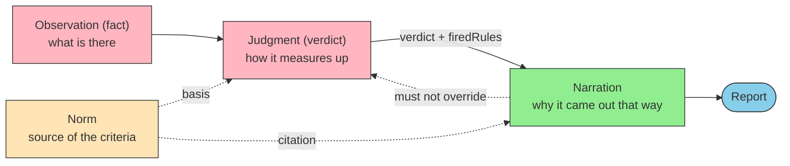
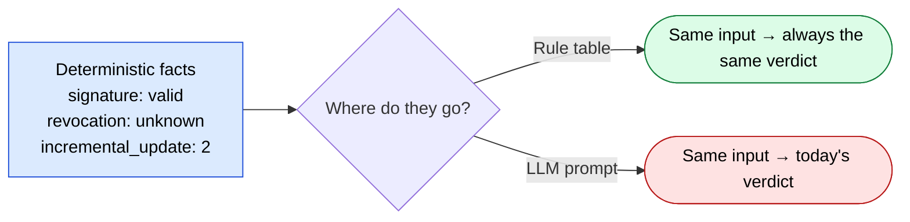

# Deterministic Verdicts — Separating Observation, Judgment, and Narration

> A system that returns a probabilistic answer to "can I trust this?" is unusable in practice.

## About This Document

[MCP Family](./mcp-family) presented "the judge is code, the narrative is the LLM" as a discipline **internal to a family**. This page promotes it to a discipline **that spans families**.

Four things are covered: (1) where to split observation, judgment, and narration; (2) how to decide which MCPs need a judgment layer; (3) how to handle domains whose criteria cannot be written down in advance; and (4) how to guard against the temporal failure mode — judgment drift.

::: warning Where this page sits
[MCP Family](./mcp-family) covers **where to split** a single domain. This page covers **how to design the judgment layer** on the far side of that split. For the boundary question of who is granted what authority, see [permission-vs-authority](./permission-vs-authority); for the quality of the judge itself (the weak-judge problem), see [routing-vs-cascading](./routing-vs-cascading).
:::

::: details Meta

|                       |                                                                                                                             |
| --------------------- | ----------------------------------------------------------------------------------------------------------------------------- |
| **What this page fixes** | The three-way split, where a judgment layer belongs, four-valued verdicts, the rule-table format, reproducibility practices, regression monitoring |
| **Out of scope**      | Domain-specific criteria, single-MCP implementation (→ [mcp/development](../mcp/development)), the mechanics of non-determinism (→ sister site) |
| **Depends on**        | [mcp-family](./mcp-family), [permission-vs-authority](./permission-vs-authority), [mcp/what-is-mcp](../mcp/what-is-mcp)      |
| **Common misuse**     | Letting the LLM issue the verdict; assuming `temperature=0` yields determinism; defaulting missing facts to "no problem"     |

:::

> [!TIP]
> **In three lines**
>
> - **A verdict is a layer distinct from both observation and narration.** The moment all three share one prompt, auditability is gone.
> - Whether the judgment layer can live in code depends not on how hard the domain is but on **whether the criteria can be written in advance**. Criteria that cannot be written are not handed to the LLM — they are returned as "cannot judge."
> - If an LLM must judge, reproducibility has to be built by hand. `temperature=0` is only a necessary condition, and it is being deprecated.

## The Three-Way Split



| Layer | Question | Output | Implementation | May it vary? |
| --- | --- | --- | --- | --- |
| **Observation** | What is there? | Facts, measurements | Code (MCP) | ❌ |
| **Judgment** | How does it measure up against the criteria? | Verdict + fired rules | **Code (rule table)** | ❌ |
| **Narration** | Why that verdict? What next? | Natural language | LLM (Skill) | ✅ wording only |

> [!IMPORTANT]
> The three layers are told apart by a single test: **may it vary?** Narration may. If the same verdict is worded differently today and tomorrow, no downstream decision changes. **A verdict is a single bit absorbed downstream; narration is prose a human reads.** That asymmetry is the whole basis for the split, and no further justification is needed.

### Why They Must Not Be Mixed

Verification results are ones and zeros. Is the signature valid? Does an incremental update rewrite the body? Was revocation confirmed? Each comes back as a discrete value that does not lie.

The moment that sequence of discrete values is handed to an LLM with "judge this holistically," **a sequence of 1s and 0s is converted into a probability distribution**. No information has been added. What was added is variance; what was lost is reproducibility. Call it **probabilistic rounding of deterministic facts**.



> [!CAUTION]
> The symptom does not present as "it sometimes returns a different answer." **Most inputs are handled correctly; only the borderline cases — the hardest calls — split.** Spot checks will not surface it, and it breaks exactly where a human most wants confidence. "I tried it several times and it was fine" is not a rebuttal.

## Where the Judgment Layer Belongs

Build an MCP that returns observations and the next question is always "so, is it OK?" The answer looks domain-dependent, but it reduces to one question: **can the criteria be written in advance?**

| Family | Facts from the observation layer | Criteria needed to judge | Writable in advance? | Where judgment belongs |
| --- | --- | --- | --- | --- |
| **PDF** | Signature verification, veraPDF verdict, incremental-update history | Acceptance profile | ✅ ISO / ETSI / internal policy | **Code** — shipped as `evaluate_policy` |
| **Translation quality** | XCOMET score, error spans | Delivery threshold | ✅ Numeric threshold | **Code** — not yet built (`xcomet_evaluate` stops at observation) |
| **Web compatibility** | BCD support data | Target browsers, share threshold | ✅ Baseline definition | **Code** — `compat_get_baseline` is close |
| **Coordinate systems** | CRS definitions, transformation parameters, accuracy | Tolerance per use case | ✅ Accuracy requirements | **Code** — `validate_crs_usage` is close |
| **Accounting** | Journals, trial balance, tax categories | Account assignment rules, tax treatment | ✅ Chart of accounts + circulars | **Code** — not yet built |
| **Law** | Statute text, circulars, rulings | Application to the case at hand | ⚠️ **Requirements are writable; findings of fact are not** | **Code (requirement checks) + explicit "cannot judge"** |

> [!IMPORTANT]
> What separates the rows is **not how hard the domain is**. "Can I trust this PDF?" is writable. "Is this expense deductible?" is writable up to requirement satisfaction — what is not writable is the finding of fact ("was this expenditure business-related?"). **The unwritable part is not handed to the LLM; the fact that it could not be written is itself returned as the verdict.**

### Four Values, Not Two

A rule table with only pass/fail must push the unwritable part into one side or the other. Which side it lands on is decided by the implementer's mood — or the LLM's.

| Verdict | Meaning | Downstream handling |
| --- | --- | --- |
| `trust_and_use` | All rules satisfied | Flow into automated processing |
| `use_with_caution` | Minor deviations; usable within limits | Flow with use restrictions |
| `human_review_required` | **A fact needed for judgment is missing, or the criteria are unwritable** | Escalate to a human |
| `reject` | Decisive violation | Stop |

> [!IMPORTANT]
> The point of four values is the third one. **Carrying "could not judge" as a verdict** is the only design that seals the leak to the LLM. Without it, every unjudgeable case flows to "let's ask the model."

## Writing the Rule Table

Five rules govern the format.

1. **Take only observation-layer facts as input.** No natural language (document body, user explanation). Admit it and the criteria become conditioned on the content being judged.
2. **Order the rules and fix one winner rule.** Either "first match wins" or "heaviest verdict wins" — pick one. Mixing them makes the same input produce different results.
3. **Always emit the fired rule IDs.** They are the input to the narration layer. A verdict without `firedRules` cannot survive an audit.
4. **Carry missing facts as missing. Never fill them with a default.**
5. **Make the profile swappable.** The same facts warrant different acceptance criteria for different uses; switching criteria must not require touching the judgment logic.

```ts
// Pseudocode: facts → verdict
type Fact = { signature: 'valid' | 'invalid'; revocation: 'ok' | 'revoked' | 'unknown'; /* ... */ };

const rules: Rule[] = [
  { id: 'SIG-01', when: f => f.signature === 'invalid',  verdict: 'reject' },
  { id: 'REV-01', when: f => f.revocation === 'revoked', verdict: 'reject' },
  // "could not be confirmed" is not "no problem"
  { id: 'REV-02', when: f => f.revocation === 'unknown', verdict: 'human_review_required' },
];
```

> [!WARNING]
> The most common implementation error is **rounding "could not be obtained" to "no problem."** "The revocation server timed out" is not "not revoked." Defaulting a missing fact to either side makes the system quietly lenient. **Propagate absence as absence.**

## What the Narration Layer Receives

| Passed in | Reason |
| --- | --- |
| The verdict and fired rule IDs | The subject of the narration; explaining it is the job |
| Observation-layer facts | Material for a concrete "why" |
| References to the norm (clause, standard number) | Used to cite the basis |
| **Not passed in: authority to change the verdict** | Leave no room in the prompt to read "you may re-evaluate" |

> [!TIP]
> A restatement of the role helps. The LLM is **not the judge but the clerk who writes the opinion.** The holding is already fixed; the LLM writes only the reasoning. Putting that framing at the top of the Skill keeps the implementation from wandering.

## Securing Reproducibility When an LLM Must Judge

Before the judgment layer can be moved into code, an LLM will provisionally do the judging. Reproducibility then has to be built by hand.

| # | Practice | Effect |
| --- | --- | --- |
| 1 | Set `temperature=0` **explicitly** at the call site | Prevents the provider default (often 1.0) from being silently applied |
| 2 | Set `seed` and record it in run metadata | Only where the provider supports it |
| 3 | Run the judge multiple times and report **variance**, not a point estimate | The only practice that survives parameter deprecation |
| 4 | Surface disagreement rate as a **first-class health metric** | High-disagreement items are candidates for promotion into the rule table |
| 5 | Log the effective configuration (model identifier, resolved version, temperature, seed, **resolved API endpoint**) into the artifact | After-the-fact accountability |
| 6 | Monitor regressions continuously against a fixed borderline test set | Drift detection (next section) |

> [!CAUTION]
> **`temperature=0` is necessary but not sufficient.** Verdicts still split under forced greedy decoding (`top_k=1`), because the non-determinism originates before the sampling step, inside the forward pass. Claude Opus 4.7 / 4.8 go further and reject temperature outright with HTTP 400. **The "pin the knobs" strategy has a shelf life.** For the mechanics, see the sister site's [Judgment Drift](https://shuji-bonji.github.io/understanding-llm-through-claude-code/appendix/judgment-drift).

## Judgment Drift — The Temporal Failure Mode

A system with the verdict in the LLM has a second failure mode beyond per-run variation: **neither the prompt nor the code changed, and yet one day the verdict does.**

The cause is a provider-side model swap. Three properties make it awkward.

- **It does not show up in a diff.** Nothing changed in the repository or the config
- **It arrives as an improvement.** Providers update to raise performance; a model that "got smarter" may start helpfully returning `use_with_caution` where it previously returned a mechanical `reject`
- **The direction is unpredictable.** Whether it becomes stricter or more lenient varies by task

**The response is a set of three.**

1. **A golden set** — fixed inputs consisting only of borderline cases, paired with expected verdicts
2. **Regression monitoring in CI** — run it on a schedule with no dependency changes, and fail the build if a verdict moves
3. **Verdict logging** — retain past judgments in a reproducible form (input facts + profile + effective configuration)

> [!IMPORTANT]
> **A family with its judgment layer in code is structurally immune to this failure mode.** A rule table does not update itself at someone else's convenience. Alongside reproducibility and auditability, this is the largest practical payoff of the "the judge is code" discipline. Conversely, a system that keeps the verdict in an LLM over the long run has **handed control of its criteria to changes outside its own repository**.

## Design Checklist

- [ ] Are observation, judgment, and narration **separate layers** (not cohabiting one prompt)?
- [ ] Does the judgment layer take **only facts** as input (no document body or other natural language)?
- [ ] Is the verdict **four-valued**, able to express "could not judge"?
- [ ] Are fired rule IDs (`firedRules`) emitted?
- [ ] Are missing facts **left unfilled** (is "could not confirm" being turned into "no problem")?
- [ ] Are acceptance criteria swappable as a **profile**?
- [ ] Does the narration prompt leave any room to read "you may re-evaluate"?
- [ ] For any remaining LLM judgment: explicit `temperature=0`, multiple runs, disagreement rate surfaced?
- [ ] Is there a **golden set of borderline cases** under CI regression monitoring?
- [ ] Are verdicts logged reproducibly (input facts + profile + effective configuration)?

## Related Documents

- [mcp-family](./mcp-family) — splitting one domain across MCPs; where "the judge is code, the narrative is the LLM" first appears
- [permission-vs-authority](./permission-vs-authority) — delegating discretion over actions (this page: delegating the power to judge)
- [proposal-and-binding](./proposal-and-binding) — the coordinate system placing the judgment layer inside "binding" and relating it to the three non-binding layers
- [routing-vs-cascading](./routing-vs-cascading) — how a weak judge breaks a cascade; the quality side of judging
- [loop-engineering](./loop-engineering) — the outer loop as engineering; the judgment layer is the loop's scorer
- [IV.2 Limits](../part-4/limits) — separating probabilistic inference from deterministic verification
- [mcp/semantic-layer](../mcp/semantic-layer) — probabilistic interpretation vs. deterministic compilation; the same shape in another domain
- [skills/conversation-to-skill](../skills/conversation-to-skill) — the reproducibility spectrum; fewer LLM judgment points is better

## Going Deeper: Why LLM Verdicts Do Not Reproduce

This page covered the **design (What/How)** of the judgment layer. For **why** LLM verdicts vary and why `temperature=0` is not enough, in terms of the structural constraints of LLMs, see the sister site.

- [understanding-llm / Judgment Drift](https://shuji-bonji.github.io/understanding-llm-through-claude-code/appendix/judgment-drift) — the three layers of irreproducibility (infrastructure, evaluator bias, model updates) and the limits of mitigation
- [understanding-llm / Sycophancy](https://shuji-bonji.github.io/understanding-llm-through-claude-code/01-llm-structural-problems/sycophancy/) — why self-review fails; the source of evaluator bias
- [understanding-llm / Authority and LLM Constraints](https://shuji-bonji.github.io/understanding-llm-through-claude-code/appendix/authority-and-llm-constraints) — the structural reasons persistent delegation is hard

---

> **Previous**: [MCP Family](./mcp-family.md)
> **Next**: [Local LLM Workspace Mapping](./local-llm-workspace-mapping.md)

**Last updated**: July 2026
