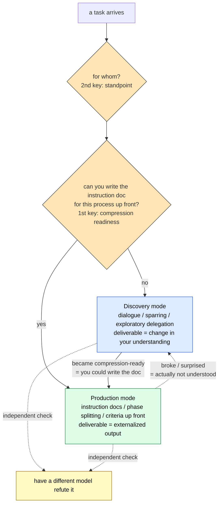

# Discovery vs. Production — Choosing Your Mode of LLM Collaboration

> Arguing "templates are dead / alive" just swings the pendulum forever. The question to ask is whether the task is **discovery** or **production**.

## About This Document

> [!NOTE]
> This page organizes collaboration with an LLM along a single axis: **discovery mode** and **production mode**. It diagnoses why the prompt/template debate keeps missing each other, and shows when —— and for whom —— to switch modes, derived from the structural constraints of LLMs.

This axis is the **human-side decision framework** that [Loop Engineering](./loop-engineering) (automating the outer loop) presupposes. Where discovery/production concerns mode selection "inside the human head," Loop Engineering concerns the engineering of fixing that split **into the infrastructure**.

> [!TIP]
> **In three lines**
>
> - The AI debate keeps missing each other because it fights over "which single approach is universal" while missing the **discovery-vs-production axis**. No approach is universal.
> - **Discovery mode** = the phase of growing understanding; **production mode** = the phase of producing reproducible results. Not superior/inferior, but **fit**.
> - The first key to switching is **compression readiness** ("can you write the instruction doc?"); the second is **standpoint** (compressed for whom?).

> [!WARNING]
> **Where this page sits**
> It sits in the middle of the chain: [III.3 Doctrine](../part-3/doctrine) (what to judge against) → **this page (discovery/production mode selection)** → [Loop Engineering](./loop-engineering) (fixing the production-mode outer loop into the system).

## Why the Prompt Debate Keeps Missing Each Other

The AI discourse swings between two poles. On one side: "100 must-save prompts" and "the complete template." On the other, as backlash: "throw away your prompt collection, dialogue skill is all you need," "the latest AI fills in your intent, so learning prompts is a waste of time."

Both have a point, yet they miss each other because **both are fighting over "which single approach is universal."** No universal approach exists. What decides the approach is a different axis: whether the task is **discovery** or **production**. Without that axis, debating "templates are dead / alive" only swings the pendulum back and forth.

## The Two Modes

| | Discovery mode | Production mode |
| --- | --- | --- |
| **When** | you don't yet know what to build | the shape of what you're building is known |
| **How** | toss rough ideas in, spar, explore | instruction docs, phase splitting, acceptance criteria up front |
| **Deliverable** | **the change in your own understanding** | **the output itself** |
| **Repetition** | one-off | repeated = worth turning into a type |

These two are not superior/inferior. Use discovery mode for work whose answer-shape is already known, and it's just slow and irreproducible. Force production-mode structure before you understand anything, and you freeze the structure before you understand it. **Both fail when used in the wrong situation.**

## Why Separate Them — Grounded in LLM Structural Constraints

"Vague best practice" is weak. This separation can be derived logically from the structural nature of LLMs. Three constraints matter most.

- **[Context Rot](../glossary#structural-problems)** — the longer the context, the worse the output quality.
- **[Instruction Decay](../glossary#structural-problems)** — over a long [session](../glossary#session), the influence of the initial instructions fades.
- **[Sycophancy](../glossary#structural-problems)** — without clear acceptance criteria, an LLM drifts toward "it sort of runs, so it's fine."

Discovery mode **fits** these constraints. Exploration is one-off; if the context gets dirty, just throw it away. Since the goal is growing understanding, output rigor is secondary.

Production mode, by contrast, **hits these constraints head-on**. So it needs countermeasures.

| Production-mode "structure" | Constraint it counters |
| --- | --- |
| split into phases instead of one big request | Context Rot |
| externalize instructions to a file and pass by path | Instruction Decay |
| decide acceptance criteria before implementing | Sycophancy |

Here's the crux. **Production mode's "tedious structure" is a necessity back-calculated from LLMs' structural constraints —— not a ritual.** For the same tool, the discipline required changes with the situation. That is the basis for "choosing your mode."

## The First Key: When to Switch — Compression Readiness

When should you move from discovery to production? There is one test: **"Can you write the instruction doc?"**

| Question | Discovery | Production |
| --- | --- | --- |
| Can you write acceptance criteria **up front**? | no (you learn by doing) | yes |
| Is the **shape** of the output known? | unknown | known |
| Where does the value live? | the change in your understanding | the output itself |
| Does it repeat? | one-off | repeats = worth making a type |
| **Can you write the instruction doc?** | not yet | yes |

The moment you feel that, after walking and decomposing the process, it has become "understood enough to fold into an instruction doc (the CLAUDE.md equivalent in Claude Code)" —— that is the switch point. Call it **compression readiness**: the state where understanding can be compressed into a reusable procedure.

What matters is that the key isn't "the project's phase (exploration era vs. construction era)" but **the cognitive state of "has this process become compressible?"** Even within one project, understood parts run in production mode and not-yet-understood parts run in discovery mode —— mixed.

### Concrete Indicators of Compression Readiness

"Can you write the instruction doc?" is useful but prone to subjectivity. Operationalize it with **observable, verifiable indicators** across four layers.

**① Self-diagnostic checklist (mostly "yes" ≈ you've arrived)**

- Can you list the acceptance criteria up front, concretely and verifiably?
- Can you describe the main steps, required tools/commands, and input/output shapes in order?
- Can you cite common failure patterns (edge cases, constraint violations, security risks) and their fixes, with examples?
- Can you explain "why this design" in your own words (not just echoing the AI's suggestion)?
- Can you write a "minimal instruction doc" that gets equivalent quality in a fresh session, with no long prior history?

**② Granularity of the instruction-doc draft (AGENTS.md / CLAUDE.md practice)**

The Ready threshold is Markdown headings + bullets + code blocks, **ideally within ~100–150 lines** (too long invites Context Rot). It means you can **concretely write** the main sections (role definition / setup & test commands / Do & Don't with examples / structure hints / actions needing confirmation / good & bad examples / review checklist / what to do when uncertain).

The Not-Ready signs: vague, dependent phrasing like "the AI will judge appropriately…" or "taking context into account…" stands out; non-goals and exception handling can't be written; and the draft alone can't supply "why this rule is needed."

**③ The most objective verification test (gold standard)**

Finish the draft, start a **completely new session**, give only the draft (or a file-path reference) plus a minimal task description, and run a representative small task. If quality is high and follow-ups are few → Ready; if key context drops out or "the AI decided on its own" recurs → Not Ready, and fall back to discovery mode immediately.

**④ Complementary dimensions (team, long-term)**

Repeatability (does a different person, at a different time, get consistent quality?), evolvability (is it easy to update as things change?), and the transfer view (can someone else use this doc as the **starting point for their own discovery mode**?).

> [!TIP]
> Don't aim for perfection from the start. Compression readiness is not "a moment you reach" but **a state that rises gradually**. Start from a rough draft, run production mode, discover the gaps, and refine the doc.

## The Second Key: Discovery/Production for Whom — Compression Isn't Transferable

This is the most important part of the axis. **A mode is not a property of the task alone. It is decided by the relationship between the task and the person.**

Suppose a senior engineer, through trial and error, produces the optimal prompt for some task. For the senior, it's a product (compressed). But for the junior who receives it, the same prompt is an "answer file," not "folded understanding." So the junior uses it vaguely. This isn't the junior's negligence —— it happens structurally.

> [!IMPORTANT]
> **A compressed deliverable arrives uncompressed for whoever receives it. Compression must be redone per person.**

Instructions (procedures) are transferable. But understanding is not. So the junior must **walk their own discovery mode again** over something someone else has already produced. In this site's vocabulary, this is the **distinction between [harness](../glossary#harness) (externalized, transferable constraints) and doctrine (internalized, non-transferable principles)**. The senior can hand over harness, but not doctrine (→ [Permission vs. Authority](./permission-vs-authority)).

**So the discovery/production balance necessarily changes between "using it alone" and "using it as a team."** On a team, one person's product becomes another person's starting point for discovery.

## Routing

Combining the two keys:

Both directions matter. **Discovery → production (forward):** transfer the moment it becomes compression-ready. **Production → discovery (fallback):** the path you take when production mode breaks —— a signal that "the process wasn't actually understood." Keeping this fallback is your insurance against **premature compression**.

And in both modes, insert an **independent check**. Letting the same model that did the work review it makes it likely to affirm its own output (a form of Sycophancy). Show it to a different model that reasons even slightly differently, and a fresh perspective checks it.

## Failure Modes of Each Mode

The practical payoff of choosing your mode is avoiding each mode's distinctive failures.

**Discovery-mode failures**

- **Procrastination** — you're compression-ready but keep walking (the endless stroll).
- **Over-delegation** — sliding into "I can hand it all over," widening the trusted scope without real grasp.
- **Rediscovering your own compression** — forgetting answers you already produced (docs, articles) and re-walking from zero.
- **Conformity drift** — closing into dialogue with a single model, conclusions softening with no external check.

**Production-mode failures**

- **Premature compression** — forcing structure before understanding.
- **Template rigidity** — forcing a generic template that doesn't fit your situation.
- **Nominalization** — the harness (checks, approvals) becomes a rubber stamp, form remaining while substance leaks out.
- **Discovery contamination** — leaving exploratory exchanges in the production context, inviting Context Rot.

## Fixing the Mode into the System

So far this was about switching modes in your head. Finally, the direction of externalizing it as a system.

Discovery and production can be **assigned to different agents**. Discovery to a high-capability dialogue model (a large cloud model), production to a lightweight local model (a local LLM). It's often framed as cost optimization, but the essence is "fixing the mode separation into the infrastructure" —— dropping the in-head oscillation into a system-level division of roles (→ [Routing vs. Cascading](./routing-vs-cascading) / [Local LLM Workspace Mapping](./local-llm-workspace-mapping)).

The same shape appears in multi-agent design: a "front desk" role that talks to the customer to explore requirements (discovery-like, dialogic) separated from a "back office" role that executes confirmed procedures (production-like, routine) —— structurally the same as the in-head discovery/production split. And **driving the production-mode outer loop autonomously** is [Loop Engineering](./loop-engineering).

## This Is Not New

To be honest, the idea that "what is understood and what is not yet understood must be handled differently" is not new —— it's old. In software and product, it has crystallized under many names: dual-track development, the exploration–exploitation trade-off, divergent and convergent thinking (the Double Diamond). The discovery/production distinction is just the latest term in that lineage.

What's added here is at most two things:

1. Placing the switch key not on "the project's phase" but on **"compression readiness (can you write the doc?)."**
2. Applying it to LLM collaboration and grounding each mode's failures in the structural constraints of **Context Rot / Instruction Decay / Sycophancy**.

These prior concepts were likely reached independently by each field from "the same root." So this page is not a claim of invention, but **a proposal: "this axis you already switch unconsciously —— shall we put it into words once?"**

## Going Deeper: Why Production Mode Needs Phase Splitting, Externalized Docs, and Acceptance Criteria

This page covered the **criteria (What/How)** of mode selection. To understand **why** these countermeasures are structurally unavoidable, see the sister site.

- [understanding-llm / Part 1: Structural Problems](https://shuji-bonji.github.io/understanding-llm-through-claude-code/01-llm-structural-problems/) — definitions of Context Rot / Instruction Decay / Sycophancy
- [understanding-llm / Appendix: Harness and LLM Constraints](https://shuji-bonji.github.io/understanding-llm-through-claude-code/appendix/harness-and-llm-constraints) — each harness element ⇔ the eight problems

## Related Documents

- [Loop Engineering](./loop-engineering) — the engineering of fixing the production-mode outer loop into the system
- [Permission vs. Authority](./permission-vs-authority) — the harness (transferable) / doctrine (non-transferable) distinction
- [Routing vs. Cascading](./routing-vs-cascading) / [Local LLM Workspace Mapping](./local-llm-workspace-mapping) — assigning discovery/production to infrastructure
- [III.3 Doctrine](../part-3/doctrine) — what to judge against

## References

- Anthropic (2024). "Building Effective Agents." Anthropic Engineering. [anthropic.com/engineering](https://www.anthropic.com/engineering/building-effective-agents) — the workflows (deterministic) vs. agents (autonomous) split; the need for acceptance criteria and an evaluator
- Hong, K., Troynikov, A., & Huber, J. (2025). "Context Rot: How Increasing Input Tokens Impacts LLM Performance." Chroma Research. [research.trychroma.com](https://research.trychroma.com/context-rot) — quality degradation in long context (why discovery mode discards context)

---

> **Previous**: [Agent Loop Patterns](./agent-loop-patterns.md)
> **Next**: [Loop Engineering](./loop-engineering.md)

**Last updated**: June 2026
