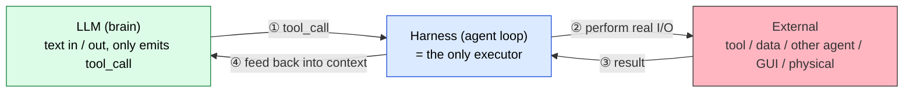
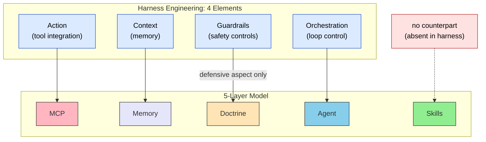
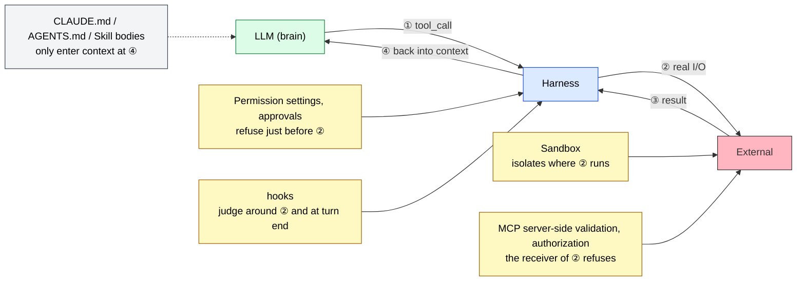
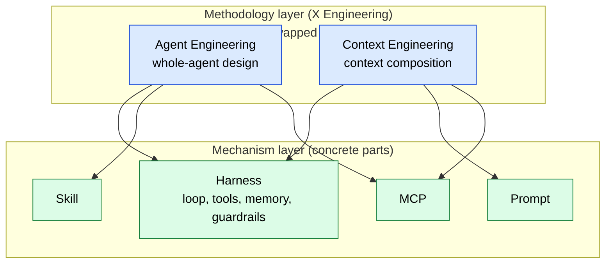
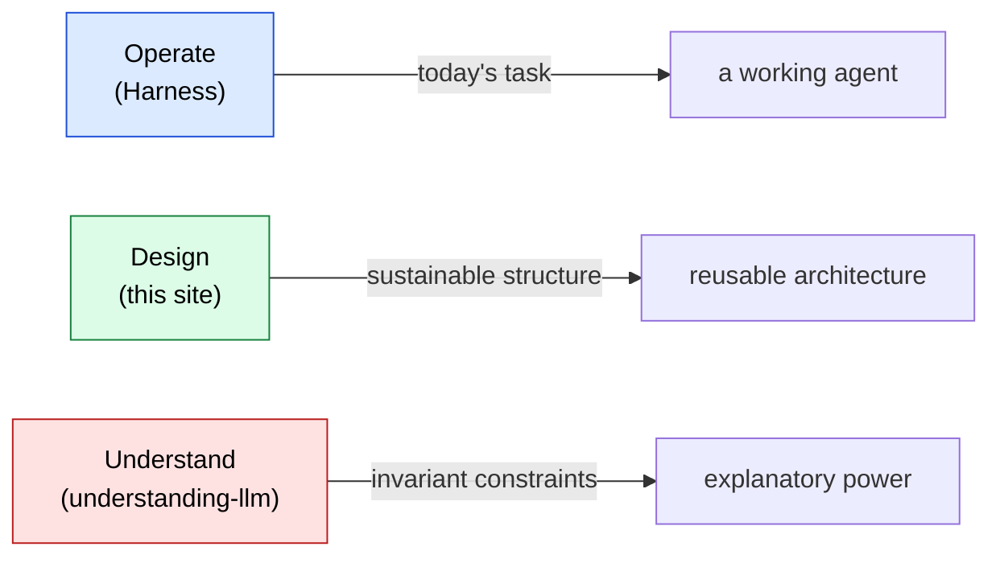

# Harness Engineering Mapping

> Map the four [harness](../glossary#harness) elements onto the 5-layer model and clarify what harness covers and what it doesn't.

## About This Document

> [!NOTE]
> "Harness Engineering" emerged as a notable framing in 2025–2026 for organizing the implementation mechanisms used to **operate** an LLM. Since this site is a map for **designing** LLM agents, this page makes the relationship between the two explicit.

For readers who found this site while searching for harness engineering: this page maps the four harness elements onto the site's 5-layer model and shows why the **areas harness does not cover** (Skills layer, part of Doctrine layer, the Why behind each prescription) still require a separate framework.

> [!TIP]
> **In three lines**
>
> - Harness is the *mechanism* for operating; the 5-layer model is the *map* for designing. They live at different abstraction levels.
> - The four harness elements map onto MCP, Memory, Agent, and Doctrine (defensive aspect only).
> - **The Skills layer and the offensive side of the Doctrine layer (normative strength declarations) are not part of harness**, so this site fills that gap.

## First Principle — the LLM Is the Brain, the Harness Is the Only Executor

Before the four elements, define **what a harness is** one level down. The LLM itself is a **text in / text out** function: it merely emits `tool_call` (a structured [token](../glossary#token) specifying which tool to call with which arguments). **Everything that touches the outside world (HTTP, files, other agents, GUI, the physical world) is done by the execution layer that surrounds the LLM — the harness.**

The loop itself — "run ①–④ until the stop condition is met" — *is* the harness, and **this distinction is what separates "LLM" from "agent."**

> [!IMPORTANT]
> **MCP, direct HTTP, A2A, and plugins look like different *kinds* of external connection, but they are all just implementation variants of step ②.** Whichever you choose, the skeleton is unchanged: the model emits `tool_call` at ①, the harness performs real I/O at ②, and ③④ feed the result back into context. The reason this page can later map the four elements onto the 5-layer model is precisely that this single skeleton underlies all of them.

The single-shelf list of "kinds" (target × I/F × executor), why the named winners collapse to just two protocols — MCP and A2A — and why MCP alone splits step ② into two communication hops are all covered in the "External Interface Catalog" section of [mcp/what-is-mcp](../mcp/what-is-mcp). This page's scope ends at the skeleton: "they are all the contents of step ②."

## What Is Harness Engineering

> [!NOTE]
> In this document, "harness engineering" refers to the implementation mechanism composed of the following four elements. They correspond to the **four responsibilities carried by the step-② executor** in the first principle above.

| Element | Description |
| --- | --- |
| **Action (tool integration)** | Connection points for accessing external APIs, databases, file systems, browsers, etc. |
| **Context (memory)** | A mechanism that retains past context, business background, and agent action history, and hands it back to the LLM when needed |
| **Guardrails (safety controls)** | Safety devices (sandboxes, etc.) that prevent leakage of confidential information and uncontrolled system damage |
| **Orchestration (loop control)** | A continuous loop that decomposes tasks, lets the LLM think, executes, evaluates results, and decides the next action |

The word "harness" — like the harness used in rocketry or climbing — carries the metaphor of a **fixture or restraint** and is used as the implementation mechanism beneath higher-level methodologies such as Agent Engineering or Context Engineering.

## Mapping to the 5-Layer Model

### Mapping Table

| Harness Element | 5-Layer Model | Correspondence |
| --- | --- | --- |
| **Action (tool integration)** | **MCP** | Connection points for external systems. Protocol layer. |
| **Context (memory)** | **Memory** | Persistent memory and relationships. Knowledge Graph, etc. |
| **Guardrails (safety controls)** | **Doctrine** (defensive aspect only) | Constraints, prohibitions, sandboxing. **Does not include normative strength declarations (MUST/SHOULD/MAY) or offensive design guidance.** The implementing components are covered in [Breaking Down Guardrails](#guardrails-breakdown). |
| **Orchestration (loop control)** | **Agent** | The locus of task decomposition, execution, and evaluation loops. |
| ❌ no counterpart | **Skills** | Static knowledge, guidelines, progressive disclosure. Absent in the harness vocabulary. |

## Breaking Down Guardrails {#guardrails-breakdown}

The four-element table above reduces Guardrails to "sandboxes, etc." This section breaks Guardrails down along four questions:

- Does a component act on the model by being read, or by blocking execution?
- Where do CLAUDE.md and AGENTS.md belong?
- Which permissions are restricted?
- Which component decides pass or fail, where in the loop, and against what criteria?

### Components That Are Read, and Components That Block

Components counted as Guardrails fall into two groups by how they act on the model.

| How it acts | Example components | When the model does not comply |
| --- | --- | --- |
| **Read** (placed in context) | CLAUDE.md / AGENTS.md, Skill bodies, system prompts | Nothing stops. The violating `tool_call` proceeds to ② as is |
| **Block** (the harness refuses execution) | Permission settings (allow / deny), sandboxes, approvals, hooks, server-side validation in MCP servers | Execution is refused before ②, or during ② |

Writing "do not send customer data to external APIs" in a prompt belongs to the first group. If the model overlooks that line ([Instruction Decay](../glossary#structural-problems)), the request is sent. If the destination is blocked by network settings, no request is sent regardless of what the model outputs. On this page, only the blocking components count as implementations of Guardrails.

> [!IMPORTANT]
> A prohibition placed only in the read group raises the probability of compliance; it does not stop execution. Any MUST rule whose violation you cannot accept must also be placed in a blocking component.

### Where CLAUDE.md and AGENTS.md Belong {#claude-md-agents-md}

Articles on harness engineering sometimes count CLAUDE.md and AGENTS.md as a "policy layer" of the harness. This site treats the mechanism that handles these files separately from the content written in them.

| Subject | Where it belongs | Does it block execution? |
| --- | --- | --- |
| The **mechanism** that finds the files and loads them into context at startup | Harness | No |
| The **content**: purpose, prohibitions, priorities written in the files | Doctrine layer ([III.3 Doctrine](../part-3/doctrine)) | No (read group) |

A prohibition written in CLAUDE.md is not an implementation of Guardrails. Prohibitions that must be enforced technically belong in permission settings, hooks, or sandboxes. CLAUDE.md should keep the reason for each prohibition and the judgments a machine cannot enforce, such as priorities and trade-offs.

### Types of Permissions to Restrict

| Permission | What it restricts | Examples |
| --- | --- | --- |
| **File system** | Paths that can be read or written | Deny writes outside the working directory. Deny reading `.env` |
| **Network** | Destinations the agent may reach | Block outbound traffic. Allow only listed domains |
| **Execution** | Commands that may run, and where they run | Restrict commands with an allowlist / denylist. Run them inside a disposable container |
| **Data access (authorization)** | Data that may be read or updated | Do not return data beyond what the requesting user's role allows |

File system, network, and execution can be restricted by harness settings and sandboxes. Data access authorization is usually decided outside the harness: in business systems, MCP servers, or identity infrastructure. Whose permissions an agent carries is covered in [Agent Identity](../agents/agent-identity).

### Implementing Components

The components are ordered by where they act in the ①–④ loop shown at the top of this page.

| Component | Where it acts in the loop | Permissions restricted | How it acts |
| --- | --- | --- | --- |
| **Runtime permission settings** (permission modes and allow / deny in Claude Code, Codex CLI, etc.) | Just before ② | File system, network, execution | Block |
| **Approval** (human-in-the-loop) | Just before ② | Dangerous operations in general. Nothing runs until a human approves | Block |
| **hooks** | Around ②, and at turn end | Specific operations. Sends work back if lint or tests fail | Block |
| **Sandbox** (the Bash sandbox in Claude Code, containers such as Docker, isolated execution services such as E2B) | Where ② runs | Execution, file system, network. Even destructive operations end inside a disposable environment | Block |
| **MCP server-side validation** | The receiver of ② (inside the server) | Operations and data the server exposes. Rejects out-of-schema input and writes | Block |
| **Authorization infrastructure** (RBAC, etc.) | The receiver of ② (business systems) | Data access | Block |
| **CLAUDE.md / AGENTS.md, Skill bodies** | Enter context at ④ | None | Read |

How to arrange permission modes as a spectrum and decide how much to delegate is covered in [Permission vs. Authority](./permission-vs-authority).

> [!NOTE]
> In the mapping table above, MCP corresponds to Action (the connection point). When the same MCP server implements input validation or refuses writes, it also becomes a Guardrails component. Being a connection point and being a place where restrictions are enforced are compatible. For server-side measures, see [Security Considerations for MCP Development](../mcp/security).

### Which Component Decides Pass or Fail

Blocking components decide whether the run may proceed. Each component differs in its criteria and in who writes them.

| Component | Pass/fail criteria | Written by | Is the verdict reproducible? |
| --- | --- | --- | --- |
| **hooks** | Exit codes of external commands such as lint, type checks, and tests | Developers | Yes |
| **MCP server** | Input schema, permitted operations, rule tables | Server authors | Yes |
| **Permission settings, sandboxes** | Patterns for paths, destinations, and commands | Operators | Yes |
| **Approval** | Human judgment | Approvers | Depends on the approver |
| **Skill checklists** | Checklist items, matched by the model itself | Skill authors | No |

Because the model itself matches a Skill checklist, the verdict can change for the same input. Asking a model to verify its own output is also subject to [Sycophancy](../glossary#structural-problems). Criteria whose verdicts must be reproducible belong in hooks or on the MCP server side. For separating observation, judgment, and narration, see [Deterministic Verdicts](./deterministic-verdicts); for deciding where hooks go, see [Hooks](./hooks).

## Three Areas Harness Does Not Cover

### 1. The Skills Layer (Reference Model for Static Knowledge)

The four harness elements lack the concept of **"how to structure static knowledge and when to invoke it."** The Skills layer covers:

- The `SKILL.md` format and progressive disclosure
- Auto-triggering based on description matching
- The choice between Skills and MCP (see [Sub-agent vs Skills](../agents/subagent-vs-skill))
- Composition across multiple Skills

These are neither Context (memory) nor Action (tools); they are **judgment criteria conditionally injected into the LLM's immediate context** and require an independent layer.

> [!NOTE]
> Some articles on harness engineering count Skills as a harness component. What they refer to is the **mechanism** that finds SKILL.md files and loads them into context when their trigger conditions match. That mechanism belongs to the harness. What this site marks as "no counterpart" is the **content** of a Skill: its judgment criteria and procedures. The four harness elements have no concept for how to structure that content or when to trigger it. CLAUDE.md and AGENTS.md are split the same way (see [Where CLAUDE.md and AGENTS.md Belong](#claude-md-agents-md)).

> [!IMPORTANT]
> Squeezing Skills into Context causes token bloat and [Priority Saturation](../glossary#structural-problems). The design hinges on expanding Skills *only when invoked* — explored in detail in [II.1 Five layers](../part-2/layers).

### 2. The Offensive Side of the Doctrine Layer

The Guardrails element of harness is confined to **defensive** functions: leak prevention and runaway prevention. The Doctrine layer also covers:

- **Purpose declarations** (what the agent exists for)
- **Judgment criteria** (priority order when trade-offs arise)
- **Normative strength ladder** (MUST / SHOULD / MAY, per RFC 2119)
- **Role boundaries** (what the agent addresses and what it does not)

These are "offensive design guidance" and have no counterpart in the harness vocabulary. See [III.3 Doctrine](../part-3/doctrine) for detail.

### 3. The Why Behind Each Prescription

Harness prescribes "give it memory" and "wrap it in a loop," but does not explain **why** those prescriptions are necessary:

- Why externalize Context? → [Context Rot](../glossary#structural-problems), [Lost in the Middle](../glossary#structural-problems)
- Why re-inject instructions in a loop? → [Instruction Decay](../glossary#structural-problems), Priority Saturation
- Why sandbox at all? → [Hallucination](../glossary#structural-problems), [Sycophancy](../glossary#structural-problems)

These **structural constraints** are the subject of the sister site, [understanding-llm-through-claude-code](https://shuji-bonji.github.io/understanding-llm-through-claude-code/).

## "Is Harness Enough?" Decision Table

Determine whether harness alone covers your question:

| Reader's Question | Harness Enough? | Where to Look Next |
| --- | --- | --- |
| "I want to give the LLM tools" | ✅ Yes | — |
| "I need to design memory" | ⚠️ Partial | Why (Context Rot, Lost in the Middle) → understanding-llm |
| "Should this go in Skills or MCP?" | ❌ No | [II.1 Five layers](../part-2/layers), [skills/what-is-skills](../skills/what-is-skills) |
| "Criteria for splitting sub-agents" | ❌ No | [agents/subagent-vs-skill](../agents/subagent-vs-skill), [agents/subagent-quality-gate](../agents/subagent-quality-gate) |
| "What to write as MUST vs SHOULD" | ❌ No | [III.3 Doctrine](../part-3/doctrine) |
| "Instructions decay over long tasks" | ⚠️ Symptomatic only | Why (Instruction Decay) → understanding-llm |
| "Granularity of guardrails" | ⚠️ Defensive only | Component choice: [Breaking Down Guardrails](#guardrails-breakdown); offensive normativity: Doctrine |
| "Coordination across multiple MCPs and Skills" | ❌ No | [strategy/composition-patterns](./composition-patterns) |

## Vocabulary Hierarchy — Harness Is a Mechanism, Engineering Is a Methodology

- **Harness** = a noun, a thing. Like a rocket or climbing harness, it is a *fixture* metaphor → **persists as mechanism**.
- **X Engineering** = methodology label. Agent Engineering, Context Engineering, etc. swap in and out as the umbrella term → **disposable**.

The 5-layer model and the 8 problems on the sister site are designed as **vocabulary-independent abstractions**. Whenever a new methodology label trends, a mapping page like this one can be added without disturbing the core model.

## Reframing With Three Verbs

| Verb | Goal | Output | Time Horizon |
| --- | --- | --- | --- |
| **Operate** | Control the LLM to complete the task | A working agent (runtime) | Today |
| **Design** | Build reusable structure and judgment criteria | A design map (5-layer model + Doctrine) | Sustained next year |
| **Understand** | Grasp why the constraint exists | The why bookshelf (8 problems) | Invariant |

> [!IMPORTANT]
> The three are **complementary at different layers, not interchangeable**. Harness handles *operate*, this site handles *design*, and the sister site handles *understand*.

## Go Deeper: Why Each Harness Element Is Necessary

This page covers the **structural correspondence (What)** between harness and the 5-layer model. For **why** each harness element is necessary in terms of LLM structural constraints, see the sister site.

- [understanding-llm / Appendix: Harness and LLM Structural Constraints](https://shuji-bonji.github.io/understanding-llm-through-claude-code/appendix/harness-and-llm-constraints) — harness 4 elements ⇔ 8 problems mapping, diagnosis before prescription
- [understanding-llm / Part 1: Structural Problems](https://shuji-bonji.github.io/understanding-llm-through-claude-code/01-llm-structural-problems/) — overview of the 8 problems

## Related Documents

- [II.1 Five layers](../part-2/layers) — the 5-layer model
- [III.3 Doctrine](../part-3/doctrine) — Doctrine layer in detail
- [skills/what-is-skills](../skills/what-is-skills) — why Skills isn't part of harness
- [strategy/composition-patterns](./composition-patterns) — composition patterns across multiple MCPs and Skills
- [strategy/proposal-and-binding](./proposal-and-binding) — the ①–④ loop re-cut along the axis of whether each step binds (sequel to this page)
- [strategy/permission-vs-authority](./permission-vs-authority) — what harness-type and doctrine-type agents ask for at the boundary
- [Hooks](./hooks) — a harness-side interrupt at a point in the run
- [strategy/deterministic-verdicts](./deterministic-verdicts) — separating observation, judgment, and narration so verdicts reproduce
- [agents/agent-identity](../agents/agent-identity) — whose permissions an agent carries
- [mcp/security](../mcp/security) — validation and authorization implemented on the MCP server side
