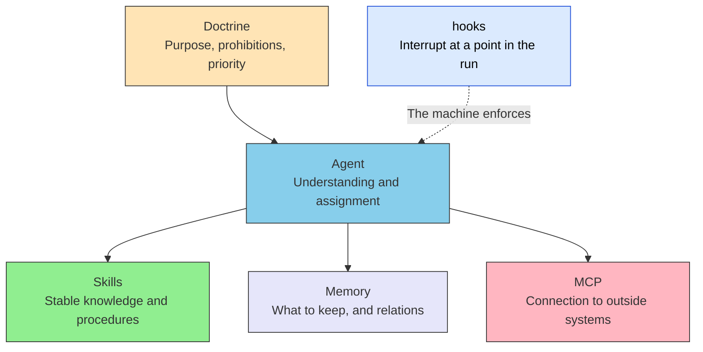

# Hooks

> [!NOTE] Where this page sits
> Hooks is none of the five layers. It is a facility of the harness (the execution boundary). This page decides when to use it and what not to mix with it. It is not a product API reference.

Doctrine says a published translation **MUST** (must) not fall below xCOMET 0.85. The procedure lives in Skills. The agent may still say "done" and move on without looking at the score. A declaration is read. It is also sometimes not read.

Hooks is the mechanism that closes that hole at a point in the run, by machine.

## Definition

Hooks is a mechanism that runs work automatically at points in an agent's run, and lets a machine decide whether the run may proceed. It interrupts before the model writes the next sentence, just before a tool is called, or when a turn ends.

It does not add the substance of a judgment into this turn's prompt. It stops the run, records what happened, or runs a fixed after-step. Whether it is read is not left to the model.

The name differs by product. One host says Hooks. Another says lifecycle hook. CI says gate. The names are examples. They are not operating instructions.

## Relation to the five layers

The five layers are a split of ownership. Hooks does not add an owner. It adds whether an existing owner can be enforced by machine at run time.

| | Five layers | Hooks |
| --- | --- | --- |
| What it is | Who owns what | An interrupt at a point in the run |
| What it holds | Knowledge, memory, connection, the measure | When it runs, what it enforces |
| Who acts | The model reads. Agent combines | The harness always runs it |
| How it is kept | By being read | By stopping, recording, after-steps |

It is not a sixth layer. Adding a layer adds another placement judgment. Hooks belongs to the harness. The map of ownership stays five layers.

> [!IMPORTANT]
> Hooks may be a means of enforcing part of Doctrine / Skills by machine at run time. Hooks itself is not the measure. The measure stays in Doctrine.

## How it differs

| Mechanism | Role |
| --- | --- |
| Skills | Stable knowledge and procedures (read) |
| MCP | Connection to outside systems |
| Sub-agent quality gate | Delegation to another context, and checking |
| Hooks | Interrupt into the lifecycle of the same run |
| Doctrine | Purpose, prohibitions, priority (the measure) |

A quality gate hands work to another role to look. Hooks interrupts inside the same run. Both can stop work. The subject that stopped it differs. Mix them, and it becomes unclear which one stopped it.

Drawing a permission line in code is what hooks is good at. Authority (whether it is still right) stays in Doctrine. The cut is in [Permission vs. Authority](./permission-vs-authority).

## When to use it

Use it when a declaration cannot, by itself, make the line hold.

| Use when | Example |
| --- | --- |
| Blocking a dangerous operation | A destructive change to production does not pass without confirmation |
| Audit | Keep which tool was called, with which arguments |
| Machine measurement of a pass line | If a score falls under the line, the run does not proceed |
| Fixed after-steps | Formatting, starting tests, where the deliverable is put |

Checks a human need not look at every time **SHOULD** (should) live in hooks. A line that can be measured **MUST NOT** (must not) be left to the model's "done". Putting a verdict in code is [deterministic verdicts](./deterministic-verdicts).

## When not to use it

| Do not | Instead |
| --- | --- |
| Use it as a place for knowledge | Skills |
| Finish the main connection to an outside system with hooks alone | MCP |
| Bury purpose and prohibitions in full in a script | Doctrine |
| Ask another model, from a hook, to make the quality verdict itself | A deterministic verdict goes in code. A split of roles goes to a quality gate |

Knowledge, connection, and the measure **MUST NOT** (must not) be gathered into hooks. If they are, harness settings become the map of layers. The map stays in the five layers.

> [!WARNING]
> A long procedure written into hooks becomes a copy of Skills. In place of a declaration that is not read, an unmaintained script remains.

## Nearby pages

| Wanted | Page |
| --- | --- |
| Harness and the five layers | [Harness Engineering Mapping](./harness-engineering-mapping) |
| Moving the outer loop into the system | [Loop Engineering](./loop-engineering) |
| Permission and status | [Permission vs. Authority](./permission-vs-authority) |
| Checking in another context | [Quality gate pattern](../agents/subagent-quality-gate) |
| The measure itself | [III.3 Doctrine](../part-3/doctrine) |

## Summary

Hooks is a harness-side interrupt. It is not a layer. Use it for enforcement a declaration cannot carry, for audit, and for fixed after-steps. Knowledge stays in Skills, connection in MCP, the measure in Doctrine. Hooks is the means of enforcing those by machine at run time.

## Related pages

- [II.1 Five layers](../part-2/layers) — the split of ownership. Hooks does not belong here
- [Harness Engineering Mapping](./harness-engineering-mapping) — the actor that runs is the harness
- [Loop Engineering](./loop-engineering) — stopping and hygiene of the outer loop
- [Deterministic verdicts](./deterministic-verdicts) — a measurable line goes in code
- [IV.2 Limits](../part-4/limits) — limits that connecting fills, and checking by machine

---

> **Previous**: [Harness Engineering Mapping](./harness-engineering-mapping)
>
> **Next**: [Proposal vs. Binding](./proposal-and-binding)
