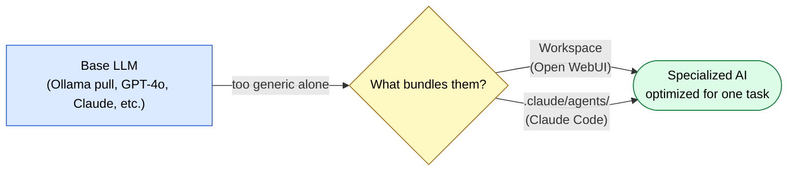
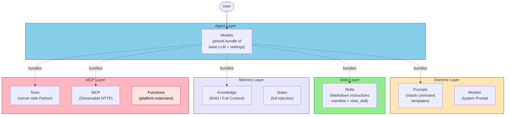
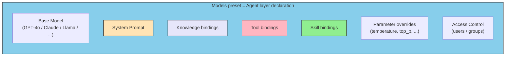
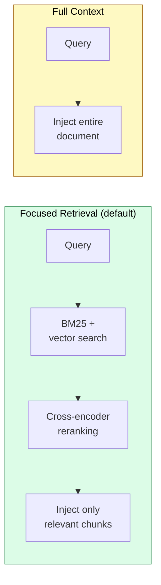
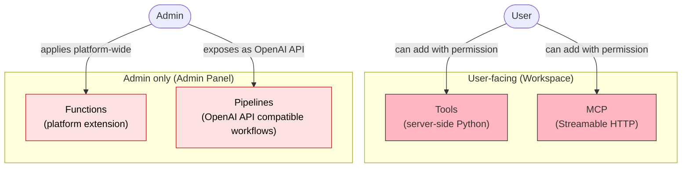
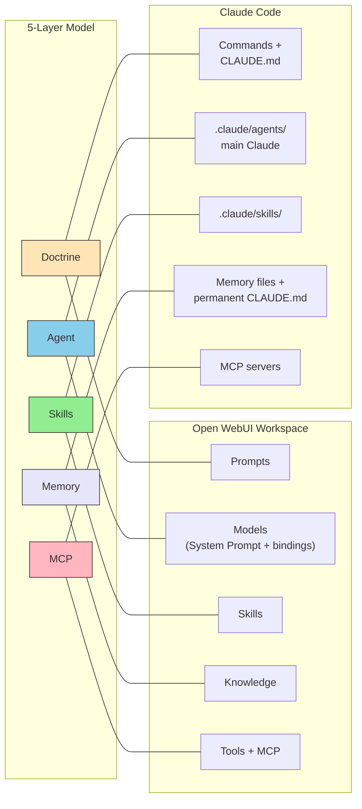

# Mapping the 5-Layer Model to Local LLM Environments — Open WebUI Workspace vs. Claude Code

> Open WebUI and Claude Code answer the same problem — "How do we package a specialized AI as a reusable unit?" — with strikingly similar structures.

## About This Document

Using a locally pulled base model (via Ollama or similar) on its own does not give you a "specialized agent for a specific task." You have to manually compose the system prompt, reference documents, tools, and guidelines for every conversation.

[Open WebUI](https://docs.openwebui.com/features/workspace/models) answers this with the **Workspace** unit. It centralizes Models, Prompts, Knowledge, Skills, Tools, and MCP, letting you build and share a "specialized AI" — a bundle of all of them — directly from the web UI.

This document maps that Workspace onto this site's 5-layer model (Doctrine / Agent / Skills / Memory / MCP) and compares it feature by feature to the Claude Code composition of `.claude/agents/` + `CLAUDE.md` + Skills + MCP. Read it as a map for understanding **what is becoming the de facto unit for packaging agents as of 2026**.

::: warning Positioning of This Document
This page is a strategy-layer document that maps the three-layer model from [03-architecture](./../concepts/03-architecture) — extended with the Memory layer ([08-memory-and-knowledge](./../concepts/08-memory-and-knowledge)) and the Doctrine layer ([07-doctrine-and-intent](./../concepts/07-doctrine-and-intent)) — **onto implementation platforms**. Where [composition-patterns](./composition-patterns) addresses *how to combine*, this page addresses *where to place*.
:::

::: details Meta Information

| | |
| --- | --- |
| **What this page establishes** | The mapping between the 5-layer model and Open WebUI Workspace / Claude Code constructs |
| **What this page does NOT cover** | Open WebUI install steps, per-feature tutorials (see primary docs at [docs.openwebui.com](https://docs.openwebui.com/)) |
| **Dependencies** | [03-architecture](./../concepts/03-architecture), [07-doctrine-and-intent](./../concepts/07-doctrine-and-intent), [08-memory-and-knowledge](./../concepts/08-memory-and-knowledge) |
| **Common misuse** | Equating Open WebUI Tools with MCP. They differ in location, execution model, and distribution (see below) |

:::

## Why a Workspace Unit Emerged



Base models are generic — they have no inherent role like "code reviewer," "translator," or "legal researcher." Giving them a role requires bundling the system prompt, reference knowledge, allowed tools, and decision criteria **into a single unit**.

::: tip Developer analogy
A Workspace is close to **`package.json` + ESLint config + tsconfig + README, bundled together** in a web project. Each works alone, but only the bundle becomes "this project's dev environment." For an AI agent, the Workspace plays that role.
:::

## Mapping to the 5-Layer Model

Each Open WebUI Workspace feature maps to a layer in this site's 5-layer model as follows.



> [!IMPORTANT]
> **Models is not only "the Agent layer" but also the unit that bundles the other four layers**. The official docs describe a Model as *"a thin wrapper: pick a base model, configure it, and share it with your team"* ([Models docs](https://docs.openwebui.com/features/workspace/models)). This is isomorphic to the way `.claude/agents/<name>.md` declares MCP, Skills, and model settings in its frontmatter in Claude Code.

### Correspondence Table

| 5-Layer Model | Open WebUI Workspace | Claude Code | Role |
| --- | --- | --- | --- |
| **Doctrine** | Prompts (`/command` templates), Models' System Prompt | Slash commands (`.claude/commands/*.md`), `CLAUDE.md` | Constraints, objectives, judgment criteria |
| **Agent** | Models (preset bundle), Base Model selection | `.claude/agents/<name>.md`, main Claude | Task understanding, orchestration |
| **Skills** | Skills (Markdown + `view_skill`) | `.claude/skills/<name>/SKILL.md` | Static knowledge, guidelines |
| **Memory** | Knowledge (RAG / Full Context), Notes | Memory files, persistent `CLAUDE.md` content | Persistent memory, reference documents |
| **MCP** | MCP (Streamable HTTP, v0.6.31+), Tools (Python) | MCP servers (stdio / HTTP) | External system connectivity |
| **Out of scope** | Functions (platform extension), Pipelines | Plugins (marketplace, `.claude/plugins`) | Platform-level extension |

## Per-Layer Detailed Mapping

### Doctrine Layer — Prompts and System Prompt

Open WebUI **Prompts** fire as slash commands like `/summarize` and can generate a form with typed input variables. The System Prompt is bound to a Models preset and supports dynamic variables like <code v-pre>{{ USER_NAME }}</code>, <code v-pre>{{ CURRENT_DATE }}</code>, and <code v-pre>{{ USER_GROUPS }}</code> ([Prompts docs](https://docs.openwebui.com/features/workspace/prompts), [Models docs](https://docs.openwebui.com/features/workspace/models)).

These correspond to two distinct constructs in Claude Code.

| Open WebUI | Claude Code | Shared role |
| --- | --- | --- |
| **Prompts** (`/command`) | Slash commands (`.claude/commands/*.md`) | A unit the user *invokes* to set behavior |
| **Models' System Prompt** | `CLAUDE.md`, frontmatter body in `.claude/agents/<name>.md` | Declaratively fixed constraints that always hold |

> [!TIP]
> Open WebUI Prompts go one step further than Claude Code slash commands by offering **typed input variables** like <code v-pre>{{title | select:options=["High","Medium","Low"]:required}}</code>. This reflects the target audience — non-engineers using a web UI — versus Claude Code's CLI-first audience.

### Agent Layer — How Models Bundle Everything

The "Agent layer bundles the other four layers" structure is most visible in the constituent fields of an Open WebUI Models preset.



This corresponds directly to the frontmatter of `.claude/agents/<name>.md` in Claude Code.

```markdown
name: translation-specialist
description: Specialist agent for technical translation and quality evaluation
tools: deepl:translate-text, xcomet:xcomet_evaluate
model: sonnet
---

You are a technical translation specialist.
Refer to the translation-workflow skill.
```

| Field | Open WebUI Models | Claude Code Sub-agent |
| --- | --- | --- |
| Base model selection | `Base Model` field | `model:` frontmatter |
| System prompt | `System prompt` field | Body under the frontmatter |
| Tool binding | `Tools` / `MCP` bindings | `tools:` frontmatter |
| Skills binding | `Skills` binding | "Refer to `<skill>`" instruction in body |
| Knowledge binding | `Knowledge` binding | Reference from `CLAUDE.md`, or via MCP |
| Access control | RBAC (users / groups) | Substituted by Git branch / PR permissions |

> [!IMPORTANT]
> **The pattern "Agent layer declaratively bundles the others" matches across both platforms**. This is not a coincidence — it reflects the separation principle from [03-architecture](./../concepts/03-architecture#layer-structure-overview), where "the Agent layer owns orchestration," pushed back into the UI design itself.

### Skills Layer — A Convergence in Name and Model

Open WebUI introduced **Skills** as a first-class feature in the v0.6.x line ([Skills docs](https://docs.openwebui.com/features/workspace/skills)). What's notable is that its implementation model nearly matches Claude Code Skills.

| Aspect | Open WebUI Skills | Claude Code Skills |
| --- | --- | --- |
| **Format** | Markdown + YAML frontmatter (`name`, `description`) | Markdown + YAML frontmatter (same) |
| **Import** | Directly from `.md` files | Place `SKILL.md` |
| **User-triggered invocation** | `$` mention injects full content | Explicit reference by skill name |
| **Auto invocation** | Bound to a Model → manifest injected; `view_skill(name)` loads the body | Manifest resident; `Read` loads the body |
| **Context efficiency** | Lazy loading (body fetched on demand) | Same (lazy loading) |
| **Dependency** | Requires native function calling | Requires tool use |

::: tip Convergence is a signal of "correct design"
Two teams reaching the same "manifest injection + on-demand body load" model independently strongly suggests this is **the correct response** to the LLM's context constraints. See [Skills structure](./../skills/what-is-skills) and the sibling site's [Part 5: On-demand Context](https://shuji-bonji.github.io/understanding-llm-through-claude-code/05-on-demand-context/) for the underlying reasoning.
:::

> [!WARNING]
> Open WebUI Skills lazy loading **only works when native function calling is enabled**. When disabled, only the manifest is injected and the body is never read ([Skills docs / Limitations](https://docs.openwebui.com/features/workspace/skills#lazy-loading-requires-function-calling)). The same dependency applies in Claude Code: Skills break if `Read` is disabled.

### Memory Layer — Knowledge's Two Modes

Open WebUI **Knowledge** is the persistent memory feature, centered on RAG vector search. It supports 9 vector DBs (ChromaDB, PGVector, Qdrant, Milvus, etc.) and 5 extraction engines (Tika, Docling, Azure, Mistral OCR, custom) ([Knowledge docs](https://docs.openwebui.com/features/workspace/knowledge)).

There are two retrieval modes.



| Mode | Injection | Best for | Context cost |
| --- | --- | --- | --- |
| **Focused Retrieval** | Hybrid Search (BM25 + vector) → rerank → inject relevant chunks | Large document sets where only specific sections matter | Low (depends on chunk count) |
| **Full Context** | Inject the document verbatim | Short references, style guides — anything always relevant | High (depends on document size) |

::: warning Behavior change under native function calling
When native function calling is enabled, Knowledge is **not auto-injected**. Instead, the model uses tools like `list_knowledge`, `query_knowledge_files`, and `view_file` to proactively explore — an **Agentic Retrieval** mode. This enables aggressive document exploration but, without an explicit "always consult Knowledge" instruction in the system prompt, the model may ignore its existence entirely ([Knowledge docs / Agentic Knowledge Tools](https://docs.openwebui.com/features/workspace/knowledge#agentic-knowledge-tools)).
:::

#### Correspondence with Claude Code

| Open WebUI Knowledge | Claude Code | Shared trait |
| --- | --- | --- |
| Focused Retrieval | RAG via MCP (external vector DB) | Dynamic injection of relevant chunks |
| Full Context | Persistent body of `CLAUDE.md`, `@<path>` references | Full text always resident |
| Agentic Knowledge Tools | Proactive exploration via the `Read` tool | Model-led document discovery |

> [!TIP]
> Placing Knowledge in the "Memory layer" is the natural answer to the **scatter-gather problem** discussed in the sibling site's [Part 8: Memory Layer](https://shuji-bonji.github.io/understanding-llm-through-claude-code/08-memory-layer/). It compensates for the base LLM's knowledge boundary with an external, persistent vector DB.

### MCP Layer — Three Distinct Constructs

This is the most commonly misunderstood part of Open WebUI. **Tools, Functions, and MCP are all different things** — they differ in location, execution model, and distribution.



| Type | Location | Execution model | Distribution | 5-layer mapping |
| --- | --- | --- | --- | --- |
| **Tools** | Workspace | Python executed inside the Open WebUI server | Community Hub or manual import | **MCP layer** (proprietary variant) |
| **MCP** | Workspace (v0.6.31+) | Streamable HTTP to remote MCP servers | Server URL + OAuth 2.1 / Bearer | **MCP layer** (standard-compliant) |
| **Functions** | Admin Panel | Python executed in the server | Admin-only | **Out of 5-layer scope** (platform extension) |
| **Pipelines** | Separate process | OpenAI API-compatible workflow | For experts | **Out of 5-layer scope** (infra layer) |

> [!CAUTION]
> Open WebUI **Tools** run "Python code directly inside the server." This is fundamentally different from MCP's protocol-based separation. Importing community Tools carries the **arbitrary-code-execution risk** noted in the [official docs](https://docs.openwebui.com/features/extensibility/plugin/). Prefer standard-compliant Streamable HTTP MCP whenever possible.

#### Why Native MCP Support Matters

Open WebUI's v0.6.31 native MCP (Streamable HTTP) support is decisive for this site's structural argument.

- **Transport: Streamable HTTP only** (stdio / SSE require the `mcpo` proxy)
- **Auth**: None / Bearer / OAuth 2.1 (DCR) / OAuth 2.1 (Static)
- **Automatic Resource Indicators (RFC 8707)**
- **RBAC for per-MCP-tool authorization**

> [!IMPORTANT]
> The fact that "MCP is becoming the de facto external-connection standard even in web-UI-based local LLM environments" reinforces the claim from [02-reference-sources](./../concepts/02-reference-sources) that **accumulated MCP-ified sources are the real asset**. MCP servers built for Claude Code can now be reused from Open WebUI by configuration alone.

## Overall Correspondence Matrix



## Projects and Agent Design

Open WebUI's **Projects** (folder-based workspace bundling) groups Models presets, Prompts, Knowledge, and Skills **into a single project unit**. This is semantically equivalent to Claude Code's **project-root `.claude/` directory**.

| Element | Open WebUI Project | Claude Code Project |
| --- | --- | --- |
| Unit boundary | Folder | Git repository root |
| Agent definitions | Models presets | `.claude/agents/*.md` |
| Shared instructions | Project-level System Prompt sharing | `CLAUDE.md` |
| Shared knowledge | Shared Knowledge collections | References in `CLAUDE.md` + MCP |
| Shared commands | Shared Prompts | `.claude/commands/*.md` |
| Distribution | Export → Import (JSON) | `git clone` |

> [!TIP]
> When designing for project-level portability, the "multi-MCP + multi-Skill coordination" patterns from [composition-patterns](./composition-patterns) apply directly. On both Open WebUI and Claude Code, the structure remains: **"specialized AI = 1 Agent + N Skills + M MCPs + Doctrine"**.

## Design Implications

Three implications follow.

### 1. The 5-Layer Model Is Platform-Independent

Open WebUI and Claude Code evolved independently and **reached nearly identical layer separations**. This is structural evidence that the 5-layer model is platform-independent — backing up the claim in [03-architecture](./../concepts/03-architecture#what-the-three-layer-model-does-not-cover---memory) that "layers represent separation of responsibilities, not deployment configuration."

### 2. Skills' Lazy Loading Has Become a De Facto Standard

The "manifest + on-demand body load" model Claude introduced first now ships natively as the **`view_skill` tool** in Open WebUI as well. This makes **Markdown-based Skills genuinely portable between platforms** — the frontmatter `name` and `description` fields form a common spec.

### 3. MCP Has Reached Local LLM Environments

Native Streamable HTTP MCP support means the shuji-bonji MCP servers ([rfcxml-mcp](https://github.com/shuji-bonji/rfcxml-mcp), [xcomet-mcp](https://github.com/shuji-bonji/xcomet-mcp-server), [pdf-reader-mcp](https://github.com/shuji-bonji/pdf-reader-mcp), and so on) are usable from local LLMs running behind a web UI. **MCP investment is no longer a Claude-Code-only investment — it's an investment in the broader ecosystem.**

## Related Documents

- [03-architecture](./../concepts/03-architecture) — Foundations of the three-layer model
- [07-doctrine-and-intent](./../concepts/07-doctrine-and-intent) — The Doctrine layer in detail
- [08-memory-and-knowledge](./../concepts/08-memory-and-knowledge) — Memory layer and Knowledge Graphs
- [composition-patterns](./composition-patterns) — Composition design for MCP × Skill × Agent
- [What is Skills](./../skills/what-is-skills) — Claude Code Skills specification
- [What is MCP](./../mcp/what-is-mcp) — Model Context Protocol fundamentals

## 🔗 Deeper: Why Convergence to This Structure?

This page covered the **structural mapping (What/How)** between Open WebUI and Claude Code. To understand **why** independent platforms converge on the same layer separation — grounded in the LLM's structural constraints — see the sibling site.

- [understanding-llm / Part 2: Context Window](https://shuji-bonji.github.io/understanding-llm-through-claude-code/02-context-window/) — Why lazy loading is inevitable
- [understanding-llm / Part 5: On-demand Context](https://shuji-bonji.github.io/understanding-llm-through-claude-code/05-on-demand-context/) — The design of Skills manifests
- [understanding-llm / Part 6: Tool Context — MCP](https://shuji-bonji.github.io/understanding-llm-through-claude-code/06-tool-context/) — Why MCP is needed for context isolation
- [understanding-llm / Part 8: Memory Layer](https://shuji-bonji.github.io/understanding-llm-through-claude-code/08-memory-layer/) — Structural positioning of Knowledge / RAG

## References

- Open WebUI (2026). "Models — Wrap any model with custom instructions, tools, and knowledge to build specialized agents." [docs.openwebui.com](https://docs.openwebui.com/features/workspace/models) — Official Models preset specification
- Open WebUI (2026). "Skills — Teach your AI how to approach a task with plain-text instructions." [docs.openwebui.com](https://docs.openwebui.com/features/workspace/skills) — `view_skill` lazy-loading spec
- Open WebUI (2026). "Knowledge — Give your AI access to your documents and let it find what matters." [docs.openwebui.com](https://docs.openwebui.com/features/workspace/knowledge) — Two retrieval modes and Agentic Retrieval
- Open WebUI (2026). "Prompts — Reusable slash commands that turn complex instructions into one-click forms." [docs.openwebui.com](https://docs.openwebui.com/features/workspace/prompts) — Declarative instructions for Doctrine-equivalent use
- Open WebUI (2026). "Tools & Functions (Plugins)." [docs.openwebui.com](https://docs.openwebui.com/features/extensibility/plugin/) — Python server-side execution model
- Open WebUI (2026). "Model Context Protocol (MCP)." [docs.openwebui.com](https://docs.openwebui.com/features/extensibility/mcp) — Native MCP support in v0.6.31+

---

> **Previous**: [Composition Patterns](./composition-patterns)
> **Next**: [Development Phases](./../workflows/development-phases)

**Last updated**: June 2026
