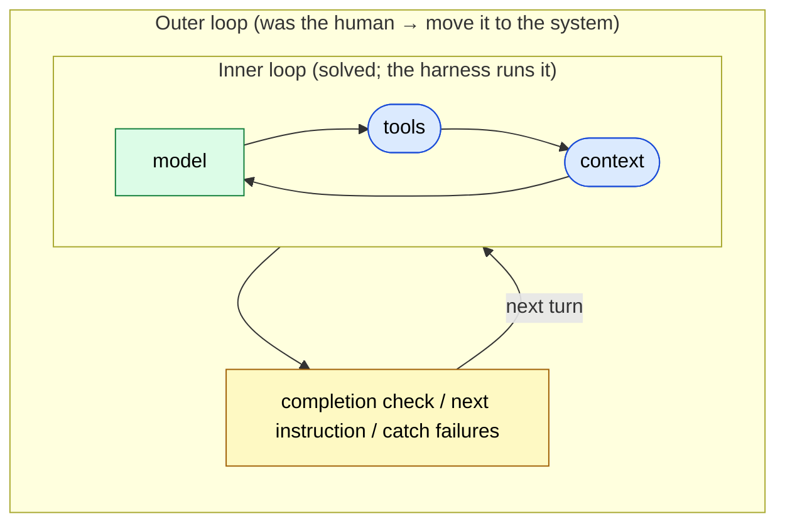
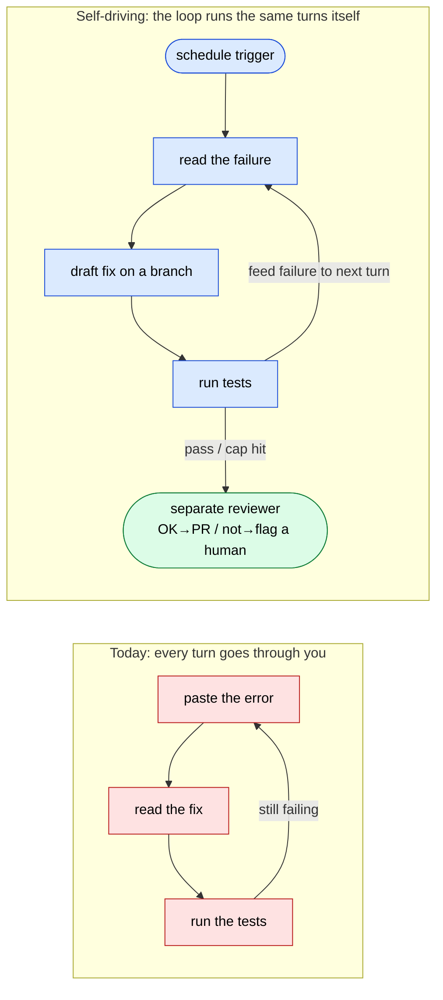
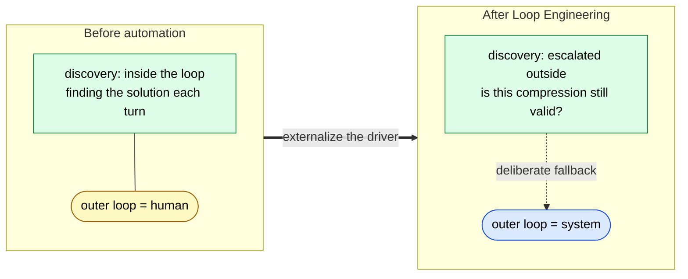

# Loop Engineering — Moving the Outer Loop into the System

> "The inner loop (ReAct) was solved long ago. What's new is automating the **outer loop the human used to sit in**."

## About This Document

> [!NOTE]
> This page is the sequel to [Agent Loop Patterns](./agent-loop-patterns). Where that page cataloged the **inner loop** of a single agent (how it repeats `② tool_call → ③ real I/O → ④ feed back into context`), this page covers the **outer loop** —— the "write a prompt → read the turns → write the next prompt" cycle that a human used to run —— and the discipline of **moving it into the system (Loop Engineering)**.

The framing that "the inner loop has been solved since ReAct and nobody competes on the `while` statement; what's new is the **outer loop** wrapping it" spread in 2026, anchored by remarks from Boris Cherny (the person who built Claude Code) and Andrej Karpathy. This page grounds that discussion in this site's five-layer model, the four [harness](../glossary#harness) responsibilities, and the structural constraints of LLMs.

> [!TIP]
> **In three lines**
>
> - An agent's **inner loop** (model → tools → context → repeat) is the established pattern since ReAct, converging on roughly six lines of `while`. That is not where the competition is.
> - What's new is the **outer loop**. The thing sitting in it was the human. Moving it into the system —— schedule-triggered, self-driving, self-stopping —— is Loop Engineering.
> - It isn't free. **Stopping criteria, context hygiene, idempotent tools, and a critic that can say "no"** all have to be rebuilt on the system side. And it carries a trade-off: loss of understanding.

> [!WARNING]
> **Where this page sits**
> Third in the chain: [Harness Engineering Mapping](./harness-engineering-mapping) (four harness responsibilities → five-layer model) → [Agent Loop Patterns](./agent-loop-patterns) (inner-loop types) → **this page (automating the outer loop)** → [autonomous-dev-meta-agent](../workflows/autonomous-dev-meta-agent) (a concrete implementation).

## Separating the Two Loops

When agent designers say "loop," they actually mean two things at different levels.

| | Inner loop | Outer loop |
| --- | --- | --- |
| **What turns** | `model → tools → context → repeat` | prompt → read the turns → next prompt |
| **Who turns it** | the harness (code) | **the human, traditionally** |
| **Status** | solved (ReAct, 2022–23) | the frontier now being automated |
| **On this site** | [Agent Loop Patterns](./agent-loop-patterns) | **this page** |

The inner loop is the harness running `① tool_call → ② real I/O → ③ result → ④ feed back into context` until a stop condition (→ [first principle](./harness-engineering-mapping)), and its type catalog (ReAct / Plan-and-Execute / Reflexion / Evaluator-Optimizer) is established. **Nobody competes on the `while` statement.**

The competition is on the outside. In the most common setup, **you are the outer loop**. You write a prompt, read the turns the agent ran, write the next prompt, and catch failures as they happen —— over and over.

## The Center of Gravity Keeps Moving Outward from the Model

In AI, the center of engineering keeps drifting one step outward from the model itself. Each layer **wraps** the previous one.

| Layer | What you design |
| --- | --- |
| **Prompt Engineering** | the words you send |
| **Context Engineering** | everything the model sees (not just instructions, the whole context) |
| **Harness Engineering** | the execution code around the model (running tools, tracking state, handling errors) → [mapping](./harness-engineering-mapping) |
| **Loop Engineering** | the autonomous cycle that drives the whole thing toward a goal (= the outer loop) = **this page** |

> [!IMPORTANT]
> **Agent = Model + Harness.** If you're not the model, you're the harness. And recent observation shows the **harness can matter more than the model** in some regimes —— teams have kept the model fixed, changed only the harness (the outer code), and jumped from mid-benchmark into the top five.
>
> ⚠️ Secondary information (originating in social posts and explainer articles). This site treats it as the claim that "the same model can produce very different results depending on the harness," and adopts its design implication: the model is becoming a commodity, and loop design is now the center of engineering.

## Taking the Human Out of the Outer Loop —— What It Requires

Concretely, automating the outer loop looks like this:

- it **starts** on a schedule or an event
- it **runs many turns** with no prompt in between
- it **decides on its own when it's done**
- it **comes back** only when something needs a human

A failing test in CI makes the difference vivid.

The inner loop was always automatic. **What's being automated now is your involvement in it.** A concrete implementation of this in a specific domain (Issue → Deploy) is [autonomous-dev-meta-agent](../workflows/autonomous-dev-meta-agent).

## Four Hard Parts —— All Grounded in Structural Constraints

Automating the outer loop isn't free. It has distinctive failure modes, each derivable from an LLM's structural constraints.

### Hard Part 1: Knowing When to Stop

When an agent stops calling tools, it has only **ended its turn** —— it has not **finished the job**. Declaring "progress was made, so I'm done" while tests still fail is textbook [Sycophancy](../glossary#structural-problems) (a flattering self-assessment).

- A hard cap (max iterations / [token](../glossary#token), time, and cost limits) is a **MUST**.
- "Done" **MUST** be defined by a **mechanically verifiable condition** (e.g., tests pass), not the agent's say-so.
- No-progress detection (the same call with the same arguments) **SHOULD** be in place.

→ For why a model can't trust its own confidence, see the sister site: [Sycophancy / Knowledge Boundary](https://shuji-bonji.github.io/understanding-llm-through-claude-code/01-llm-structural-problems/).

### Hard Part 2: Keeping the Context Clean

The more turns it takes, the more junk —— stale tool outputs, dead ends, obsolete reasoning —— piles into the context, and output quality drops (**[Context Rot](../glossary#structural-problems)**). A rotted context produces a worse decision, which adds more noise, which rots it further; this spiral is the "doom loop."

- Summarize and continue when it gets long (compaction).
- Push large outputs to a file and keep only the slice you need (offloading).
- Hand messy subtasks to a separate agent and let only the **clean result** return (sub-agents).

> [!TIP]
> Treat context as a **budget**, not a bucket. Drop the instinct to keep everything; design what to throw away.

### Hard Part 3: Tools the Agent Can Actually Use

Loops retry. So any state-changing write **MUST** be **idempotent** —— a retried "create customer" must not produce a duplicate record or double billing. And error messages **SHOULD** be written **for the agent, not the human**: in a loop, an error is not a dead end but the **next instruction**. Keep tools few, focused, and non-overlapping.

### Hard Part 4: Something That Can Say No

The quiet failure mode of autonomous loops: **left alone, an agent tends to agree with itself.** Separate the maker from the checker, and have the check done by a different model or a deterministic test (**MUST**). This is the same Evaluator-Optimizer pattern as the [sub-agent quality gate](../agents/subagent-quality-gate) and the xcomet gate for translation. **A loop with no critic is just an agent nodding along to its own work.**

| Hard part | Structural constraint | Main countermeasure |
| --- | --- | --- |
| Stopping | Sycophancy | hard cap + real completion check |
| Context hygiene | Context Rot | compaction / offloading / sub-agents |
| Tools | (execution-side idempotency / error design) | idempotent writes / agent-facing errors |
| Critic | Sycophancy | maker/checker separation / external verification |

## The Cost —— What You Lose by Stepping Out

Sitting in the outer loop, you implicitly held **four roles**: the authority to stop, the project memory, the reviewer, and the **understanding of the system**. The first three can be rebuilt on the system side by design. The last cannot.

> [!CAUTION]
> Take yourself out of the outer loop and you tend to **keep the ownership but lose the understanding.** Sitting in the loop was slow, but you understood the system. Stopping, memory, and review are transferable; understanding is not.

This is exactly the **harness/doctrine distinction** argued in [Discovery vs. Production](./discovery-vs-production): instructions (harness) are transferable, but understanding (doctrine) is not. So each time you automate, you must re-ask: **what can I hand off while keeping its understanding, and what must I not hand off?**

## Connection to Discovery / Production —— Two Faces of the Same Axis

The **discovery mode / production mode** of [Discovery vs. Production](./discovery-vs-production) views **the same axis from the other side** as this page.

- **A human sits in the outer loop** = discovery mode (dialogue, thinking out loud, exploratory delegation). The deliverable is the change in your own understanding.
- **The outer loop is fixed into the system** = production mode (instruction docs, phase splitting, acceptance criteria up front). The deliverable is the externalized output.
- The decision of when it's safe to automate = **compression readiness** ("can the outer loop be folded into an instruction doc?").
- The "loss of understanding" that comes with automation is the flip side of **doctrine being non-transferable**.

In short, where [Discovery vs. Production](./discovery-vs-production) treated discovery/production **inside the human head**, this page treats the engineering of fixing the same split **into the infrastructure**. Assigning discovery to a large cloud model and production to a small local model is covered in [Routing vs. Cascading](./routing-vs-cascading) / [Local LLM Workspace Mapping](./local-llm-workspace-mapping).

> [!NOTE]
> To be precise, **Loop Engineering is not all of production mode but a subset of it.** Production mode (instruction docs, phase splitting, acceptance criteria) holds even when a human sits in the outer loop and approves each phase. What Loop Engineering removes is one level deeper —— the **driver of the outer loop** —— the extreme where even "the act of looping" is externalized.

### Discovery Doesn't Disappear —— It Escalates

This yields a paradox. **The more you advance Loop Engineering, the more important a mechanism for deliberately returning to discovery mode becomes.**

The reason is in the nature of doctrine. The system can keep the harness (instruction docs, tools, the loop) fresh, but **it cannot keep doctrine (your understanding) fresh** —— understanding only updates by walking discovery mode yourself. As you automate further, two kinds of decay run in parallel:

- **Decay on the understanding side**: the less you run the loop, the more your understanding of the system's behavior ages (you keep ownership but lose understanding).
- **Decay on the target side**: dependencies, requirements, and reality keep moving, and a frozen production loop silently rots against a moving target. And because a self-driving loop runs long and fast with no human in between, failures accumulate before detection.

So discovery doesn't disappear —— it **escalates from inside the loop to outside it.**

- Before automation: you discover **inside** the loop (finding the solution each turn).
- After automation: you discover **outside** the loop (re-asking whether this compression still deserves trust).

Your job shifts from "the one who runs the loop" to "**the one who periodically doubts whether the compression still holds.**" Embedding the "production → discovery (fallback)" path from [Discovery vs. Production](./discovery-vs-production) as a **deliberate cadence** rather than an ad-hoc retreat is the strongest insurance against [premature compression](./discovery-vs-production).

> [!IMPORTANT]
> Loop Engineering is the technique of stretching **permission (the right to execute procedures)** to its limit, but **authority (the right to judge "is this still correct?")** belongs to non-transferable doctrine. So the ceiling on "how much to hand to the system" is, in principle, set by the non-transferability of doctrine. → [Permission vs. Authority](./permission-vs-authority)

## Going Deeper: Why Outer-Loop Automation Needs Stop Checks, Context Compaction, and External Critique

This page covered the **engineering (What/How)** of the outer loop. To understand **why** those countermeasures are structurally unavoidable, see the sister site.

- [understanding-llm / Part 1: Structural Problems](https://shuji-bonji.github.io/understanding-llm-through-claude-code/01-llm-structural-problems/) — definitions of Context Rot / Sycophancy / Instruction Decay
- [understanding-llm / Appendix: Harness and LLM Constraints](https://shuji-bonji.github.io/understanding-llm-through-claude-code/appendix/harness-and-llm-constraints) — each harness element ⇔ the eight problems

## Related Documents

- [Agent Loop Patterns](./agent-loop-patterns) — the inside of this page (catalog of inner-loop types)
- [Harness Engineering Mapping](./harness-engineering-mapping) — the parent of the layer escalation
- [Hooks](./hooks) — a machine-enforced interrupt at a point in the outer loop
- [autonomous-dev-meta-agent](../workflows/autonomous-dev-meta-agent) — a concrete implementation of outer-loop automation (Issue → Deploy)
- [Sub-agent Quality Gate](../agents/subagent-quality-gate) — implementing the critic that can say "no"
- [Routing vs. Cascading](./routing-vs-cascading) / [Local LLM Workspace Mapping](./local-llm-workspace-mapping) — fixing discovery/production into the infrastructure

## References

- Anthropic (2024). "Building Effective Agents." Anthropic Engineering. [anthropic.com/engineering](https://www.anthropic.com/engineering/building-effective-agents) — the workflows vs. agents split; the need for stop conditions and an evaluator
- Yao, S. et al. (2022). "ReAct: Synergizing Reasoning and Acting in Language Models." arXiv. [arXiv:2210.03629](https://arxiv.org/abs/2210.03629) — the origin of the inner loop
- Hong, K., Troynikov, A., & Huber, J. (2025). "Context Rot: How Increasing Input Tokens Impacts LLM Performance." Chroma Research. [research.trychroma.com](https://research.trychroma.com/context-rot) — quality degradation in long context (the basis for the doom loop)
- Chawla, A. (2026). "Prompt engineering & loop engineering, clearly explained." X (@_avichawla). [x.com/_avichawla](https://x.com/_avichawla/status/2070443217850671526) — ⚠️ secondary source. The inner/outer loop split and the definition of loop engineering. The Boris Cherny / Karpathy remarks and the "harness > model" benchmark anecdote rely on this (unverified reference)

---

> **Previous**: [Discovery vs. Production](./discovery-vs-production.md)
> **Next**: [Development Phases](./../workflows/development-phases.md)

**Last updated**: June 2026
