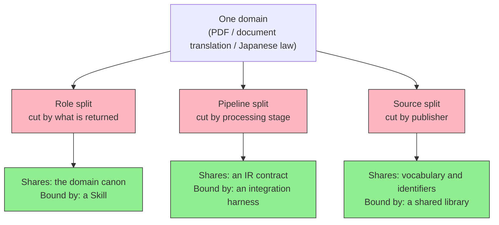
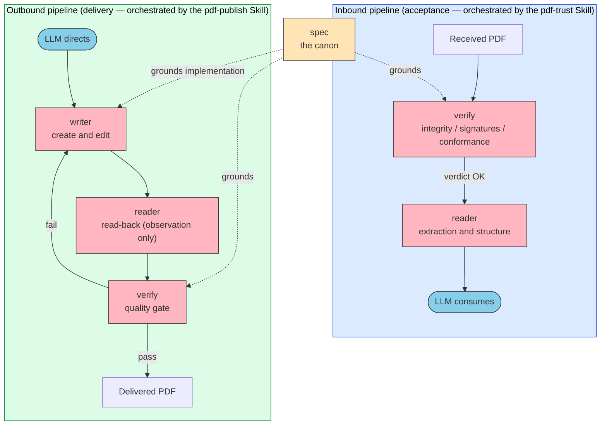
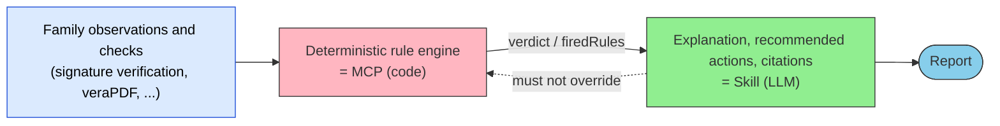

# MCP Family — Splitting One Domain Across Multiple MCPs

> The hard question is not "should I build an MCP?" It is **where to split one domain, and what binds the pieces together**.

## About This Document

Discussion of MCP usually stops at "how do I design one server?" But take a domain seriously and you will always end up with several. For PDF, "look up the spec," "read the contents," "judge whether it is authentic," and "write it" differ in dependencies, in audience, and in expected lifespan. Cram them into one server and you get a bloated monolith; split them without a rule and responsibilities bleed across the seams.

This page covers the judgment involved in splitting a single domain into a **family** of MCP servers. It reduces to two questions: **where to split** (the split axis) and **what binds** (the connector).

::: warning Positioning of This Document
This page extends [composition-patterns](./composition-patterns). That page combines MCPs and Skills from **different domains horizontally** (a translation MCP × a quality-evaluation MCP, for instance); this one splits **the same domain vertically**. For the internal design of a single server see [mcp/development](../mcp/development); for whether specialization belongs in the [weights](../glossary#weights) or in the context see [specialization-weights-vs-context](./specialization-weights-vs-context).
:::

::: details Meta Information

| | |
| --- | --- |
| **What this page establishes** | The three split axes, the mutual-independence principle, the MCP / Skill / library placement rule, the closed-loop pattern, and how to handle responsibility leaks |
| **What this page does NOT cover** | Tool design and implementation for a single MCP (see [mcp/development](../mcp/development)); domain-specific spec knowledge |
| **Dependencies** | [composition-patterns](./composition-patterns), [mcp/what-is-mcp](../mcp/what-is-mcp), [skills/vs-mcp](../skills/vs-mcp) |
| **Common misuse** | Creating runtime dependencies between MCP servers; letting the LLM issue the verdict; treating a tool's successful exit as evidence of the result |

:::

> [!TIP]
> **In three lines**
>
> - There are three axes for splitting one domain across MCPs — **role** (what kind of thing the server returns), **pipeline** (processing stage), and **source** (publisher). What the family shares determines the axis.
> - **Never create runtime dependencies between MCP servers.** Each must stand alone; what binds them is a Skill (orchestration), a contract (intermediate representation), or a shared library (vocabulary).
> - A family earns its keep through the **closed loop**. Running writer → reader → verify makes the judgment layer produce a **verifiable reward** — and that is training data.

## Why "Family" Is the Right Unit

Build one MCP and you will immediately want its neighbor. Once you can look up a spec, you want to check whether a real file conforms to it. Once you can read, you want to write. The growth is natural, but left unmanaged it collapses into one of two failures.

| Failure | Symptom |
| --- | --- |
| **Over-packing** | Twenty-plus tools share one server, and the tool definitions alone crowd the context. Users who only read still ship crypto libraries and heavy validators |
| **Splitting without a rule** | The servers are separate but the responsibilities bleed. A server meant to return *observations* sprouts pass/fail tools, and the same judgment gets implemented in two places |

Designing as a family means **writing the boundary down and providing the machinery to cross it**.

## Split Axes — Where to Cut

What the servers share determines how you cut.

| Axis | How it cuts | What is shared | Connector | Example |
| --- | --- | --- | --- | --- |
| **Role split** | By what is returned (norm / observation / judgment / production) | The domain canon | **A Skill** (orchestration) | PDF family |
| **Pipeline split** | By processing stage (read → transform → write) | **An IR contract** | An integration [harness](../glossary#harness) (separate repo) | DTIR family |
| **Source split** | By publisher or jurisdiction | Vocabulary and identifiers | **A shared library** (npm) | houki-hub family |

> [!IMPORTANT]
> The three axes are not exclusive; a family may combine two. What matters is being able to state **what this family shares, in one sentence**. If you cannot, it is not yet a family — it is a pile of MCPs.

### Role Split — Cut by What Is Returned

For the same target (a PDF file), separate the layers by **the nature of the information returned**.

| Layer | Server | One-line definition | What it returns |
| --- | --- | --- | --- |
| Norm | `pdf-spec-mcp` | What does the specification require? | Standard clauses and requirements |
| Fact | `pdf-reader-mcp` | What is actually inside? | **Observations. It never says pass or fail** |
| Judgment | `pdf-verify-mcp` | Is it authentic, and does it conform? | A pass / fail verdict |
| Production | `pdf-writer-mcp` | Can we write it to spec? | A new or edited PDF |

> [!TIP]
> **The boundary rule fits on one line.** If it returns compliant / valid / pass-fail against a standard, it belongs to the judgment layer; if it only returns an observation, it belongs to the fact layer.
>
> Whether that line exists determines the family's lifespan. Without it, convenient tools keep landing wherever they are easiest to add, and six months later the same judgment is implemented twice.

### Pipeline Split — Make the Intermediate Representation the Contract

When you cut by processing stage, the data format flowing between servers becomes the real API. The key move is to **fix only the intermediate representation (IR) and leave each server's internals free**.

In the DTIR family — translating mixed-language `.docx` files without breaking layout — each stage of `reader → language resolution → translation → quality evaluation → writer` is a separate MCP, and only the format flowing between stages is fixed, in a contract package (`@shuji-bonji/doc-translation-ir`). Each MCP depends **only on the contract** and knows nothing about its neighbors.

> [!IMPORTANT]
> The discipline that matters most in a pipeline split is **isolating "the one place that depends on everything."** The DTIR family puts its integration harness in a separate repository (`dtir-docx-pipeline`), so no individual MCP carries sibling dependencies. Skip this and you will find yourself building the writer just to run the reader's tests.

### Source Split — Cut by Publisher, Share the Vocabulary

Within the single domain of "Japanese law," e-Gov, the National Tax Agency, and the Ministry of Health, Labour and Welfare differ in retrieval path, update cadence, and HTML structure. Pack them into one server and a single site redesign takes the whole family down. Cutting by publisher is the natural move.

But users say "消法," "労基法," "電帳法" — abbreviations. If every server carries its own resolution dictionary, the copies will diverge. The houki-hub family centralizes it in an npm package (`@shuji-bonji/houki-abbreviations`) that every MCP references.

> [!NOTE]
> Share vocabulary through a **library, not an MCP**. Abbreviation resolution is a deterministic mapping; it does not deserve a tool-call round trip. Where the common parts of a family belong follows the placement rule below.

## Placement — MCP, Skill, or Library

Designing a family means asking "where does this belong?" repeatedly. One line decides it.

| Nature of the work | Where it belongs | Why |
| --- | --- | --- |
| Deterministic computation, cryptography, external I/O | **MCP** | The LLM must not reproduce it probabilistically. The same input has to yield the same output |
| Procedure, knowledge, orchestration across tools | **Skill** | Ordering and branching of judgment is more maintainable written in natural language |
| Reusable logic used by several servers | **npm library** | Costs no tool call and keeps the family consistent |

> [!WARNING]
> The common mistake is **turning the orchestration itself into an MCP**. "Trust" and "publish" are procedures, and procedures belong to Skills. Push orchestration into a server and you create runtime dependencies between servers, forfeiting every benefit of splitting — independent testing, independent adoption, independent evolution.

## Mutual Independence — A Family Is Not a Dependency Graph

This is the most important principle in family design.

> [!CAUTION]
> **Never create runtime dependencies between MCP servers.** Each server must deliver value on its own and work even when no sibling is connected. Orchestration is the job of Skills and the LLM.

Why state it so forcefully? Because the temptation to merge is constant. In the PDF family, "should reader and verify be merged?" has been revisited repeatedly, and the answer each time is **no**.

| Consideration | If merged | If kept separate |
| --- | --- | --- |
| Tool count | A twenty-plus-tool server crowds the context with definitions alone | Connect only what the task needs |
| Weight of dependencies | Crypto libraries and validators ship to read-only users | Only the judgment layer carries the heavy load |
| **A2A resilience** | Commoditizable functions and structurally durable ones share a fate | Each can pursue its own survival strategy |
| Trustworthiness as a reward signal | Judgment gets mixed with other concerns | **Judgment stays a specialty, so it is trustworthy as a test oracle** |

Resolve ambiguity not by merging but by **enforcing the boundary rule and migrating tools**.

## The Closed Loop — What Separates a Family from a Pile

When the split is right, a shape emerges naturally: **a judgment layer standing at both the entrance and the exit**. This is where a designed family diverges from a collection of handy tools.

- **Inbound (acceptance)**: judge before you read. Reading something untrustworthy first lets contaminated information into the LLM's context
- **Outbound (delivery)**: after writing, read it back and score it mechanically. On failure, write again
- **The norm layer grounds both sides** — not as a runtime dependency, but because the Skill calls it to cite the clause behind a deviation

> [!IMPORTANT]
> The outbound loop has the shape "the LLM generates, a deterministic validator scores." That is the outer loop of Loop Engineering, closed with a domain-specific pass/fail criterion. See [Loop Engineering](./loop-engineering).

### The Judge Is Code, the Narrative Is the LLM

This is the discipline that makes the closed loop work.

Put the verdict in the MCP as a deterministic pass over a fixed rule table. The same file with the same profile always yields the same verdict. The LLM's job is to **explain why that verdict fired, phrase the recommended actions, and cite the grounds** — not to overrule it.

> [!CAUTION]
> Let the LLM issue the verdict and the family loses auditability. A system that answers "can I trust this PDF?" probabilistically is unusable in legal, medical, or governmental contexts. **Reproducibility of judgment is the dividing line between a family that survives production and one that does not.**

This discipline is not specific to the PDF family; it applies to every family that issues verdicts. The rule-table format, how to express "cannot judge," how to tell whether the judgment layer can live in code, and how to guard against judgment drift from model updates are covered in [Deterministic Verdicts](./deterministic-verdicts).

### A Byproduct of the Loop — Verifiable Reward

As the judgment layer returns pass/fail over time, it accumulates **input–label pairs**. That is exactly the training data for weight specialization.

> [!IMPORTANT]
> [specialization-weights-vs-context](./specialization-weights-vs-context) covered whether specialization lives in the **weights (Route B)** or in **context and tools (Route A)**. A family's closed loop connects the two: **a family assembled on Route A manufactures the fuel — verifiable reward — for Route B.** If a domain-specialized LLM is anywhere in your plans, the more judgment you concentrate in the judgment layer, the better the reward signal.

## What Always Happens Once a Family Is Running

A family is never finished at creation. The following occur without exception; decide the response in advance.

### Responsibility Leaks

"Because it was convenient," pass/fail tools sprout in the observation layer. In the PDF family, `validate_tagged` and `validate_metadata` grew on the reader side and overlapped the judgment layer's remit.

**Response**: migrate against the boundary rule — but do not delete immediately. Redirect via the tool description and remove in the next major version: staged deprecation.

### Drift Between Spec and Implementation

The spec starts at Tier A, while the implementation began with a capability (create-from-scratch) that appears in no tier at all. Usually the implementation is not the problem; the spec has simply not caught up.

**Response**: add a **Tier 0** to the spec and place the implementation inside the taxonomy. Discarding working code to satisfy a document tends to break things that work.

### Name Collisions

A generic word like `verify` attracts multiple meanings. "Verifying the authenticity of an original" and "cross-checking AI extraction results" share a name but differ in input and audience entirely.

**Response**: split them into separate packages. Keeping the judgment layer small is the source of its A2A resilience; do not house foreign concerns inside it.

### A Successful Exit Is Not Evidence of the Result

This is not unique to families, but the closed loop exposes it. A writer can exit 0 with no warnings and still not contain what you asked for. In practice, inline-decoration handling in Markdown stripped the `_` from `snake_case`, turning an identifier into a different string.

**Response**: on read-back, **reconcile mechanically against the input**. Check that identifiers, proper nouns, and numbers survived, and that heading counts match. For operations you can merely *believe* you performed (attachments, bookmarks), confirm the trace exists in the output.

> [!WARNING]
> One more: **if an earlier stage fails, record later stages as "skipped," not "failed."** Serialized operations take the previous stage's output as input, so a failure upstream drags the rest down with it. Conflating the two makes readers of the report misdiagnose the cause.

## When to Form a Family — and When Not To

| Form a family | Stay a single MCP |
| --- | --- |
| Dependency weight differs sharply per layer (crypto, validators, models) | Dependencies are uniform |
| The audience differs per layer (readers vs. auditors) | One audience |
| You need to separate "observation" from "judgment" (audit, law, standards) | There is no notion of pass/fail |
| Each cut still delivers value on its own | Splitting leaves every piece half-useful |
| Tool count is heading past twenty | Around ten is enough |

> [!TIP]
> When in doubt, ask: **"is this server worth anything if its neighbor does not exist?"** If the answer is no, it is not a separate server — it is a tool inside the same one.

## Design Checklist

- [ ] Can you state **what this family shares** in one sentence (canon / contract / vocabulary)?
- [ ] Have you named which of the three split axes you used?
- [ ] Can you write the boundary rule in **one line** (e.g., pass/fail → judgment layer, observation → fact layer)?
- [ ] Are there **no runtime dependencies** between MCP servers?
- [ ] Is orchestration in a Skill, and reusable logic in a library?
- [ ] Have you isolated "the one place that depends on everything"?
- [ ] Does the **verdict live in deterministic code**, beyond the LLM's ability to override?
- [ ] Does the outbound side have a **read-back plus mechanical scoring** gate?
- [ ] Do you confirm results by **observing the output**, not by a tool's successful exit?
- [ ] Have you defined the **migration procedure (staged deprecation)** for responsibility leaks?

## Related Documents

- [deterministic-verdicts](./deterministic-verdicts) — generalises "the judge is code" into a cross-family discipline: rule-table format, four-valued verdicts, guarding against judgment drift
- [composition-patterns](./composition-patterns) — combining MCPs and Skills across domains horizontally (this page cuts vertically)
- [specialization-weights-vs-context](./specialization-weights-vs-context) — how a family's closed loop feeds weight specialization
- [loop-engineering](./loop-engineering) — moving the outer loop into the system; the general form of the closed loop
- [mcp/development](../mcp/development) — designing a single MCP: tool granularity and implementation
- [mcp/catalog](../mcp/catalog) — catalog of built MCPs
- [mcp/what-is-mcp](../mcp/what-is-mcp) — the MCP layer and its interface catalog
- [skills/vs-mcp](../skills/vs-mcp) — choosing between a Skill and an MCP
- [skills/showcase](../skills/showcase) — Skill examples

## Going Deeper: Why Tool Definitions Crowd the Context

This page addressed the **splitting and binding (What/How)** of a family. To understand from LLMs' structural constraints *why* the volume of tool definitions degrades performance and *why* the middle of a long context stops being read, see the sister site.

- [understanding-llm / Part 6: The Context Cost of MCP](https://shuji-bonji.github.io/understanding-llm-through-claude-code/06-tool-context/mcp-context-cost) — what tool definitions consume permanently; the case for splitting and selective connection
- [understanding-llm / Context Rot](https://shuji-bonji.github.io/understanding-llm-through-claude-code/01-llm-structural-problems/context-rot/) — performance degrading as input tokens grow; the case against monolithic servers
- [understanding-llm / Lost in the Middle](https://shuji-bonji.github.io/understanding-llm-through-claude-code/01-llm-structural-problems/lost-in-the-middle/) — information in the middle of the context going unreferenced

---

> **Previous**: [Composition Patterns](./composition-patterns.md)
> **Next**: [Deterministic Verdicts](./deterministic-verdicts.md)

**Last updated**: July 2026
