# MCP Construction Roadmap

> Evaluate built and planned MCPs, and organize priorities and construction plans.

[日本語](/ja/strategy/mcp-roadmap)

## About This Document

This document formalizes [Discussion #19](https://github.com/shuji-bonji/ai-agent-toolkit/discussions/19) (MCP Construction Strategy Map v2) as an official project document.

It evaluates MCP candidates across 5 axes and presents the build status and priority roadmap. For the Skill construction strategy, see [skill-roadmap.md](./skill-roadmap.md). For MCP × Skill composition patterns, see [composition-patterns.md](./composition-patterns.md).

## 5-Axis MCP Evaluation

New MCP candidates are evaluated for feasibility across the following 5 axes. This evaluation corresponds to the five properties of "Reliable Reference Sources" in [02-reference-sources.md](../concepts/02-reference-sources.md).

| Axis                | Meaning                                                        |
| ------------------- | -------------------------------------------------------------- |
| Governing Body      | Whether a clear standards organization exists                  |
| Openness            | Whether the specification is freely available                  |
| Machine Readability | Whether XML Schema / DTD / JSON Schema etc. are provided       |
| Structural Clarity  | Whether the structure is queryable at the section/module level |
| Practical Use Cases | Industries and scale where it is actually used                 |

## Build Status

### Built MCPs

| MCP               | npm                           | Category            |
| ----------------- | ----------------------------- | ------------------- |
| rfcxml-mcp        | `@shuji-bonji/rfcxml-mcp`     | Standards           |
| w3c-mcp           | `@shuji-bonji/w3c-mcp`        | Standards           |
| pdf-spec-mcp      | `@shuji-bonji/pdf-spec-mcp`   | Standards           |
| pdf-reader-mcp    | `@shuji-bonji/pdf-reader-mcp` | Tool Execution      |
| epsg-mcp          | `@shuji-bonji/epsg-mcp`       | Specialized Domain  |
| rxjs-mcp-server   | `rxjs-mcp-server`             | Tool Execution      |
| xcomet-mcp-server | `xcomet-mcp-server`           | Tool Execution      |
| pwa-mcp           | 🔒 Private                    | Development Support |

### Planned MCPs — 5-Axis Evaluation

| MCP Candidate | Governing Body        | Openness          | Machine Readability   | Structure | Practical Use               | Overall |
| ------------- | --------------------- | ----------------- | --------------------- | --------- | --------------------------- | ------- |
| **OpenAPI**   | ✅ OpenAPI Initiative | ✅ Free           | ✅ JSON/YAML          | ✅        | ✅ API design in general    | **◎**   |
| **S1000D**    | ✅ ASD/AIA/ATA        | ✅ Free           | ✅ XML Schema         | ✅        | ✅ Defense & heavy industry | **◎**   |
| **JATS XML**  | ✅ NISO               | ✅ Free           | ✅ XML DTD            | ✅        | ✅ Academic publishing      | **◎**   |
| **BIM/IFC**   | ✅ buildingSMART      | ✅ Free           | ✅ EXPRESS            | ⚠️        | ✅ Construction DX          | **○**   |
| **HL7 FHIR**  | ✅ HL7                | ✅ Free           | ✅ JSON/XML           | ✅        | ✅ Healthcare informatics   | **◎**   |
| **DICOM**     | ✅ NEMA               | ⚠️ Partially paid | ✅ Proprietary format | ⚠️        | ✅ Medical imaging          | **△**   |

### Candidate Details

#### S1000D MCP

> **Note**: Initially evaluated as "specification is paid," but this was incorrect. The S1000D specification is **freely downloadable** from s1000d.org (agreement to terms of use is required).

The conditions equivalent to rfcxml-mcp / w3c-mcp are met. The specification is massive at over 3,500 pages (51.8MB), but the chapter/data module structure is clear, and the same "search and retrieve only the necessary sections" design pattern used in rfcxml-mcp can be applied.

Notable points:

- **Supply chain quality gatekeeping**: AI can verify "Does this data module comply with S1000D Issue 6?" by referencing the specification
- **International interoperability**: Foundation for defense industries across countries to exchange technical documents using a common standard
- **Alignment with "democratization of knowledge"**: Many people are unaware that it is freely available; making it accessible via MCP has intrinsic value

#### JATS XML MCP

The design pattern from rfcxml-mcp is directly applicable. It can provide structured reference of academic papers, citation relationship analysis, and metadata extraction as MCP tools.

#### BIM/IFC MCP

> A Chinese university already provides a BIM MCP, but this project takes the approach of building bottom-up with [ifc-core-mcp](https://github.com/shuji-bonji/ifc-core-mcp) as the core.

Construction strategy:

- **ifc-core-mcp** (IFC4.3 schema definitions, entity search, inheritance relationships, PropertySet) is built first as the core
- Validation tools, conversion tools, etc. are progressively layered on top in a bottom-up approach

## Priority Roadmap

```mermaid
flowchart TB
    subgraph P1["Phase 1: Short-term"]
        direction TB
        P1_1["🔴 OpenAPI MCP"]
    end

    subgraph P2["Phase 2: Mid-term"]
        direction TB
        P2_1["🔴 S1000D MCP"]
        P2_2["🔴 JATS XML MCP"]
    end

    subgraph P3["Phase 3: Long-term"]
        direction TB
        P3_1["⚡ BIM/IFC MCP<br>Progressive expansion from ifc-core-mcp"]
        P3_2["🔴 HL7 FHIR MCP"]
    end

    P1 -.-> P2 -.-> P3

    style P1 fill:#E8F5E9,stroke:#4CAF50,color:#333
    style P2 fill:#FFF3E0,stroke:#FF9800,color:#333
    style P3 fill:#FFEBEE,stroke:#F44336,color:#333
```

> For the Skill-side roadmap, see [skill-roadmap.md](./skill-roadmap.md). For hybrid composition (MCP + Skill) design guidelines, see [composition-patterns.md](./composition-patterns.md).

## Related Documents

- [Discussion #19: MCP Construction Strategy Map v2](https://github.com/shuji-bonji/ai-agent-toolkit/discussions/19) — The Discussion that this document is based on
- [skill-roadmap.md](./skill-roadmap.md) — Skill Construction Roadmap
- [composition-patterns.md](./composition-patterns.md) — Composition Patterns
- [concepts/03-architecture.md](../concepts/03-architecture.md) — MCP / Skill / Agent Layer Structure
- [mcp/catalog.md](../mcp/catalog.md) — Built MCP Catalog
