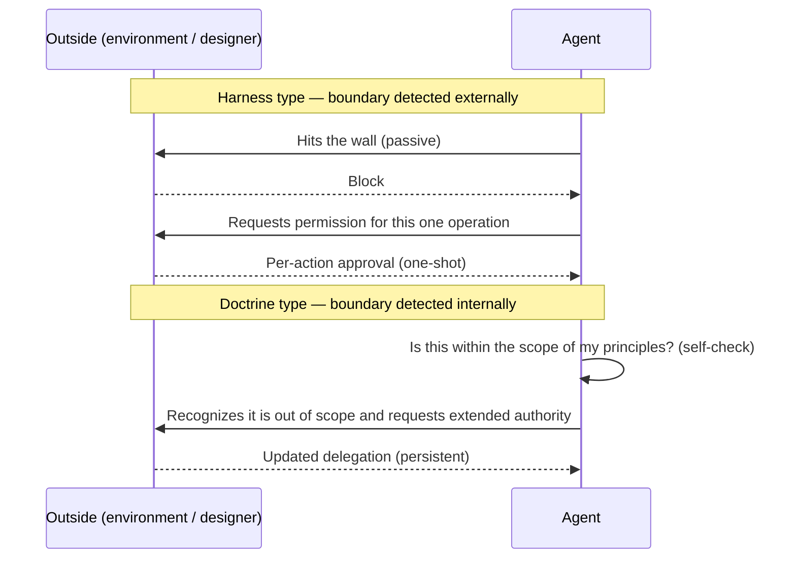
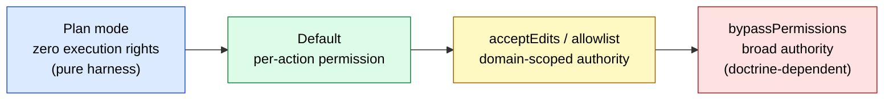
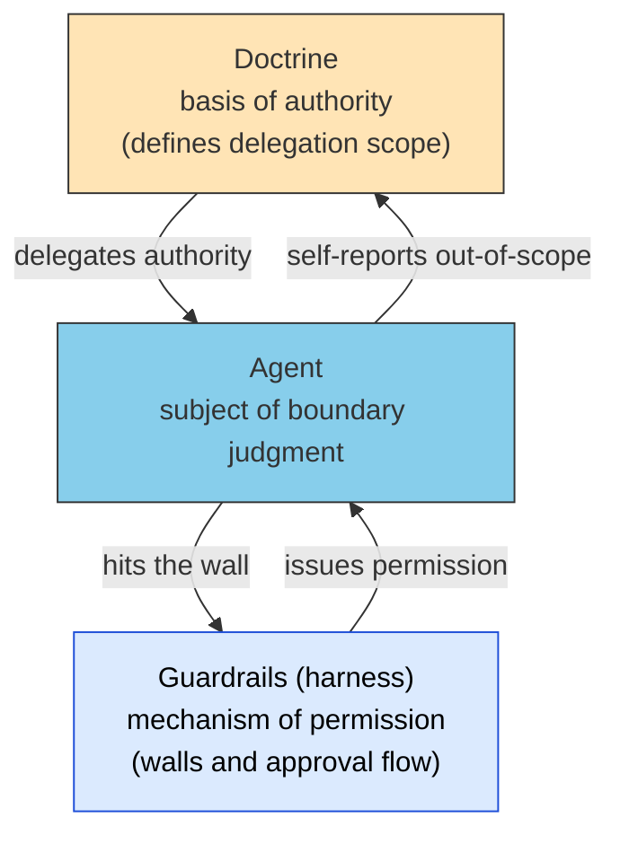

# Permission vs. Authority — What Agents Ask For at the Boundary

> Harness-type agents ask for permission; doctrine-type agents ask for authority. The granularity of the request, the locus of boundary detection, and the failure modes all invert symmetrically.

## About This Document

> [!NOTE]
> [Harness Engineering Mapping](./harness-engineering-mapping) covered the **static structural correspondence** between harness and the 5-layer model. This page is its sequel: it covers the difference in **dynamic behavior** — what a harness-type agent (driven by external constraints) and a doctrine-type agent (driven by internalized principles) each request when they reach a control boundary.

> **Audience**: people designing agent autonomy levels, and anyone who wants to understand Claude Code's permission modes as a design principle rather than a list of settings

> [!TIP]
> **In three lines**
>
> - Permission is one-shot, per-action approval; authority is a persistent, recursive grant of discretion. They differ in temporal durability.
> - Harness-type agents have boundary detection externalized (the wall stops them). Doctrine-type agents have it internalized (they ask themselves about scope).
> - The failure modes also invert: harness-type agents freeze waiting for approval; doctrine-type agents over-interpret their mandate and run wild.

## Permission vs. Authority — A Difference in Temporal Durability

The decisive point is that "permission" and "authority" differ in **temporal durability**.

- **Permission** is per-action approval: "May I perform this one operation, right now?" Even when granted, nothing remains in the agent's hands afterward. It asks again next time. **One-shot and repetitive.**
- **Authority** is the **grant of standing** to make that kind of judgment at one's own discretion from now on: "Please make this domain mine to decide." Once granted, it can be exercised **persistently and recursively**.

| | Permission | Authority |
| --- | --- | --- |
| Granularity | Individual action | Domain of judgment |
| Durability | One-shot (consumed per action) | Persistent (held over a domain) |
| Repetition | Requested every time | Granted once, exercised recursively |
| Question at the boundary | "May I do this operation?" | "May this domain become mine to decide?" |
| Security-engineering counterpart | ACL (checked per access) | Capability (a holdable, delegable token) |

> [!IMPORTANT]
> A harness-type agent is structurally designed never to hold durable authority — **granting authority would erode the meaning of the outer wall**. So it has no choice but to repeat per-action approvals. A doctrine-type agent, by contrast, has already received a delegation the moment it was given principles: "within the scope of these principles, decide for yourself." What it asks for at the boundary is therefore an **update or extension** of that authority.

This distinction is not an improvised metaphor. It is isomorphic to the ACL vs. capability-based security contrast in security engineering and to delegation in principal-agent theory — a structure already validated in prior fields.

## The Locus of Boundary Detection — Who Notices the Boundary

There is a further asymmetry: **who detects that the boundary is near**.

- **In the harness type, boundary judgment is externalized.** The agent need not even know it is near the boundary — the wall stops it. It is **passive** toward the boundary; the approval process starts only after collision.
- **In the doctrine type, boundary judgment is internalized.** The agent asks itself, "Is this within the scope of my principles?" It is **active** toward the boundary; an agent that recognizes it is out of scope self-reports and requests authority.

The capacity to *ask for permission* is itself conferred by the harness (an external device — the wall — generates the approval flow), while the capacity to *ask for authority* is conferred by doctrine (an internal device — the principles — generates the meta-judgment of measuring one's own scope). **Even the quality of the request is determined by where control resides.**

## The Symmetry of Failure Modes

Because the locus of boundary detection is inverted, the ways of breaking invert too.

| | Harness-type failure | Doctrine-type failure |
| --- | --- | --- |
| Form | Stalls waiting for approval: excessive timidity, deadlock | Over-interprets its own authority: expansive readings of principles, deviation |
| Character | Safe but rigid | Flexible but unruly |
| Detectability | Easy (you can see it has stopped) | Hard (it keeps moving, so deviation stays invisible) |
| Countermeasures | Gradual delegation via allowlists, raising the autonomy level | Audit logs, [quality gates](../agents/subagent-quality-gate), explicit scoping of principles |

> [!WARNING]
> The most important point in practice is the **asymmetry of detectability**. A harness-type failure (a stall) is noticed immediately, but a doctrine-type failure (expansive interpretation) keeps making progress on the task, so discovery is delayed. If you delegate authority, designing **detection devices (audits, quality gates) as a set** is a MUST.

## No Pure Type Exists — The Delegation Spectrum

Real-world agents are neither purely harness-type nor purely doctrine-type; they sit on a **spectrum** between the two. Claude Code's permission modes are a prime example — a UI that implements gradual delegation from permission to authority.

| Claude Code mechanism | Position on the spectrum | [Autonomy level from Chapter 07](../concepts/07-doctrine-and-intent) |
| --- | --- | --- |
| Plan mode | Pure harness (proposals only, zero execution rights) | Level 1 (fully supervised) |
| Default (confirm each action) | Repeated permission | Level 2 |
| `acceptEdits` / allowlist | Domain-scoped authority | Level 3 |
| `bypassPermissions` | Broad authority (safety depends on doctrine) | Level 4 (full autonomy) |

> [!TIP]
> An allowlist can be read as a **device that converts a bundle of one-shot permissions into durable authority**. The moment you choose "always allow this operation," permission is converted into authority over that operation class. Movement along the delegation spectrum is realized by accumulating these conversions.

> [!CAUTION]
> The further you move toward the right end of the spectrum (broad authority), the more the basis of safety **migrates from the wall to doctrine**. Whether `bypassPermissions` can be operated safely depends directly on the quality of the Doctrine layer (explicit objectives, constraints, judgment criteria, and scope). Moving to the right end with an empty doctrine is a design that invites doctrine-type failure with no detection devices.

## Relation to the 5-Layer Model

The mechanism of permission is provided by the harness (Guardrails); the basis of authority is provided by the Doctrine layer. The subject performing boundary judgment is the Agent layer.

[Harness Engineering Mapping](./harness-engineering-mapping) established that "Guardrails correspond only to the defensive aspect of Doctrine." Restated in this page's vocabulary: **Guardrails manage permission; Doctrine defines authority.** The reason harness does not include the offensive side of the Doctrine layer (normative strength declarations) is that harness has no vocabulary for authority.

## Related Documents

- [strategy/harness-engineering-mapping](./harness-engineering-mapping) — the static correspondence between the four harness elements and the 5-layer model (the premise of this page)
- [concepts/07-doctrine-and-intent](../concepts/07-doctrine-and-intent) — the Doctrine layer in detail, autonomy levels 1–4
- [agents/subagent-quality-gate](../agents/subagent-quality-gate) — quality gates as detection devices for doctrine-type failure (expansive interpretation)
- [mcp/security](../mcp/security) — authority management at MCP boundaries
- [strategy/deterministic-verdicts](./deterministic-verdicts) — delegating **the power to issue a verdict** rather than discretion over actions; actions can be undone, a verdict absorbed downstream cannot

## 🔗 Going Deeper: Why It Is Hard to Hand LLMs Durable Authority

This page covered the **structure (What/How)** of permission and authority. To understand from the LLM's structural constraints **why** durable delegation of authority to an LLM is difficult, see the sister site.

- [understanding-llm / Appendix: Authority and LLM Constraints](https://shuji-bonji.github.io/understanding-llm-through-claude-code/appendix/authority-and-llm-constraints) — how Instruction Decay, Sycophancy, and Context Rot erode the self-judgment of scope
- [understanding-llm / Judgment Drift](https://shuji-bonji.github.io/understanding-llm-through-claude-code/appendix/judgment-drift) — the three layers behind verdicts that do not reproduce once judging is delegated

---

> **Previous**: [Harness Engineering Mapping](./harness-engineering-mapping.md)
> **Next**: [Weight vs. Context Specialization](./specialization-weights-vs-context.md)

**Last updated**: June 2026
