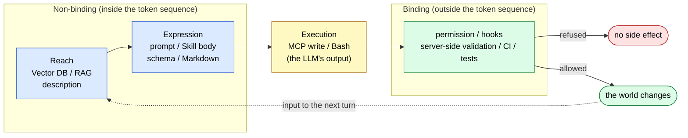

# Proposal vs. Binding — The Reach / Expression / Execution / Binding Layers

> What makes something binding is not whether its processing is deterministic. It is whether its output lands in the token sequence.

## About This Document

RAG, vector DBs, MCP, Skills, prompts. All of them end up as text in the LLM's context window. That makes the observation "this is all about structuring data so the model can read it" a fair one. The observation is sound, but using it alone as a design principle pushes the layer that **actually decides outcomes** out of view.

This page defines the coordinate system you put in place before evaluating any individual technology. It covers three things: (1) the question that separates what binds from what does not, (2) the two distinct jobs hiding inside the token sequence — reach and expression, and (3) the four-layer placement, and what happens when layers are confused.

> **Audience**: people who place RAG, MCP, Skills, and permission side by side in one design, and anyone who wants to explain "I wrote it in the prompt and it still wasn't followed" in terms of layers

::: warning Where This Page Sits
This page covers only the coordinate system. The designs that sit on top of it live elsewhere. For **how to design the judgment part of the binding layer**, see [Deterministic Verdicts](./deterministic-verdicts). For **what an agent asks for at the binding boundary**, see [Permission vs. Authority](./permission-vs-authority). For the **static correspondence between harness and the 5-layer model**, see [Harness Engineering Mapping](./harness-engineering-mapping).
:::

::: details Metadata

|                            |                                                                                                                            |
| -------------------------- | -------------------------------------------------------------------------------------------------------------------------- |
| **What this page fixes**   | The binding / non-binding test question, the reach vs. expression distinction, the four-layer definition, per-technology placement, the three-point design check |
| **Out of scope**           | Internal design of the judgment layer (→ [deterministic-verdicts](./deterministic-verdicts)), request forms at the boundary (→ [permission-vs-authority](./permission-vs-authority)), individual MCP implementation (→ [mcp/development](../mcp/development)) |
| **Depends on**             | [harness-engineering-mapping](./harness-engineering-mapping)                                                                |
| **Common misreadings**     | Assuming retrieval binds because retrieval code is deterministic; treating schema validation as binding on *whether* a tool should be called; counting CLAUDE.md prohibitions as part of the binding layer |

:::

> [!TIP]
> **In three lines**
>
> - Whether something binds is decided by **whether its output enters the token sequence** — not by whether the processing itself is deterministic.
> - The inside of the token sequence splits into two jobs: **reach** (what becomes a candidate) and **expression** (whether it is misread once it arrives). Neither substitutes for the other.
> - The most common mistake is writing something you intend as binding and landing in the expression layer instead. Prompt prohibitions are exactly this.

## The Starting Observation, and What It Misses

The LLM has one input: a single token sequence. RAG results, MCP responses, Skill bodies, prompts — all of them converge on being lined up there. "It's all data structuring" captures that fact correctly.

What it misses is that **no matter how precise the structuring, the model can still emit output that ignores it**. Structuring moves the output distribution; it does not fix it. Where in the design something *is* fixed does not follow from the structuring discussion at all.

## The Dividing Line — What Decides the Outcome

One question is enough.

> [!IMPORTANT]
> **If the LLM emits output that ignores the instruction, does the outcome change?**
>
> - It changes → **non-binding**. This is a proposal, nothing more.
> - It does not change → **binding**. The outcome is fixed here.

| Side                                    | Contents                                                                     | Binds                        |
| --------------------------------------- | ---------------------------------------------------------------------------- | ---------------------------- |
| **Enters the token sequence**           | RAG results, prompts, Skill bodies, tool descriptions, MCP responses          | No                           |
| **The boundary: the LLM's own output**  | Which tool gets called, with which arguments                                  | Decided probabilistically    |
| **Stays outside the token sequence**    | permission, hooks, server-side argument validation, type checks, CI, tests    | Yes                          |

The intuition "control mechanisms are a separate thing from structuring" is correct for **the third row only**. CLAUDE.md prohibitions, prompt warnings, cautionary notes in a tool description — all look like control, and all sit in the first row.

> [!WARNING]
> **Whether the processing itself is deterministic has no bearing on whether it binds.**
>
> Vector DB retrieval is deterministic code: the same query returns the same result. The result still enters the context, so the model can emit output that ignores it. Conversely, permission takes the LLM's output as its input, yet the decision completes outside the token sequence — so it binds. Being a deterministic implementation and fixing an outcome are two different properties.

## Inside the Token Sequence — Reach and Expression

What gets called "data structuring" contains two jobs with different purposes.

| Category       | Question                                       | Typical instances                                              |
| -------------- | ---------------------------------------------- | -------------------------------------------------------------- |
| **Reach**      | What becomes a candidate for the context?      | Vector DB retrieval, Skill `description` triggering, tool descriptions |
| **Expression** | Once it arrives, is it in a form that won't be misread? | Markdown structure, schema definitions, prompt body, Skill body |

Good reach with poor expression produces misreadings. Good expression with poor reach never enters the context at all. Strengthening one does not substitute for the other.

## The Four Layers

| Layer          | Binds       | Question                        | Typical instances                                     |
| -------------- | ----------- | ------------------------------- | ----------------------------------------------------- |
| **Reach**      | No          | What becomes a candidate?       | Vector DB / RAG, selection by description             |
| **Expression** | No          | Is it in a form that won't be misread? | Prompts, Skill bodies, schemas, formatted responses |
| **Execution**  | Boundary    | What gets called, and how?      | MCP write tools, Bash                                  |
| **Binding**    | Yes         | Allow it, or refuse it?         | permission / hooks, server-side validation, types / CI / tests |

Execution results feed back into reach and expression on the next turn. This loop is the same one described in [Harness Engineering Mapping](./harness-engineering-mapping) as steps ①–④, cut along a different axis: whether each step binds.

### Where Each Technology Sits

| Technology              | Reach                 | Expression              | Execution        | Binding                       |
| ----------------------- | --------------------- | ----------------------- | ---------------- | ----------------------------- |
| Vector DB / RAG         | ◎                     | ○                       | –                | –                             |
| Prompts                 | –                     | ◎                       | –                | –                             |
| Skills                  | ○ (description)       | ◎ (body)                | –                | –                             |
| MCP                     | ○ (tool description)  | ○ (response formatting) | ◎ (write tools)  | ○ (argument validation, schema) |
| permission / hooks / CI | –                     | –                       | –                | ◎                             |

**MCP is the only one that spans all four.** Treating MCP purely as a data-structuring mechanism drops the one binding part it has — server-side argument validation and schema refusal — out of the design.

> [!WARNING]
> **Schema validation binds only on "how it is called."**
>
> A schema can refuse malformed arguments. It cannot refuse calling that tool in a situation where it should not be called. That decision belongs to permission and needs a separate mechanism. → [Permission vs. Authority](./permission-vs-authority)

## Common Misreadings

| Misreading                                        | What it actually is                                                             |
| ------------------------------------------------- | ------------------------------------------------------------------------------- |
| "It's safe, the prohibition is in CLAUDE.md"      | Expression layer. If ignored, the outcome changes                                |
| "The prompt says not to allow it"                 | A request to the proposing side, not the binding layer                           |
| "Schema validation is in place, so it's safe"     | Refuses argument shape only; whether to call at all is a different layer         |
| "Enough RAG and binding becomes unnecessary"      | Strengthens reach and expression; the locus of approval does not move            |
| "Put a second LLM in the approver role and it binds" | Separating actors does catch uncorrelated errors, but the approval decision stays probabilistic |

Do not read that last row as pure negation. **Separating the actors has real value**: errors decorrelate between the proposing side and the approving side, so cases where only one of them is wrong become detectable. The layer does not change, though, and it is no substitute for the binding layer.

## The Proposing Actor and the Approving Actor

The reason this four-layer split is needed comes down to one sentence.

> [!IMPORTANT]
> When the actor that proposes also decides whether to approve, **a correct judgment** and **a judgment that happened to be right** become indistinguishable.

However much justification the proposing side supplies, that justification sits in the expression layer. The quality of the justification and the granting of approval have to be decided in different layers. When both live in the same actor and the same layer, no way remains to tell them apart after the fact.

Note also that a decision placed in the binding layer loses force if its **input** is controlled by the proposing side. If the evaluator reads only the agent's self-report, the decision is formally outside but substantively inside. For the design of judgment-layer inputs and reproducibility, see [Deterministic Verdicts](./deterministic-verdicts).

## A Three-Point Design Check

Ask these three every time you add a mechanism.

1. Which is it — **reach / expression / execution / binding**?
2. **If the LLM ignores it, does the outcome change?** (If yes, it is not the binding layer.)
3. If you placed it in the binding layer, **is its input controlled by the proposing side?**

Structuring (reach and expression) raises the quality of proposals. Binding decides whether approval and execution succeed. Both are required, and thickening one is never a substitute for the other.

## Related Documents

- [strategy/harness-engineering-mapping](./harness-engineering-mapping) — static correspondence between the harness's four elements and the 5-layer model; the premise of this page
- [strategy/permission-vs-authority](./permission-vs-authority) — what harness-type and doctrine-type agents ask for at the binding boundary
- [strategy/deterministic-verdicts](./deterministic-verdicts) — how to design the judgment part of the binding layer; the observation / judgment / narration split
- [strategy/mcp-family](./mcp-family) — "judgment in code, narrative in the LLM" stated as an intra-family discipline
- [mcp/semantic-layer](../mcp/semantic-layer) — probabilistic interpretation vs. deterministic compilation; the same shape in another domain
- [concepts/05-solving-ai-limitations](../concepts/05-solving-ai-limitations) — separating probabilistic inference from deterministic verification

## 🔗 Going Deeper: Why the Expression Layer Cannot Bind

This page covered the **classification (What/How)** of the layers. To understand **why** instructions written into the context sometimes go unfollowed, in terms of the LLM's structural constraints, see the sister site.

- [understanding-llm / Authority and LLM Structural Constraints](https://shuji-bonji.github.io/understanding-llm-through-claude-code/appendix/authority-and-llm-constraints) — how Instruction Decay, Context Rot, and Sycophancy erode "holding on to a principle"
- [understanding-llm / Judgment Drift](https://shuji-bonji.github.io/understanding-llm-through-claude-code/appendix/judgment-drift) — the three layers behind verdicts that do not reproduce once judging sits in the LLM

---

> **Previous**: [Harness Engineering Mapping](./harness-engineering-mapping.md)
> **Next**: [Permission vs. Authority](./permission-vs-authority.md)

**Last updated**: August 2026
