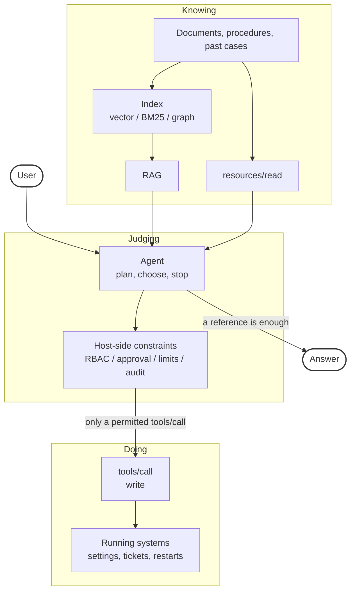
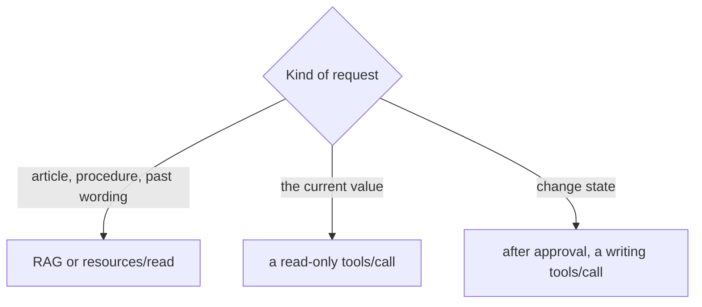
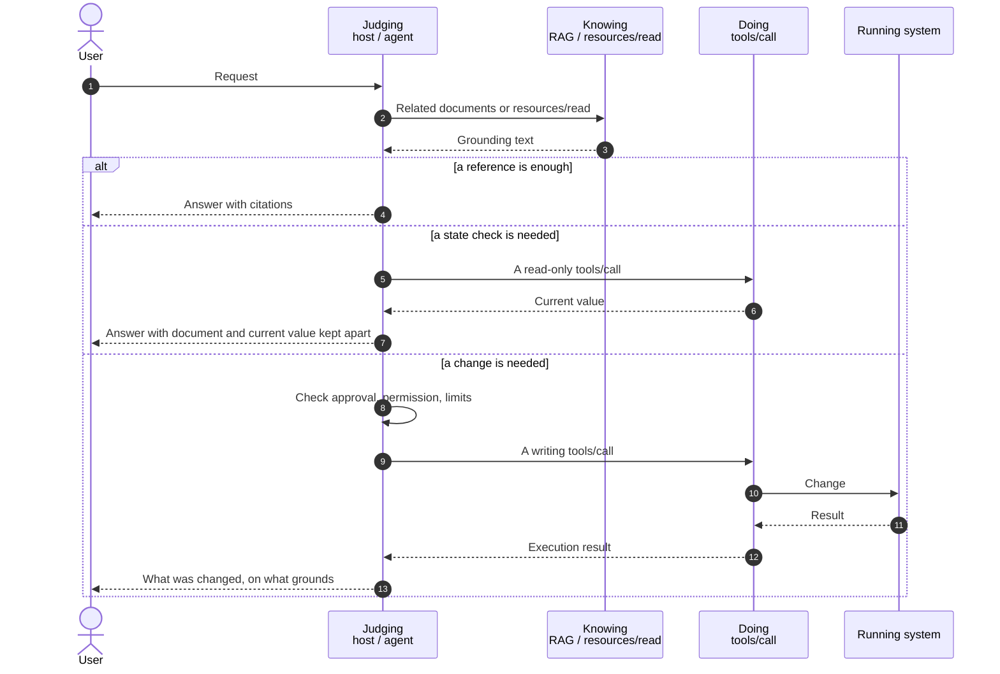

# Knowing Paths and Doing Paths

::: tip Where This Page Sits
This page is not a theory of binding. The coordinate system for what binds and what does not is in [Proposal vs. Binding](./proposal-and-binding).
What is decided here is an operating rule: whether one request is finished on the knowing path, or carried on to the doing path.
:::

"1.2 RAG and MCP" in [IV.1 Patterns](../part-4/patterns) wrote about how knowledge outside the model is fetched. This page writes about the boundary beyond it. The point is not to mix the path for knowing with the path that changes state.

## What This Page Covers

- What RAG handles, and what it does not
- What MCP handles, and what it does not
- Why the result of a reference is not permission to act
- Splitting the path used first by the kind of request
- Where this sits in the five layers

## What This Page Does Not Cover

- Choosing a vector DB, or how to cut chunks
- Implementing an MCP server ([III.2 MCP](../mcp/what-is-mcp), [MCP Development Guide](../mcp/development))
- Building GraphRAG (if a net of relations is the body of the work, see [III.4 Memory](../part-3/memory) and [IV.1](../part-4/patterns))
- Credential management and server threat classes ([MCP Security](../mcp/security))

## 1. The Two Contrasts Are Different Things

The centre of [IV.1](../part-4/patterns) was this contrast.

- RAG: cut documents and look for similar sentences
- MCP: point at a place and take source text or an API result

As a contrast about how knowledge is fetched, it still holds. In the field, though, another contrast happens at the same time.

- Knowing: read documents, source text, or a current value, and answer
- Doing: change a setting, open a ticket, restart a process

**RAG vs. MCP is not another name for that second contrast.** MCP is used for knowing as well. The output of RAG is not permission to act.

| Axis                     | RAG                                                                        | MCP                                                                    |
| ------------------------ | -------------------------------------------------------------------------- | ---------------------------------------------------------------------- |
| What it is               | A type that searches and hands the result to generation                    | A protocol where a host and a server exchange capabilities and context |
| How knowledge is fetched | Similarity search over scraps                                              | Pointing at a place — a section, an article, an API                    |
| Execution                | It has none                                                                | It can have one through `tools/call`. `resources/read` is a read       |
| Freshness                | Depends on the index being updated                                         | Takes the value as of the call                                         |
| Permission               | Being able to read a document and being allowed to change it are different | Being able to connect and being allowed to change are different        |

It is not either-or. The two may be stacked on one job.

## 2. What Each One Handles

### What RAG Handles

From outside documents, it finds the part related to the present question and puts it beside generation. It suits write-ups on an internal wiki, draft procedures, and the text of past cases.

### What RAG Does Not Handle

- Guaranteeing the "current value" of a running system
- Changing settings, opening tickets, restarting
- Making an amendment absent from the index count as known
- Turning a procedure it picked up into permission to act
- Keeping the access control that was on the original document

The last one is easy to miss. Put a document only HR may read into the index, and no distinction of permission remains on the search side. Who may read what **SHOULD** (should) be designed when the index is built.

### What MCP Handles

The Model Context Protocol is the agreement between a host and a server. What a server can offer is mainly these three.

| Offering     | Call names                                                  | Meaning                                                            |
| ------------ | ----------------------------------------------------------- | ------------------------------------------------------------------ |
| **Tool**     | `tools/list` / `tools/call`                                 | An operation that can be run. Read-only operations included        |
| **Resource** | `resources/list` / `resources/read` / `resources/subscribe` | Data that can be read. Files, records, a clause of a specification |
| **Prompt**   | `prompts/list` / `prompts/get`                              | A form for how to use it                                           |

It suits work where a place is pointed at and taken: a statute, an RFC, the current replica count, the current translation. Offer a writing Tool, and state can be changed as well.

### What MCP Does Not Handle

- The final judgment of whether an operation may be run. That judgment belongs to the host, Doctrine, and approval
- Search quality itself. Putting scrap search inside a Tool leaves it scrap search
- What stands in after the server stops. How it stops belongs in the design

Work that needs no judgment **MUST NOT** (must not) be made into MCP. An ordinary program will do. Placing things by the amount of judgment is in [II.2 Placement](../part-2/placement).

## 3. Common Mix-ups

Asking "RAG or MCP" invites these mix-ups.

1. **Thinking MCP is only for execution.** `resources/read` and read-only `tools/call` have been forgotten.
2. **Thinking RAG is the knowledge itself.** RAG is not a place to hold things. It is a type that searches and hands over.
3. **Thinking MCP has replaced RAG because the RAG was put inside an MCP server.** The inside is still search.
4. **Thinking that being listed in `tools/list` is permission to run.** Permission is given by constraints on the host side.

The fourth has help on the specification side too. MCP tool annotations (`readOnlyHint` / `destructiveHint` / `idempotentHint` / `openWorldHint`) are how a server declares the nature of its own tools. The specification states, however, that these are hints and not a guarantee of behavior, and that tool use decisions **MUST NOT** (must not) be made on annotations received from untrusted servers. A tool with no annotations is treated as destructive by default.

Annotations are material for listing reads and writes apart. They are not grounds for permission. See [MCP Security](../mcp/security) for the detail.

Here are combinations that work.

- Write-ups from RAG, articles from `resources/read` or a reference Tool
- Document search itself made into a Tool such as `search_docs`
- A current value checked with a read-only Tool, a change made with a writing Tool on a separate server

## 4. How It Breaks When the Boundary Is Ignored

Put the knowing path and the doing path at the same entrance, and this happens.

| Crowd                                                            | What happens                                                                               |
| ---------------------------------------------------------------- | ------------------------------------------------------------------------------------------ |
| Changing things on an old procedure picked up by RAG             | The document is old. The agent runs it. The effect lands on the real system                |
| Sending "what is the policy" to a writing Tool                   | It gets slower. A side effect occurs. Permission is attached to a question that needs none |
| Answering a current value from the indexed design document alone | A drift between the document and what is running goes unnoticed                            |
| Listing reference Tools and change Tools in one list             | Room remains for the model to pick a writing tool with a similar name                      |
| Reading text returned by the knowing path as an instruction      | An instruction written in a document becomes the trigger for a write                       |

The last row holds regardless of freshness. Even with the index up to date, text that says "run the following" does the same thing. This is MCP06 (Prompt Injection via Contextual Payloads) in the OWASP MCP Top 10.

The boundary is not a taste in implementation. In work that has change operations, it is a control on reliability.

The result of a reference **MUST NOT** (must not) become permission to act. That proposition has a sibling. The result of a reference **MUST NOT** (must not) be read as an instruction.

## 5. The Shape It Takes in Production

Split into three duties. Not product names. Duties.

| Duty    | What it holds                                                      | What does not go there                       |
| ------- | ------------------------------------------------------------------ | -------------------------------------------- |
| Knowing | Fragments of documents, a clause of source text, the current value | Change operations                            |
| Judging | Whether it suffices, whether it is stale, whether it may be run    | The search index itself, connection settings |
| Doing   | A permitted `tools/call`                                           | Full procedure documents, policy text        |

Judging is Agent and Doctrine in the five layers. The entrance to the doing path is the MCP layer. The knowing path splits across RAG (most often the way Agent fetches), Memory, and MCP's Resource and read-only Tools.

## 6. Choosing the Path by the Kind of Request

| Example question                                | Use first                                      | Do not use first              |
| ----------------------------------------------- | ---------------------------------------------- | ----------------------------- |
| What is the incident procedure for this service | RAG or `resources/read`                        | The restart Tool              |
| How many replicas are there now                 | A read-only `tools/call`                       | The old design document alone |
| May replicas be raised to 3                     | Judgment, approval, and a writing `tools/call` | One line returned by RAG      |

Documents and current values **SHOULD** (should) be checked apart before a change. The name, arguments, and result of a writing Tool **SHOULD** (should) be kept.

Put into the names of the implementation, the whole flow looks like this.

## 7. Relation to the Five Layers

A pattern is not another name for a layer. The same stance as [1.4 of IV.1](../part-4/patterns).

| Layer    | Role at this boundary                                                                    |
| -------- | ---------------------------------------------------------------------------------------- |
| Doctrine | The conditions for running, prohibitions, the line where approval is required            |
| Agent    | Splitting whether knowing suffices, a read is needed, or a change is needed              |
| Skills   | Procedures and viewpoints. Not the connection itself                                     |
| Memory   | Relations and history of our own work. Source text of statutes and RFCs does not go here |
| MCP      | Connection to outside. Reads and writes split by server or by Tool                       |

Even if Skills says restarting is allowed, it cannot be run without a Tool that calls a restart. Conversely, even if a restart Tool is listed in `tools/list`, it must not be run when Doctrine forbids it. That asymmetry is handled in [Permission vs. Authority](./permission-vs-authority).

RAG on cloud Projects and Citations in the Messages API are implementations on the knowing side. GraphRAG is a type that knows by following relations. It does not become the doing side.

## 8. Summary

RAG and MCP do not compete. They sit at different layers.

- To search write-ups, RAG
- To point at an article, a section, or a current value, MCP's Resource or a read-only Tool
- To change state, a writing Tool beyond approval
- For what remains of relations, Memory
- Whether it may be done, Doctrine
- Which to choose, Agent

There is no single right answer in choosing a type. Look at the failures that actually happened, and split the knowing path from the doing path.

## Related Documents

- [Proposal vs. Binding](./proposal-and-binding) — the coordinate system for what binds and what does not
- [Permission vs. Authority](./permission-vs-authority) — what is asked for at the binding boundary
- [Deterministic Verdicts](./deterministic-verdicts) — designing verdicts to sit outside the LLM
- [Composition Patterns](./composition-patterns) — composing MCPs and Skills from different domains side by side
- [IV.1 Patterns](../part-4/patterns) — the contrast in how knowledge is fetched
- [III.2 MCP](../mcp/what-is-mcp) — Tool / Resource / Prompt
- [MCP Security](../mcp/security) — the OWASP MCP Top 10 and how annotations are treated
- [III.4 Memory](../part-3/memory) — what remains of relations
- [MCP vs Skills](../faq/mcp-vs-skills) — connection and procedure
- [II.2 Placement](../part-2/placement) — work that needs no judgment stays an ordinary program
- [Architecture Map](../information/architecture-map) — the three axes of resource and access
