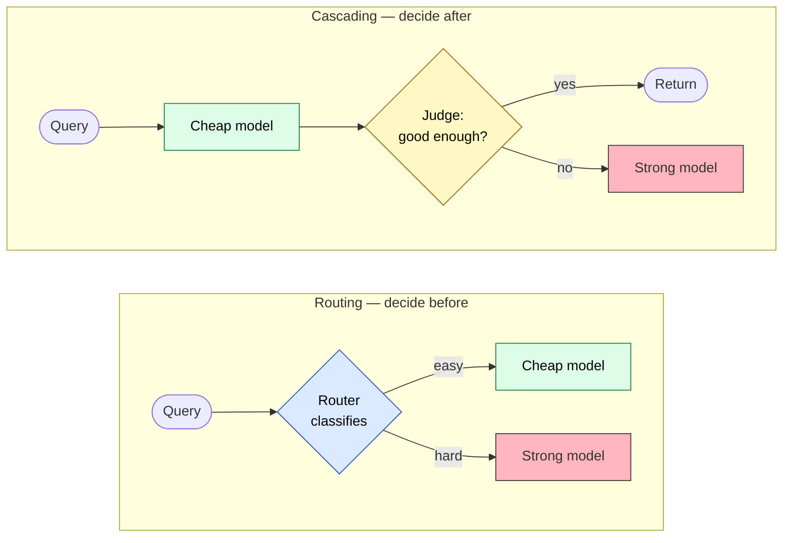
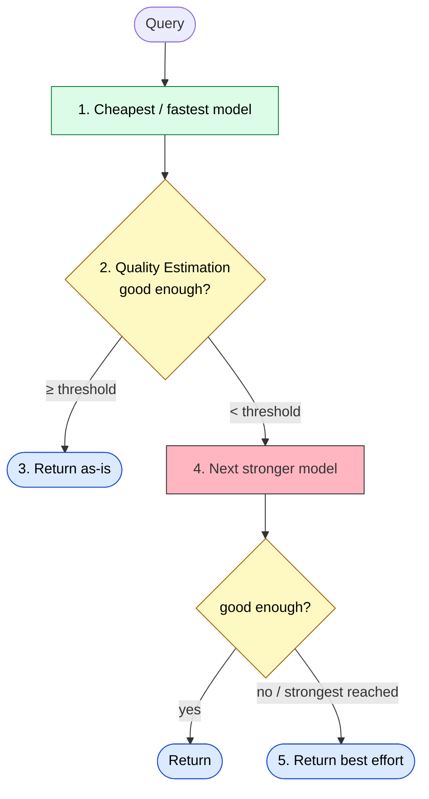
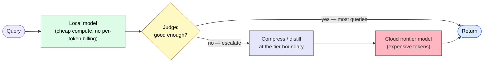

# Routing vs. Cascading — Allocating Queries Across Models by Cost and Quality

> Routing decides **before** the model runs; cascading decides **after** it has answered. One buys predictable latency, the other buys lower average cost.

## About This Document

Once you have more than one model available — a cheap local model and an expensive cloud model, or a small and a large variant of the same family — the design question stops being "which model" and becomes "**which model for which query**." Answer it badly and you either burn the frontier model on trivial queries, or you route hard queries to a model that quietly gets them wrong.

There are two foundational answers, and they differ on **when** the decision is made. **Routing** classifies the query up front and picks one model. **Cascading** runs the cheap model first, judges the output, and escalates only if it falls short. This page lets you choose between them on principle, and shows why they are the natural control layer for a **local + cloud tier** setup.

::: warning Positioning of This Document
This is a strategy-layer document that builds on the three-layer model in [03-architecture](./../concepts/03-architecture) and the pattern selection in [04-ai-design-patterns](./../concepts/04-ai-design-patterns). Where [specialization-weights-vs-context](./specialization-weights-vs-context) addresses *how to build a specialist*, this page addresses *how to allocate queries across a fleet of models you already have*. It is the policy layer that sits on top of [What is A2A](./../agents/what-is-a2a).
:::

::: details Meta Information

| | |
| --- | --- |
| **What this page establishes** | The selection axis (decide-before vs. decide-after), a decision heuristic, and the local + cloud tier mapping |
| **What this page does NOT cover** | Router training recipes, specific Judge model hyperparameters (see each paper's primary source) |
| **Dependencies** | [03-architecture](./../concepts/03-architecture), [04-ai-design-patterns](./../concepts/04-ai-design-patterns), [What is A2A](./../agents/what-is-a2a) |
| **Common misuse** | Treating "routing vs. cascading" as either/or; entangling the routing decision with the compression decision so you can't tell which one moved the metric |

:::

## In One Sentence

Both strategies spend the least per query across multiple models. They differ only on **when the allocation decision is made**.

- **Routing** = "pick the right model up front" — classify the query *before* generation, run **one** model.
- **Cascading** = "try cheap, escalate if it's not good enough" — judge the output *after* generation, run **one or more** models in sequence.

### The core differences

| Aspect | **Routing** | **Cascading** |
| --- | --- | --- |
| When the decision is made | **Right after receiving the query** (before generation) | **After generation**, by evaluating quality, then escalating if needed |
| Models actually run | Basically **one** | **One or more in sequence** |
| Core strategy | "Which model fits this query?" — classify up front | "Is a cheap model enough? → if not, go stronger" |
| Representative work | RouteLLM, Semantic Routing | **FrugalGPT** (the canonical reference) |
| Strength | Simple, predictable latency | Large cost savings (most queries clear on the cheap model) |
| Weakness | Router accuracy directly caps overall quality | Worst case calls multiple models, hurting latency + Judge cost |

## Routing — Choosing the Model Up Front

**Definition**: given an input query, decide **which LLM to use before generating anything**.

### Routing methods

| Method | What it does | Trait / difficulty |
| --- | --- | --- |
| **Static / Rule-based** | Fixed rules by query type or user attribute | Simplest, least flexible |
| **Classifier-based** | A small model (or LLM) judges difficulty / category | Commonly used |
| **Semantic Routing** | Compare the query embedding to each model's representative-query embeddings | Routes by natural-language similarity |
| **LLM-as-a-Router** | Have another LLM decide "which model fits this query" | Accurate but costly |
| **Learned Router** | Train the router on past data, as in RouteLLM | The most active research area |

**Merits**: cuts needless calls to a high-end model; makes it easy to exploit specialist models (coding, search); keeps the cost/quality balance tunable.

**Challenges**: the router's own accuracy is decisive — misrouting a hard query to a weak model collapses quality. The routing decision itself adds overhead.

> [!IMPORTANT]
> A router **SHOULD** be cheaper and faster than the difference between the models it chooses between. If the router costs as much as just calling the strong model, routing is a net loss. This is the routing-specific form of the universal "the gatekeeper must be cheaper than the gate" rule.

## Cascading — Try Cheap, Escalate on Demand

**Definition**: try models from cheap/fast to expensive, and **escalate to a stronger model only when the output quality is judged insufficient**.

The canonical reference is **FrugalGPT** (Stanford, 2023), which matched GPT-4 quality with up to **98% cost reduction** by learning which cascade of models to use per query.

### Typical cascade flow

### Cascade variants

- **Simple Cascade** — weak → strong in a fixed order.
- **Confidence-based Cascade** — escalate based on the model's own output confidence.
- **Judge-based Cascade** — a separate model (or the same one) decides "is this answer enough?" (the approach in FrugalGPT).
- **Cascade Routing** (unified) — combine routing and cascading; see below.

**Merits**: when most queries are in fact *easy*, the cheap model clears them and average cost drops sharply, while overall quality stays near the strongest model.

**Challenges**: the Judge's accuracy is decisive; the worst case calls several models and worsens latency; the Judge model is itself an added cost.

> [!WARNING]
> The hardest part of a cascade is **Quality Estimation (the Judge)**. A weak Judge is worse than no cascade: it passes bad answers through (quality collapse) *and* escalates good answers needlessly (cost blow-up). Designing the Judge is the real engineering problem — not wiring the models together.

## Choosing Between Them

| Situation / goal | Recommended | Why |
| --- | --- | --- |
| Models have clearly distinct strengths | **Routing** | You can pick the optimal model from the start |
| Most queries are relatively easy | **Cascading** | A high fraction clears on the cheap model |
| Maximize quality while capping cost | **Cascading** or **Cascade Routing** | Escalate in stages |
| Strict latency budget | **Routing** | Basically one model call |
| Combine several specialist models | **Routing** | Easy to dispatch by specialty |

> [!TIP]
> Quick rule: if the deciding factor is **specialty**, route. If it is **difficulty**, cascade. If it is **both**, reach for cascade routing.

### Cascade Routing — The Unified Frontier

Recent work frames the choice not as "routing *or* cascading" but as a single optimization. **Cascade routing** ([Dekoninck et al., 2024](https://arxiv.org/abs/2410.10347)) integrates both into a theoretically optimal strategy: route up front *and* keep the option to escalate, choosing per query whichever path minimizes expected cost for a target quality. In their experiments it consistently beats either approach alone.

## Local + Cloud — The Natural Home for These Patterns

Routing and cascading map almost perfectly onto a **local model + cloud model** tier. The cheap/fast tier is the local model; the strong/expensive tier is the cloud frontier model. "Easy locally, hard in the cloud" is exactly the cascade decision.

Two design notes specific to the hybrid tier:

> [!IMPORTANT]
> **Keep the routing decision and the compression decision as separate, composable policies.** "Which tier handles this query" (routing/cascading) and "what context crosses the tier boundary" (a context-optimization layer such as [Headroom](https://github.com/chopratejas/headroom)) are both Doctrine-layer concerns, but entangling them makes it impossible to tell, in an experiment, whether a win came from better routing or better compression. Decide the tier first; compress what crosses the boundary second.

> [!TIP]
> The escalation boundary is also where context compression pays off most. When a cascade escalates from local to cloud, the local model has often already gathered large context (tool outputs, retrieved chunks); compressing it **at the boundary** trims the expensive cloud tokens while the cheap local compute absorbs the compression cost. The cost lands on the cheap side; the benefit lands on the expensive side.

## Implementation Notes

- **Judge design is the crux.** Build it carelessly and overall quality drops hard. Measure the Judge's own accuracy before trusting the cascade.
- **Account for Judge cost.** In a cascade, the Judge runs on every query — its cost is not negligible and must be in the budget.
- **Measure the right axis per deployment.** On cloud tiers measure cost-per-query and quality; on local tiers measure **TTFT, tokens/sec, and VRAM** instead — the "cost saved" number is meaningless when there is no per-token billing.
- **Routing and cascading are not mutually exclusive.** As of 2026, combining them ("cascade routing") is an active and promising direction.

## Related Documents

- [04-ai-design-patterns](./../concepts/04-ai-design-patterns) — which pattern to choose when (WHICH)
- [What is A2A](./../agents/what-is-a2a) — the agent-to-agent substrate routing/cascading policies sit on top of
- [specialization-weights-vs-context](./specialization-weights-vs-context) — building the specialist models a router dispatches to
- [local-llm-workspace-mapping](./local-llm-workspace-mapping) — placing the local tier of a hybrid setup
- [composition-patterns](./composition-patterns) — composing MCP × Skill × Agent within each tier

## 🔗 Deeper: Why Is the Judge So Hard to Trust?

This page covered the **design judgment (What/How)** of allocating queries across models. The hardest part — a model reliably judging whether an answer is "good enough" — runs straight into the LLM's structural limits. To understand **why** self-evaluation is unreliable, see the sibling site.

- [understanding-llm / Hallucination](https://shuji-bonji.github.io/understanding-llm-through-claude-code/01-llm-structural-problems/hallucination/) — why a confident answer is not a correct one
- [understanding-llm / Sycophancy](https://shuji-bonji.github.io/understanding-llm-through-claude-code/01-llm-structural-problems/sycophancy/) — why a model's self-assessment skews agreeable
- [understanding-llm / Context Rot](https://shuji-bonji.github.io/understanding-llm-through-claude-code/01-llm-structural-problems/context-rot/) — why compressing context at the escalation boundary helps the cloud tier

## References

- Chen, L., Zaharia, M., & Zou, J. (2023). "FrugalGPT: How to Use Large Language Models While Reducing Cost and Improving Performance." arXiv. [arxiv.org/abs/2305.05176](https://arxiv.org/abs/2305.05176) — the canonical LLM cascade; matched GPT-4 with up to 98% cost reduction
- Ong, I., et al. (2024). "RouteLLM: Learning to Route LLMs with Preference Data." arXiv. [arxiv.org/abs/2406.18665](https://arxiv.org/abs/2406.18665) — learned routers trained on preference data; >2× cost reduction with transferable routing
- Dekoninck, J., Baader, M., & Vechev, M. (2024). "A Unified Approach to Routing and Cascading for LLMs." arXiv. [arxiv.org/abs/2410.10347](https://arxiv.org/abs/2410.10347) — cascade routing as a theoretically optimal unification of the two strategies
- chopratejas (2026). "Headroom — the context compression layer for AI agents." GitHub. [github.com/chopratejas/headroom](https://github.com/chopratejas/headroom) — a context-optimization layer usable at the tier boundary

---

> **Previous**: [Weight vs. Context Specialization](./specialization-weights-vs-context.md)
> **Next**: [Development Phases](./../workflows/development-phases.md)

**Last updated**: June 2026
