# Skill Construction Roadmap

> Organize the classification system, evaluation criteria, dependency relationships, and construction plans for Skills.

[日本語](/ja/strategy/skill-roadmap)

## About This Document

This document formalizes [Discussion #20](https://github.com/shuji-bonji/ai-agent-toolkit/discussions/20) (Skill Construction Strategy Map) as an official project document.

While MCPs handle "real-time access to external data," Skills handle "static knowledge and judgment criteria" (see [03-architecture.md](../concepts/03-architecture.md)). For the MCP construction strategy, see [mcp-roadmap.md](./mcp-roadmap.md). For composition patterns, see [composition-patterns.md](./composition-patterns.md).

## 5 Skill Types

All Skills are "static knowledge," but the structure differs depending on the type of knowledge.

```mermaid
flowchart TB
    subgraph TYPES["5 Skill Types"]
        direction TB
        PRINCIPLE["🔵 Principle Type<br>Abstract judgment criteria<br>Ex: SOLID, DRY, YAGNI"]
        PATTERN["🟢 Pattern Type<br>Reusable solution catalog<br>Ex: Design Patterns, EIP"]
        METHOD["🟡 Methodology Type<br>Development process & procedures<br>Ex: TDD, BDD, DDD"]
        CHECKLIST["🟠 Checklist Type<br>Verification & review criteria<br>Ex: Coverage Strategy"]
        GUIDELINE["🔴 Guideline Type<br>Style & quality standards<br>Ex: Clean Code"]
    end

    PRINCIPLE -->|"Patterns emerge<br>from principles"| PATTERN
    PRINCIPLE -->|"Principles guide<br>methodologies"| METHOD
    PATTERN -->|"Checklist items emerge<br>from patterns"| CHECKLIST
    METHOD -->|"Guidelines emerge<br>from methodologies"| GUIDELINE

    style PRINCIPLE fill:#4A90D9,color:#fff
    style PATTERN fill:#7BC67E,color:#333
    style METHOD fill:#F5C542,color:#333
    style CHECKLIST fill:#E8945A,color:#333
    style GUIDELINE fill:#D95B5B,color:#fff
```

| Type                 | Form of AI Instruction                            | Approximate Volume                        |
| -------------------- | ------------------------------------------------- | ----------------------------------------- |
| **Principle Type**   | "Determine whether this violates the principle"   | Short (1-3 pages)                         |
| **Pattern Type**     | "Select an applicable pattern for this situation" | Long (proportional to number of patterns) |
| **Methodology Type** | "Execute following this process"                  | Medium                                    |
| **Checklist Type**   | "Check all items and report the results"          | Short                                     |
| **Guideline Type**   | "Improve according to this guideline"             | Medium                                    |

## 5-Axis Skill Evaluation

Skill-specific evaluation criteria corresponding to MCP's 5 axes (Governing Body, Openness, Machine Readability, Structural Clarity, Practical Use Cases).

| Axis                        | Meaning                                                      |
| --------------------------- | ------------------------------------------------------------ |
| **Knowledge Stability**     | How frequently it is updated (Stable ◎ to Volatile △)        |
| **Scope Clarity**           | Whether the boundary with other Skills is clear              |
| **Trigger Clarity**         | Whether it is possible to determine when to use it           |
| **Standalone Completeness** | Whether it can deliver value alone, or requires other Skills |
| **Verifiability**           | Whether the effect can be objectively measured               |

## Individual Skill Evaluations

### Foundation Skills

| Skill          | Type        | Stability | Scope | Trigger | Standalone | Verifiability |
| -------------- | ----------- | --------- | ----- | ------- | ---------- | ------------- |
| **SOLID**      | Principle   | ◎         | ◎     | ◎       | ◎          | ○             |
| **Clean Code** | Guideline   | ◎         | ○     | ◎       | ◎          | △             |
| **TDD**        | Methodology | ◎         | ◎     | ◎       | ◎          | ◎             |

### Design Skills

| Skill                  | Type        | Stability | Scope | Trigger | Standalone | Verifiability |
| ---------------------- | ----------- | --------- | ----- | ------- | ---------- | ------------- |
| **Design Patterns**    | Pattern     | ◎         | ◎     | ○       | ○          | ○             |
| **Clean Architecture** | Principle   | ◎         | ◎     | ○       | ○          | ◎             |
| **DDD**                | Methodology | ◎         | △     | △       | △          | △             |

### Testing Skills

| Skill                 | Type        | Stability | Scope | Trigger | Standalone | Verifiability |
| --------------------- | ----------- | --------- | ----- | ------- | ---------- | ------------- |
| **Test Patterns**     | Pattern     | ○         | ○     | ◎       | ○          | ◎             |
| **BDD**               | Methodology | ◎         | ◎     | ○       | ◎          | ◎             |
| **Coverage Strategy** | Checklist   | ○         | ◎     | ◎       | ○          | ◎             |

### Infrastructure & Architecture Skills

| Skill             | Type      | Stability | Scope | Trigger | Standalone | Verifiability |
| ----------------- | --------- | --------- | ----- | ------- | ---------- | ------------- |
| **12 Factor App** | Principle | ◎         | ◎     | ○       | ◎          | ◎             |
| **Microservices** | Pattern   | ○         | △     | △       | △          | △             |
| **EIP**           | Pattern   | ◎         | ◎     | ○       | ○          | ○             |
| **IaC Patterns**  | Pattern   | ○         | ○     | ○       | ◎          | ○             |

### Quality Improvement Skills

| Skill           | Type    | Stability | Scope | Trigger | Standalone | Verifiability |
| --------------- | ------- | --------- | ----- | ------- | ---------- | ------------- |
| **Refactoring** | Pattern | ◎         | ◎     | ◎       | ○          | ○             |

## Skill Dependency Relationships

Skills have a clear dependency hierarchy. While MCPs can be built independently, Skills require a build order that considers dependencies.

```mermaid
flowchart TB
    subgraph L1["Layer 1: Foundation (Build First)"]
        SOLID["🔵 SOLID"]
        CLEAN_CODE["🔴 Clean Code"]
        TDD["🟡 TDD"]
    end

    subgraph L2["Layer 2: Design"]
        DESIGN_PAT["🟢 Design Patterns"]
        CLEAN_ARCH["🔵 Clean Architecture"]
        BDD["🟡 BDD"]
        TEST_PAT["🟢 Test Patterns"]
    end

    subgraph L3["Layer 3: Application"]
        DDD["🟡 DDD"]
        REFACTOR["🟢 Refactoring"]
        COV["🟠 Coverage Strategy"]
        TWELVE_F["🔵 12 Factor App"]
    end

    subgraph L4["Layer 4: Integration"]
        MICRO["🟢 Microservices"]
        EIP["🟢 EIP"]
        IAC["🟢 IaC Patterns"]
    end

    SOLID --> CLEAN_ARCH
    SOLID --> DESIGN_PAT
    SOLID -.-> CLEAN_CODE
    CLEAN_CODE --> REFACTOR
    DESIGN_PAT --> REFACTOR
    DESIGN_PAT --> DDD
    CLEAN_ARCH --> DDD
    CLEAN_ARCH --> TWELVE_F
    TDD --> TEST_PAT
    TDD --> BDD
    TEST_PAT --> COV
    DDD --> MICRO
    TWELVE_F --> MICRO
    MICRO --> EIP

    style L1 fill:#E3F2FD,stroke:#1565C0,color:#333
    style L2 fill:#E8F5E9,stroke:#2E7D32,color:#333
    style L3 fill:#FFF3E0,stroke:#EF6C00,color:#333
    style L4 fill:#FFEBEE,stroke:#C62828,color:#333
```

## Trigger Contexts — When to Use

Skills tend to have ambiguous "when to trigger" conditions. Here we organize them by context-based Skill sets.

| Context                   | Triggered Skills                      | Combination Purpose                                                  |
| ------------------------- | ------------------------------------- | -------------------------------------------------------------------- |
| **Writing Code**          | Clean Code                            | Constant reference for naming and function design standards          |
| **Code Review**           | SOLID + Clean Code + Refactoring      | Detect principle violations → Identify smells → Suggest improvements |
| **Architecture Design**   | DDD + Clean Architecture + 12 Factor  | Domain modeling → Layer design → Cloud readiness                     |
| **Test Design**           | TDD + BDD + Test Patterns + Coverage  | Process → Scenarios → Pattern application → Coverage assessment      |
| **Refactoring**           | Refactoring + Design Patterns + SOLID | Detect smells → Apply patterns → Verify principle compliance         |
| **Infrastructure Design** | 12 Factor + Microservices + IaC + EIP | Cloud-native → Decomposition → Automation → Integration              |

> For details on multi-Skill simultaneous trigger patterns, see [composition-patterns.md](./composition-patterns.md).

## Challenges of "Ambiguity" and Countermeasures

Skill design has unique challenges that MCPs do not face.

### Challenge 1: Scope Overlap

Is "SRP (Single Responsibility Principle)" part of the SOLID Skill or the Clean Code Skill?

**Countermeasure**: Place the **definition** of the principle in the SOLID Skill, and **reference it as an application example** in Clean Code. Establish a "primary source of definition" among Skills.

### Challenge 2: Granularity Decisions

Should DDD be one Skill? Or should it be split into Strategic Patterns and Tactical Patterns?

**Countermeasure**: If the trigger context is the same, keep it as one. Start with one and decide on separation through operational experience.

### Challenge 3: Quality Measurement

How do you measure "Is this a good Skill?"

**Countermeasure**: Measure using the following indirect metrics.

| Metric                  | Measurement Method                                                                    |
| ----------------------- | ------------------------------------------------------------------------------------- |
| AI Judgment Accuracy    | Whether review feedback became more accurate after Skill application                  |
| Trigger Appropriateness | Whether it avoids triggering in unnecessary situations and triggers in necessary ones |
| Context Efficiency      | The effect gained relative to token consumption from Skill references                 |

## Priority Roadmap

Build order considering dependencies and practical relevance.

```mermaid
flowchart TB
    subgraph P1["Phase 1: Foundation (Ready to Start)"]
        direction TB
        P1_1["🔵 SOLID Skill<br>Prerequisite for most Skills"]
        P1_2["🔴 Clean Code Skill<br>Triggered daily"]
        P1_3["🟡 TDD Skill<br>Foundation for testing"]
    end

    subgraph P2["Phase 2: Design"]
        direction TB
        P2_1["🟢 Test Patterns Skill<br>Directly practical (Jasmine/RxJS)"]
        P2_2["🟢 Design Patterns Skill"]
        P2_3["🔵 Clean Architecture Skill"]
    end

    subgraph P3["Phase 3: Application"]
        direction TB
        P3_1["🟢 Refactoring Skill"]
        P3_2["🟡 DDD Skill"]
        P3_3["🟡 BDD Skill"]
        P3_4["🟠 Coverage Strategy Skill"]
    end

    subgraph P4["Phase 4: Infrastructure Integration"]
        direction TB
        P4_1["🔵 12 Factor App Skill"]
        P4_2["🟢 Microservices Skill"]
        P4_3["🟢 EIP / IaC Patterns Skill"]
    end

    P1 -.-> P2 -.-> P3 -.-> P4

    style P1 fill:#E3F2FD,stroke:#1565C0,color:#333
    style P2 fill:#E8F5E9,stroke:#2E7D32,color:#333
    style P3 fill:#FFF3E0,stroke:#EF6C00,color:#333
    style P4 fill:#FFEBEE,stroke:#C62828,color:#333
```

## Related Documents

- [Discussion #20: Skill Construction Strategy Map](https://github.com/shuji-bonji/ai-agent-toolkit/discussions/20) — The Discussion that this document is based on
- [mcp-roadmap.md](./mcp-roadmap.md) — MCP Construction Roadmap
- [composition-patterns.md](./composition-patterns.md) — Composition Patterns
- [concepts/03-architecture.md](../concepts/03-architecture.md) — Skill Definitions and Layer Structure
- [skills/creating-skills.md](../skills/creating-skills.md) — Skill Creation Guide
