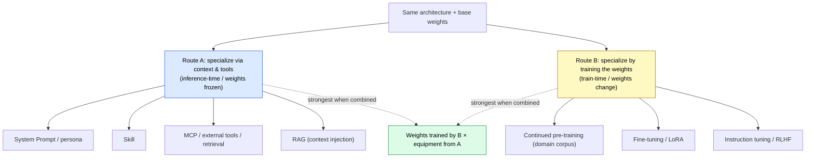
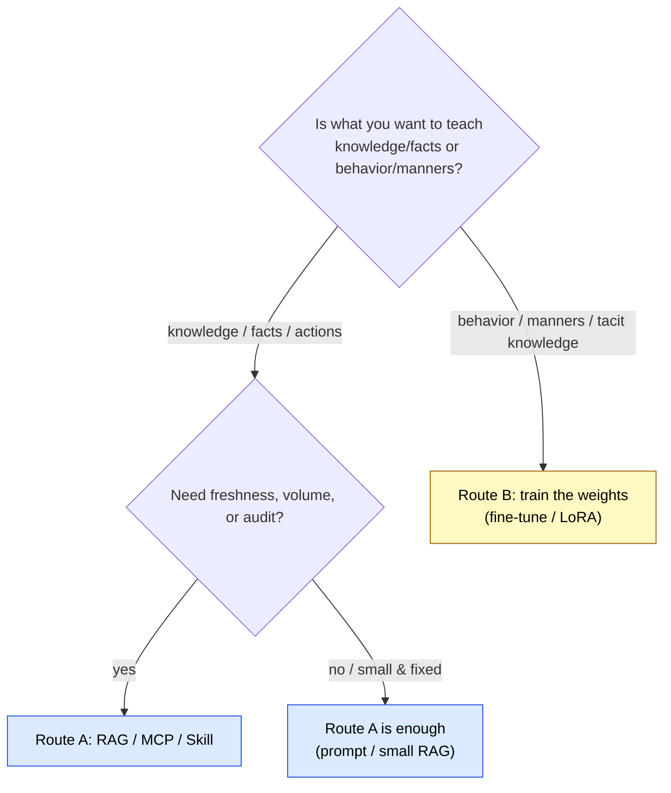

# Building Specialist Agents — Weight Specialization vs. Context Specialization

> From the same architecture and the same base weights, there are two routes to a specialist. They are not mutually exclusive but orthogonal — and combined, they are strongest.

## About This Document

When you set out to build "an agent specialized for a specific task," the first design fork is this: do you **train the weights** (at train-time), or do you **arm the model with context and tools** (at inference-time)? Choosing by fashion — "just fine-tune it," "just bolt on RAG" — without noticing this fork leads to retraining on every update, or to stuffing style into the prompt until reproducibility collapses.

This page lets you decide on **principle**. The whole point reduces to one question: **where does the specialization live** — in the weights (parametric), or in the context (non-parametric)?

::: warning Positioning of This Document
This is a strategy-layer document that builds on the three-layer model in [03-architecture](./../concepts/03-architecture) and the pattern selection in [04-ai-design-patterns](./../concepts/04-ai-design-patterns). Where [composition-patterns](./composition-patterns) addresses *how to combine* and [local-llm-workspace-mapping](./local-llm-workspace-mapping) addresses *where to place*, this page addresses **whether to bake specialization into the weights or inject it into the context**.
:::

::: details Meta Information

| | |
| --- | --- |
| **What this page establishes** | The selection axis, decision heuristic, and hybrid design for weight specialization (train-time) vs. context specialization (inference-time) |
| **What this page does NOT cover** | Specific fine-tuning procedures or per-model training hyperparameters (see each framework's primary docs) |
| **Dependencies** | [03-architecture](./../concepts/03-architecture), [04-ai-design-patterns](./../concepts/04-ai-design-patterns), [08-memory-and-knowledge](./../concepts/08-memory-and-knowledge) |
| **Common misuse** | Trying to bake fresh facts into the weights; trying to write tacit style endlessly into the prompt (see Anti-patterns) |

:::

## In One Sentence

From the same architecture and the same base weights, there are **two routes** to a specialist. They are not mutually exclusive but **orthogonal**, and combined they are strongest.

## Terminology: Parametric vs. Non-parametric Knowledge

- **Parametric knowledge**: knowledge and behavior **baked into the weights** through training. It cannot be changed at inference-time (frozen).
- **Non-parametric knowledge**: knowledge **injected into the context window from outside** at inference-time. Supplied each time by retrieval, tools, and documents.

> [!NOTE]
> The structural reasons — *why* weights are frozen at inference-time and *why* context consumes tokens — connect to **Knowledge Boundary / Context Window budget** on the sister site `understanding-llm-through-claude-code` (see the links at the end). This page takes those constraints as given and addresses how to design around them.

## The Two Routes

### Route A: Specialize via Context & Tools (inference-time)

Leave the weights untouched and turn the model into a specialist at inference-time with **System Prompt, Skill, MCP, retrieval, and RAG**. The brain (weights) stays general; you specialize through **equipment**. "Custom sub-agents" and "context engineering" belong here. This site's [Skills](../skills/what-is-skills), [MCP](../mcp/what-is-mcp), and [sub-agents](../agents/what-is-subagent) are all Route A means.

### Route B: Specialize by Training the Weights (train-time)

Keep the same architecture but **train the weights themselves** to bake in the specialization. Continued pre-training, fine-tuning, LoRA, and instruction tuning all fall here. Variants like `Instruct` / `Code` / `Reasoning` are all products of Route B.

## Comparison

| Aspect          | Route A (context & tools)                       | Route B (training the weights)        |
| --------------- | ----------------------------------------------- | ------------------------------------- |
| What changes    | Input, context, available actions               | The weights themselves                |
| Where knowledge lives | Context window / external (**non-parametric**) | Inside the weights (**parametric**) |
| When knowledge enters | At inference-time (every time)            | At train-time (once)                  |
| Freshness       | Always current (tools fetch it)                 | Frozen at training time               |
| Update cost     | Just swap the prompt/document — instant          | Needs GPU, data, retraining           |
| Runtime cost    | Tokens spent every time + tool round-trip latency | No extra cost at inference — low latency |
| Transparency    | Traceable what was retrieved (auditable)        | Dissolved into the weights (opaque)   |
| Main risk       | Prompt injection / tool errors                  | Overfitting / catastrophic forgetting |
| Strong suit     | **Facts, fresh info, actions (API execution)**  | **Behavior, manners, tone, tacit knowledge** |

## Decision Heuristic

The single most useful sentence:

> [!TIP]
> If what you want to teach is **"facts, fresh info, actions,"** use Route A; if it is **"behavior, manners, tone, tacit knowledge,"** use Route B.

Why:

- Baking fresh facts (e.g. today's stock price, the current state of your private repo) into the weights is hopeless. **Go fetch it with tools (A)**.
- Tacit knowledge that is hard to spell out (e.g. house style, reasoning format, fluency in tool use) suits the **weights (B)** better than writing it endlessly into the prompt.

## Combining Them (Hybrid)

In practice the strongest setup takes both — **a specialist variant honed by B**, armed with **equipment from A (RAG, MCP)**.

> [!IMPORTANT]
> A key dependency: **the tool-calling capability itself is honed by Route B** (instruction-tuned models are trained for tool calling). In other words, **"when B is good, A runs well."** A and B are not competitors but **foundation and superstructure**. To make Route A's equipment pay off, the base model's tool-calling aptitude (a product of B) is the prerequisite.

## Anti-patterns

| Common misdesign                          | Why it fails                                          | Correct choice            |
| ----------------------------------------- | ---------------------------------------------------- | ------------------------- |
| Fine-tune the model to memorize fresh facts | Frozen at training time, quickly stale; retrain on every update | A (RAG / tools)    |
| Write tacit style endlessly into the prompt | Eats context, low reproducibility                   | B (small fine-tune / LoRA)|
| Try to correct behavior with RAG          | Retrieving examples won't instill consistent manners | B                         |
| Dissolve an audit-critical domain into the weights | Can't trace what an answer was based on        | A (the retrieved basis remains) |

## Design Checklist

- [ ] Have you separated what you want to give — **knowledge/actions** vs. **behavior/manners**?
- [ ] Does that knowledge require **freshness, volume, or audit**? (If so, A.)
- [ ] Is it tacit knowledge that can't be spelled out in words? (If so, B.)
- [ ] How often does it update? (High → A; fixed → B is fine.)
- [ ] If choosing B, have you accounted for **catastrophic forgetting** and retraining cost?
- [ ] If choosing A, have you accounted for the **context budget** and **prompt injection**?
- [ ] For a hybrid, have you verified the base model's **tool-calling aptitude (B)**?

## Related Documents

- [03-architecture](../concepts/03-architecture) — the three-layer model (the layers Route A's equipment lives in)
- [04-ai-design-patterns](../concepts/04-ai-design-patterns) — which pattern to choose when (WHICH)
- [08-memory-and-knowledge](../concepts/08-memory-and-knowledge) — parametric / non-parametric knowledge and the Memory layer
- [composition-patterns](./composition-patterns) — combining Route A's equipment (MCP × Skill × Agent)
- [local-llm-workspace-mapping](./local-llm-workspace-mapping) — consuming variants and arming agents in a local LLM environment
- [Skills vs MCP](../skills/vs-mcp) — choosing between non-parametric equipment

## 🔗 Going Deeper: Why Are Weights Frozen, and Why Does Context Cost Budget?

This page addressed the **design judgment (What/How)** of weight vs. context specialization. To understand from LLMs' structural constraints *why* weights are frozen at inference-time and *why* context consumes token budget, see the sister site.

- [understanding-llm / Knowledge Boundary](https://shuji-bonji.github.io/understanding-llm-through-claude-code/01-llm-structural-problems/knowledge-boundary/) — the boundary of weight-baked knowledge and its frozen nature
- [understanding-llm / Part 2: Context Window](https://shuji-bonji.github.io/understanding-llm-through-claude-code/02-context-window/) — why non-parametric knowledge eats the token budget

---

> **Previous**: [Harness Engineering Mapping](./harness-engineering-mapping.md)
> **Next**: [Development Phases](../workflows/development-phases.md)

**Last updated**: June 2026
