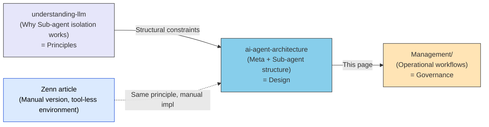
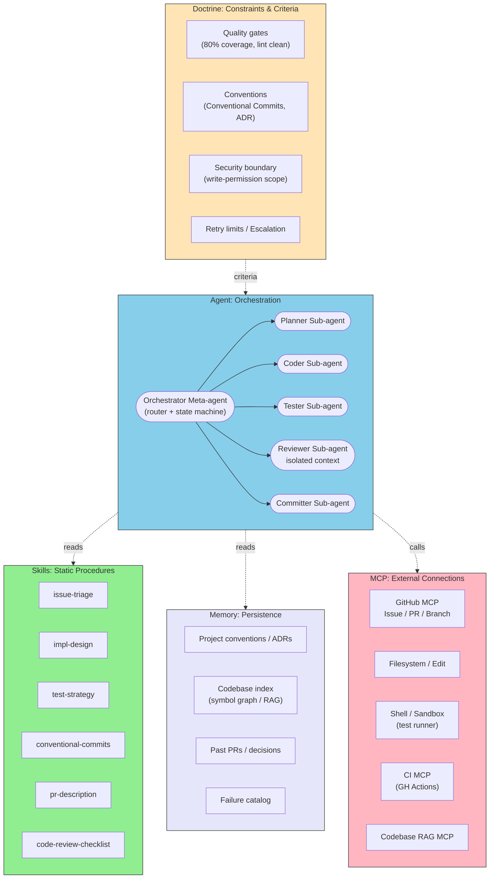
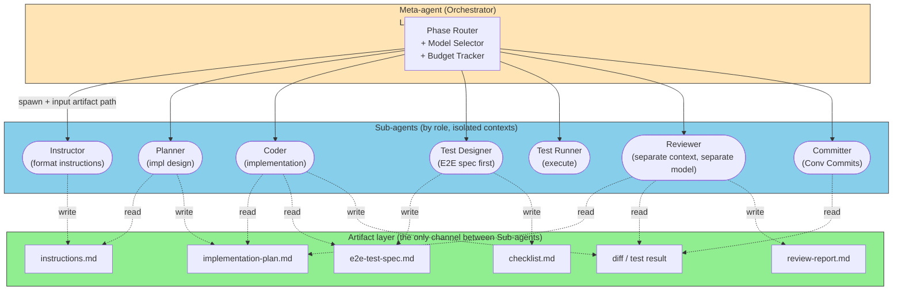
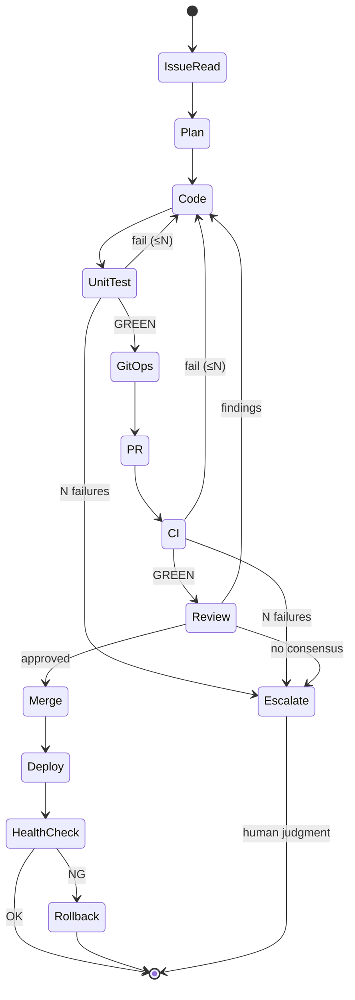
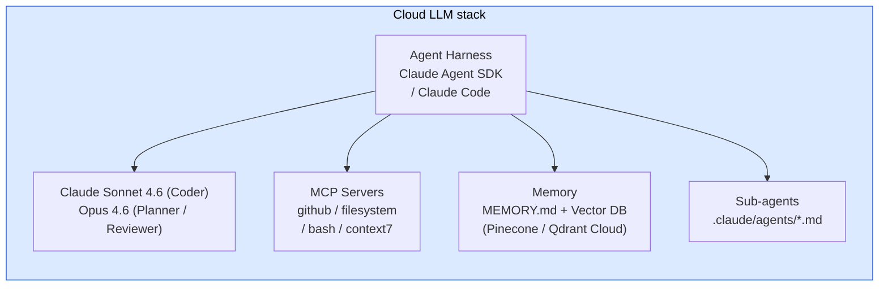
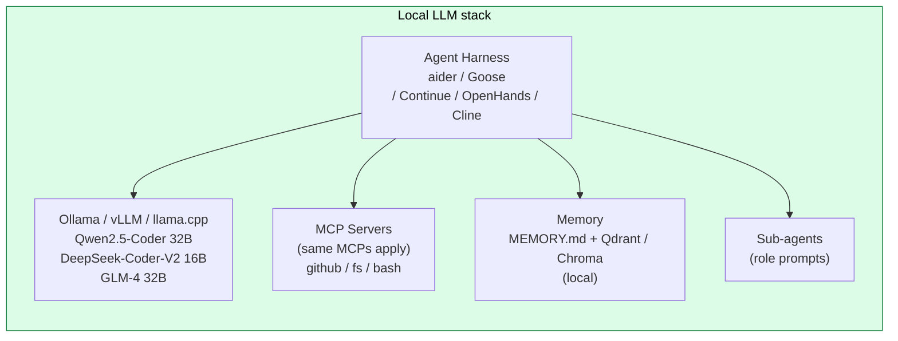
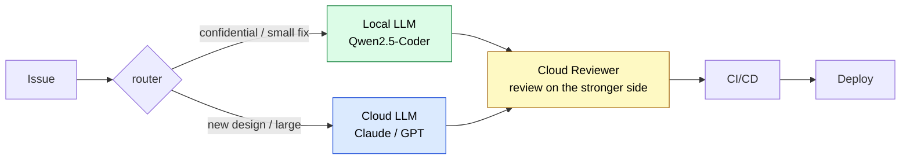
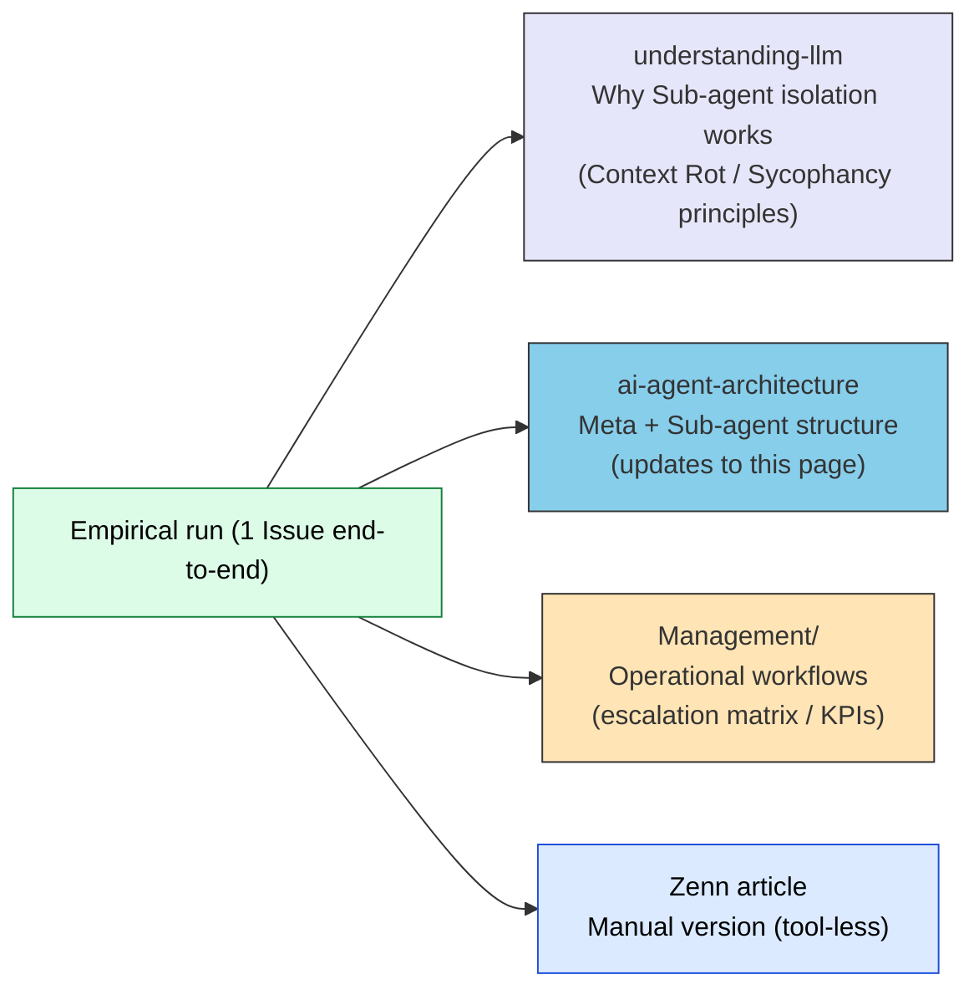

# Issue→Deploy Autonomy: Meta-agent + Sub-agent Pattern

> Designing an autonomous development pipeline that drives the full Issue→Deploy cycle with AI, structured as a Meta-agent orchestrator plus role-specialized Sub-agents.

## About This Document

> [!NOTE]
> This page maps the structure of an autonomous development pipeline — one where AI drives the workflow from Issue to Deploy — onto the 5-layer model (Doctrine / Agent / Skills / Memory / MCP). Both cloud LLM and local LLM variants are presented.

This pipeline is the automated counterpart of the manual prompt-driven development described in shuji-bonji's Zenn article [Fighting Without CLAUDE.md — Prompt-Driven Development Aware of LLM Structural Constraints](https://zenn.dev/shuji_bonji/articles/c9d325f1fd7646). The two are **different implementations of the same principle** — countermeasures against Context Rot, Instruction Decay, and Sycophancy. The design judgments are identical; only the implementation means change based on whether tool support is available.

> [!TIP]
> **In three lines:**
>
> - The Zenn article's "hand off artifact files to a separate chat" = Sub-agent's isolated context + artifact handoff
> - The Meta-agent acts only as a router operating on **artifact paths**, never summarizing or merging Sub-agent outputs (to avoid Context Rot)
> - One phase = one Sub-agent is the right granularity. Slicing Sub-agents too finely makes the startup overhead exceed the actual task

## Position in the Documentation Series

## 1. Correspondence with Manual Prompt-Driven Development

The "manual operation in tool-less environments" discussed in the Zenn article and the "automated operation via Sub-agent + Meta-agent" discussed here address the same structural constraints (Context Rot / Instruction Decay / Sycophancy) through different implementation means.

| Zenn article (manual) | Sub-agent automation | Structural problem addressed |
| --- | --- | --- |
| Request implementation in a "separate chat" | Sub-agent's isolated context | Context Rot |
| Hand off deliverables as **files** | Artifact handoff between Sub-agents | Context Rot |
| Have a different model review | Reviewer Sub-agent (different LLM) | Sycophancy |
| Commit + reset per phase | Context discarded automatically on Sub-agent termination | Instruction Decay |
| Premium-consumption model switching | Meta-agent's model routing | Cost optimization (side effect) |
| Instruction → plan → review | Planner → Critic Sub-agent | Sycophancy |
| Instruction templates | Skill (`SKILL.md`) | Knowledge Boundary |

> [!IMPORTANT]
> Sub-agent decomposition is not done "because it's convenient" — it is the **automation of countermeasures logically derived from LLM structural constraints**. Lose sight of this and you end up with "mere multi-invocation" that only inflates cost.

## 2. Shared Architecture (LLM-agnostic)

Mapping each step onto the 5-layer model makes it clear which pieces get swapped to produce the cloud and local variants.

## 3. Artifact-Driven Sub-agent Communication

The core of this pipeline is that **communication between Sub-agents is restricted to artifact files only**. This is exactly the Zenn article's principle "deliverables substitute for context."

> [!IMPORTANT]
> The Meta-agent passes only **artifact paths** to Sub-agents. Sub-agent outputs MUST NOT be pulled back into the Meta-agent for summarization or merging. Doing so accumulates every Sub-agent's trial-and-error in the Meta-agent's context, causing the Meta-agent itself to suffer Context Rot. The Meta-agent stays as a **state machine + router** and never touches content.

## 4. Per-Step Responsibility Mapping

| # | Step | Sub-agent | Skills | MCP | Exit criteria (Doctrine) |
|---|---|---|---|---|---|
| 1 | Issue triage | Instructor | issue-triage | GitHub MCP, RAG | Labels / scope decided |
| 2 | Implementation design | Planner | impl-design, ADR | Codebase RAG, FS read | Plan + uncertainty list emitted |
| 3 | Code generation | Coder | coding-conventions | FS Edit, type-check | lint / typecheck PASS |
| 4 | Test code generation | Test Designer | test-strategy | FS Edit | Coverage target reached |
| 5 | Test execution ① | Test Runner | — | Shell (sandbox) | All tests GREEN |
| 6 | Git operations | Committer | conventional-commits | Git CLI MCP | branch / commit shaped |
| 7 | PR creation | Committer | pr-description | GitHub MCP | template + Issue link |
| 8 | Test ② (integration) | CI | — | CI MCP | CI GREEN |
| 9 | Code review | Reviewer (separate context) | code-review-checklist | GitHub MCP, RAG | Zero findings or fixes applied |
| 10 | Test ③ (rerun) | CI | — | CI MCP | CI GREEN |
| 11 | CI/CD deploy | Orchestrator | release-skill | CI MCP, Deploy MCP | health-check PASS |

> [!CAUTION]
> **The Reviewer MUST be a Sub-agent with an isolated context.** In the same context as the Coder, self-affirmation bias (Sycophancy) yields almost no findings. Where possible, use **different LLMs** (e.g., Coder=Sonnet, Reviewer=Opus / GPT-5). This is the linchpin of the architecture.

## 5. Loop Structure (Self-Healing on Failure)

Each retry is bounded by an **upper limit N (e.g., 3)**; if exceeded, escalate to Human-in-the-Loop. Without this bound, the system enters an infinite "trying to fix what can't be fixed" loop with runaway cost. Combining a failure catalog (Memory layer) with **early-stop on recurring symptoms** is also effective.

## 6. Cloud LLM Stack

| Layer | Example |
|---|---|
| Harness | Claude Agent SDK / Claude Code / Cursor Agent / Devin / OpenHands |
| LLM | Claude Sonnet 4.6 (primary), Opus 4.6 (design / review), GPT-5 / Gemini 2.5 also viable |
| Skills | `.claude/skills/*` (this site's approach) |
| MCP | GitHub MCP, Playwright MCP, CI MCP, Codebase RAG |
| Memory | `MEMORY.md` + managed Vector DB |
| Sandbox | GitHub Actions / Cloud Run sandbox |

**Strengths**: 32K–200K context, complex dependency comprehension, stable tool calling, native Sub-agent support.

**Weaknesses**: $5–$50 per Issue, code leaves the premises, rate limits.

## 7. Local LLM Stack

| Layer | Example |
|---|---|
| Harness | aider / Goose (by Block) / Continue.dev / OpenHands / Cline |
| LLM | Qwen2.5-Coder-32B-Instruct, DeepSeek-Coder-V2-Lite, Codestral-22B, GLM-4-32B |
| Runtime | Ollama (easy) / vLLM (serious) / llama.cpp (low-RAM) |
| Skills | Prompt templates + few-shot examples (most harnesses lack Skills machinery) |
| MCP | Identical to cloud version (this is MCP's main benefit) |
| Memory | Qdrant local / Chroma / SQLite-VSS |
| Sandbox | Docker / Firejail / nsjail |
| Min. hardware | RTX 4090 24GB or M2 Max 64GB (rough target for 32B quantized) |

**Strengths**: Code never leaves, fixed monthly cost, no rate limits, **Sub-agent decomposition pays off more here than in cloud** (rationale below).

**Weaknesses**: Breaks down above 100K context, unstable tool calling (even 32B-class models produce broken JSON), weak at complex dependency graphs.

> [!IMPORTANT]
> Local LLMs are **especially weak with long contexts**, so the benefit of Sub-agent decomposition is **greater than for cloud LLMs**. If each Sub-agent's context can be kept to 8–16K, stable local operation becomes feasible. **Meta-agent + Sub-agent is the key that makes local-LLM autonomy realistic.**

## 8. Comparison

| Aspect | Cloud LLM | Local LLM |
|---|---|---|
| Issue comprehension | Excellent | Good (short text) |
| Multi-file design | Excellent | Fair |
| Single-file code gen | Excellent | Good–Excellent |
| Test code gen | Excellent | Good |
| Tool / MCP call stability | Excellent | Fair (frequent JSON breakage) |
| Long context (>32K) | Excellent | Poor (usable range 8–16K) |
| Cost / Issue | $5–$50 | Electricity only |
| Code confidentiality | Fair (depends on policy) | Excellent |
| Rate limits | Yes | None |
| Self-review rigor | Excellent | Fair (Sycophancy stronger) |
| Uncertainty awareness | Good | Poor (hard to notice hallucinations) |
| Need for Sub-agent decomposition | High | **Maximum** |

## 9. Recommended Hybrid (2026 Sweet Spot)

- **Code generation on Local, design and review on Cloud** is the 2026 sweet spot
- Why review goes Cloud: critical reading, dependency awareness, and security perspective are weak in 32B-class models
- If confidential code must stay fully local, cross-check review with **multiple different local models** (Qwen + DeepSeek) in separate contexts

## 10. Efficiency Trade-offs (Honest Take)

| Aspect | Monolithic Agent | Meta + Sub-agent |
|---|---|---|
| Total tokens | Low (single session) | High (role / context per Sub-agent) |
| Quality (Context Rot resistance) | Low | **High** |
| Sycophancy suppression | None (self-review) | **Excellent (separate Reviewer)** |
| Model specialization | None | **Excellent (per role)** |
| Debuggability | Fair (single log) | **Excellent (verified per artifact)** |
| Latency | Short | Long (much sequential) |
| Failure localization | Fair | **Excellent (rerun the one Sub-agent)** |

Tokens and latency grow, but the cost is **recouped through quality and avoided rework**. "Redo everything at the final PR review" in a monolithic agent is more expensive than independent per-phase verification in Sub-agents.

## 11. Three Pitfalls Blocking Autonomy

> [!WARNING]
> **① Repair loops without self-awareness of uncertainty**: "Test fails → patch sloppily → fails again" — infinite loop. Retry limits + a recurring-failure detector are MUST.
>
> **② Reviewer Sub-agent in the same context**: Asking the same session that wrote the code to "now review it" finds almost nothing. MUST be a separate process, separate context, and preferably a separate model.
>
> **③ Development without Memory**: Forcing the agent to re-read project conventions every time is the scatter-gather problem. Index ADRs and past PRs in the Memory layer. (See [Memory & Knowledge](../concepts/08-memory-and-knowledge).)

> [!WARNING]
> Also **④ Meta-agent bloat**: the moment the Meta-agent starts summarizing or merging Sub-agent outputs, this pattern collapses. Keep the Meta-agent as a state machine + artifact router — never let it touch content.

## 12. Empirical → Formalization Feedback

This architecture is best built by **"running a minimal unit, then promoting it to a workflow"** rather than "designing it before running." The destinations for empirically-derived insights are as follows.

What belongs in Management is **the "workflow" (how we manage), not the "implementation" (how it works)**. Implementation stays in the experimental project; Management captures things like:

- Which judgments stay with humans (escalation matrix)
- Per-step retry limits and stop conditions (governance)
- KPIs to measure (success rate, intervention rate, cost per Issue)
- Failure classification (root cause taxonomy)

## Related Documents

- [Multi-Agent Coordination](./patterns/multi-agent.md) — General pattern for specialized Sub-agent collaboration (foundation of this page)
- [Development Phases × MCP](./development-phases.md) — MCPs available per development phase
- [Sub-agents](../agents/what-is-subagent.md) — Sub-agent fundamentals
- [Sub-agent vs Skills](../agents/subagent-vs-skill.md) — When to use which
- [Sub-agent as Quality Gate](../agents/subagent-quality-gate.md) — Reviewer Sub-agent design
- [Composition Patterns](../strategy/composition-patterns.md) — Coordination patterns for multiple MCPs / Skills
- [Local LLM Workspace Mapping](../strategy/local-llm-workspace-mapping.md) — Details of the local-LLM variant
- [Memory & Knowledge (KG)](../concepts/08-memory-and-knowledge.md) — Memory layer design

## 🔗 Going Deeper: Why Sub-agent Isolation Works

This page covers the **structure (What / How)** of the Meta + Sub-agent pattern. To understand **why** Sub-agent isolation improves quality, in terms of LLM structural constraints, see the sister site.

- [understanding-llm / Part 1: Structural Problems](https://shuji-bonji.github.io/understanding-llm-through-claude-code/01-llm-structural-problems/) — Principles of Context Rot / Instruction Decay / Sycophancy
- [Fighting Without CLAUDE.md — Prompt-Driven Development Aware of LLM Structural Constraints](https://zenn.dev/shuji_bonji/articles/c9d325f1fd7646) (Japanese) — The **manual version** of this page (for tool-less environments)

## References

- shuji-bonji (2026). "Fighting Without CLAUDE.md — Prompt-Driven Development Aware of LLM Structural Constraints." Zenn. [zenn.dev/shuji_bonji](https://zenn.dev/shuji_bonji/articles/c9d325f1fd7646) — The manual-operation counterpart of this page
- Osmani, A. (2025). "agent-skills: Production-grade engineering skills for AI coding agents." [github.com/addyosmani/agent-skills](https://github.com/addyosmani/agent-skills) — Codified Skills in plain Markdown
- Hong, K., Troynikov, A., & Huber, J. (2025). "Context Rot: How Increasing Input Tokens Impacts LLM Performance." Chroma Research. [research.trychroma.com](https://research.trychroma.com/context-rot) — Structural basis for why Sub-agent isolation works

---

> **Previous**: [Multi-Agent Coordination](./patterns/multi-agent.md)

**Last updated**: June 2026
