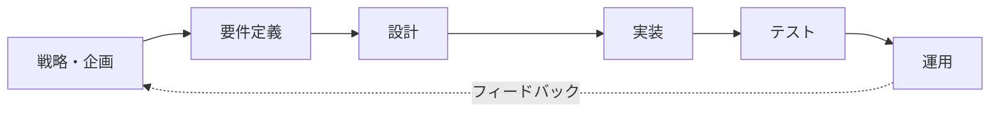
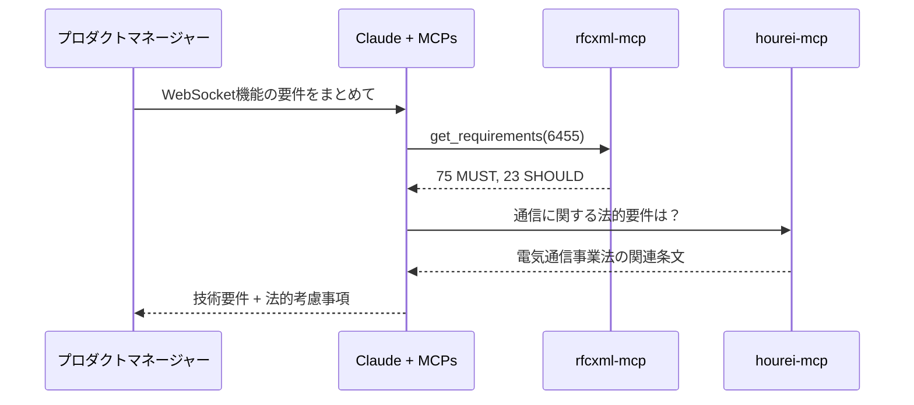
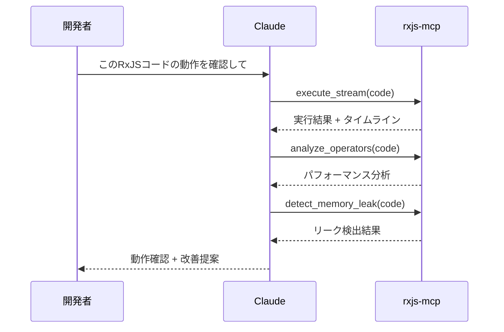
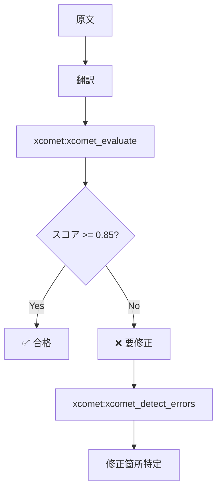
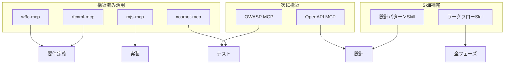

# 開発フェーズ × MCP対応

> システム・アプリケーション開発の各フェーズで活用できるMCPを整理する。

## このドキュメントについて

ソフトウェア開発は「戦略・企画 → 要件定義 → 設計 → 実装 → テスト → 運用」というフェーズで進む。AI駆動開発では、各フェーズで適切なMCPを活用することで、品質と効率の両方を向上させることができる。

このドキュメントでは、各開発フェーズで利用可能なMCP、まだ構築されていない領域、今後の優先構築候補を整理する。「このフェーズでAIを活用したいが、何を使えばいいか」という問いに対する実践的な回答を提供する。

## 開発フェーズ全体像



## フェーズ1: 戦略・企画

### 概要

ビジネス目標の設定、実現可能性調査、プロダクト戦略の策定。

### MCP活用

| タスク   | MCP                     | 機能               | 状況    |
| -------- | ----------------------- | ------------------ | ------- |
| 市場調査 | Market Research MCP     | 市場規模データ取得 | 📋 構想 |
| 競合分析 | Competitor Analysis MCP | 競合製品比較       | 📋 構想 |
| ROI計算  | Financial Modeling MCP  | TCO算出            | 📋 構想 |

### 現状

このフェーズのMCPは未構築。Web検索やClaude自体の分析能力で代替。

## フェーズ2: 要件定義

### 概要

機能要件・非機能要件の収集と整理。

### MCP活用

| タスク       | MCP            | 機能                  | 状況      |
| ------------ | -------------- | --------------------- | --------- |
| RFC要件確認  | **rfcxml-mcp** | MUST/SHOULD/MAY抽出   | ✅ 構築済 |
| Web標準確認  | **w3c-mcp**    | WebIDL、CSS、HTML仕様 | ✅ 構築済 |
| 法令要件確認 | **hourei-mcp** | 法令条文取得          | ✅ 利用可 |
| API仕様確認  | OpenAPI MCP    | 仕様検証              | 📋 構想   |

### 具体例



## フェーズ3: 設計

### 概要

アーキテクチャ設計、詳細設計、API設計。

### MCP活用

| タスク       | MCP                 | 機能                | 状況      |
| ------------ | ------------------- | ------------------- | --------- |
| 設計パターン | Design Pattern MCP  | パターン提案        | 📋 構想   |
| ADR生成      | ADR Generator MCP   | 決定記録生成        | 📋 構想   |
| DB設計       | Schema Designer MCP | ER図生成            | 📋 構想   |
| 図表生成     | **mermaid-mcp**     | Mermaidダイアグラム | ✅ 利用可 |
| API設計検証  | OpenAPI MCP         | 仕様検証            | 📋 構想   |

### 現状

設計パターン系MCPは未構築。Skillとして「設計パターン集」を定義する方が適切かもしれない。

### Skill代替例

```markdown
<!-- .claude/skills/design-patterns/SKILL.md -->

# 設計パターン集

## アーキテクチャパターン

- Clean Architecture
- Hexagonal Architecture
- CQRS + Event Sourcing

## GoFパターン（抜粋）

- Factory Method
- Observer
- Strategy
  ...
```

## フェーズ4: 実装

### 概要

コーディング、API実装、フロントエンド/バックエンド開発。

### MCP活用

| タスク           | MCP                   | 機能                   | 状況      |
| ---------------- | --------------------- | ---------------------- | --------- |
| ドキュメント検索 | Context7              | ライブラリドキュメント | ✅ 利用可 |
| Svelte開発       | **svelte-mcp**        | Svelte/SvelteKit支援   | ✅ 利用可 |
| UIコンポーネント | **shadcn-svelte-mcp** | UIコンポーネント       | ✅ 利用可 |
| RxJS開発         | **rxjs-mcp-server**   | ストリーム実行・分析   | ✅ 構築済 |
| 座標系参照       | **epsg-mcp**          | EPSG座標系             | ✅ 構築済 |
| Angular開発      | Angular MCP           | Angular支援            | 📋 構想   |

### 具体例：RxJS実装フロー



## フェーズ5: テスト・品質保証

### 概要

単体テスト、統合テスト、品質評価。

### MCP活用

| タスク       | MCP                   | 機能                   | 状況      |
| ------------ | --------------------- | ---------------------- | --------- |
| 翻訳品質評価 | **xcomet-mcp-server** | 品質スコア、エラー検出 | ✅ 構築済 |
| テスト生成   | Test Generator MCP    | テストコード生成       | 📋 構想   |
| セキュリティ | OWASP MCP             | 脆弱性チェック         | 📋 構想   |
| RFC準拠確認  | **rfcxml-mcp**        | validate_statement     | ✅ 構築済 |

### 具体例：翻訳品質テスト



## フェーズ6: 運用・保守

### 概要

デプロイ、監視、インシデント対応、継続改善。

### MCP活用

| タスク       | MCP                    | 機能          | 状況    |
| ------------ | ---------------------- | ------------- | ------- |
| IaC生成      | IaC Generator MCP      | Terraform生成 | 📋 構想 |
| パイプライン | Pipeline Generator MCP | CI/CD設定     | 📋 構想 |
| 監視設定     | Monitoring Config MCP  | 監視設定生成  | 📋 構想 |

### 現状

運用系MCPは未構築。クラウドプロバイダー固有のMCPが存在する場合はそちらを利用。

## 横断的活動

### ドキュメンテーション

| タスク   | MCP             | 状況      |
| -------- | --------------- | --------- |
| 図表生成 | **mermaid-mcp** | ✅ 利用可 |
| 翻訳     | **deepl-mcp**   | ✅ 利用可 |
| 品質確認 | **xcomet-mcp**  | ✅ 構築済 |

### セキュリティ

| タスク    | MCP         | 状況    |
| --------- | ----------- | ------- |
| OWASP確認 | OWASP MCP   | 📋 構想 |
| CVE検索   | CVE/NVD MCP | 📋 構想 |

### 法令遵守

| タスク   | MCP            | 状況      |
| -------- | -------------- | --------- |
| 法令検索 | **hourei-mcp** | ✅ 利用可 |
| GDPR確認 | GDPR MCP       | 📋 構想   |

## フェーズ × MCP マトリックス

| フェーズ   | 構築済MCP                  | 構想中MCP                           |
| ---------- | -------------------------- | ----------------------------------- |
| 戦略・企画 | -                          | Market Research, Financial Modeling |
| 要件定義   | rfcxml, w3c, hourei        | OpenAPI                             |
| 設計       | mermaid                    | Design Pattern, ADR Generator       |
| 実装       | rxjs, svelte, shadcn, epsg | Angular, Context7連携強化           |
| テスト     | xcomet, rfcxml             | Test Generator, OWASP               |
| 運用       | -                          | IaC Generator, Pipeline Generator   |

## 優先的に構築すべきMCP

### 現在の強みを活かす

1. **OpenAPI MCP** - API設計・検証（要件定義〜設計〜テスト横断）
2. **OWASP MCP** - セキュリティ（設計〜テスト横断）
3. **Angular MCP** - 専門領域の実装支援

### ギャップを埋める

1. 設計フェーズのパターン系 → **Skillで代替可能**
2. 運用フェーズのIaC系 → 優先度低（既存ツールで代替）

## 推奨アプローチ



### 原則

1. **構築済みMCPを最大限活用**
2. **静的知識はSkillで補完**
3. **ギャップは優先度を見て順次構築**
