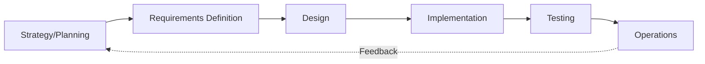
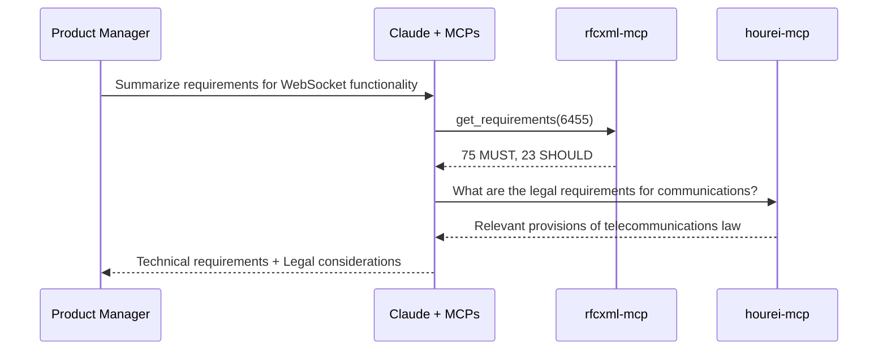
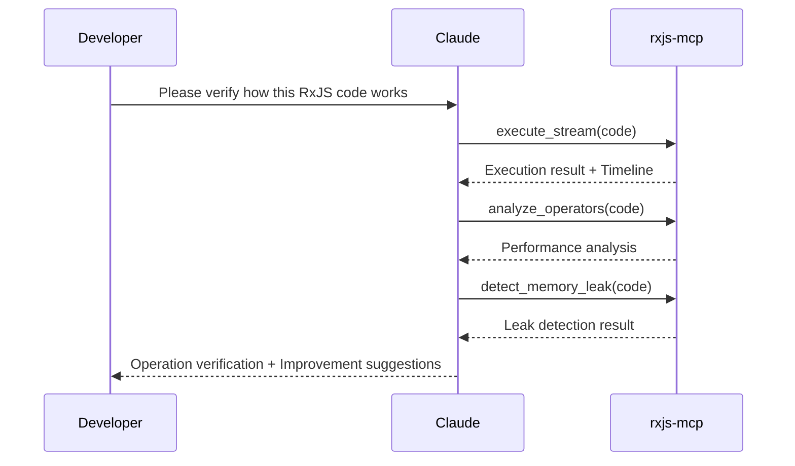
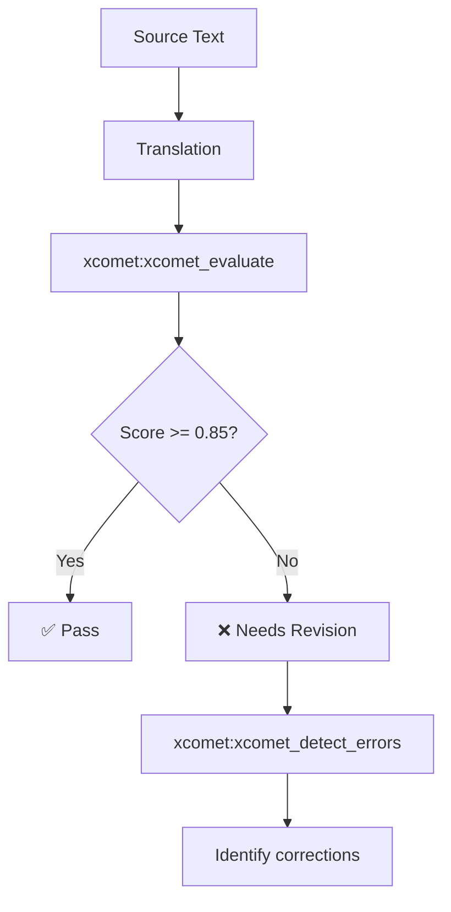
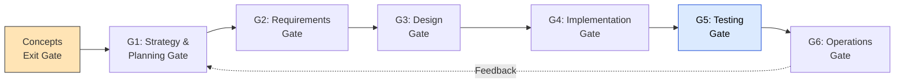

# Development Phases × MCP Integration

> Organizing MCPs that can be utilized in each phase of system and application development.

## About This Document

Software development progresses through phases: "Strategy/Planning → Requirements Definition → Design → Implementation → Testing → Operations." In AI-driven development, leveraging appropriate MCPs at each phase can improve both quality and efficiency.

This document organizes the MCPs available for each development phase, areas that have not yet been built, and candidates for future priority development. It provides practical answers to the question "I want to use AI in this phase, but what should I use?"

## Development Phase Overview

The following diagram shows how development phases flow sequentially through the project lifecycle:


```mermaid
flowchart LR
    P1[Strategy/Planning] --> P2[Requirements Definition]
    P2 --> P3[Design]
    P3 --> P4[Implementation]
    P4 --> P5[Testing]
    P5 --> P6[Operations]

    P6 -.->|Feedback| P1
```

## Phase 1: Strategy/Planning

### Overview

Setting business goals, conducting feasibility studies, and formulating product strategy.

### MCP Utilization

This table shows which MCPs are available and planned for strategic planning tasks:

| Task              | MCP                     | Function              | Status    |
| ----------------- | ----------------------- | --------------------- | --------- |
| Market Research   | Market Research MCP     | Market size data      | 📋 Planned |
| Competitor Analysis | Competitor Analysis MCP | Competitor comparison | 📋 Planned |
| ROI Calculation   | Financial Modeling MCP  | TCO calculation       | 📋 Planned |

### Current Status

MCPs for this phase have not been built. Web search and Claude's own analytical capabilities serve as alternatives.

## Phase 2: Requirements Definition

### Overview

Gathering and organizing functional and non-functional requirements.

### MCP Utilization

The following table identifies MCPs that help extract and structure requirements:

| Task                   | MCP            | Function                    | Status     |
| ---------------------- | -------------- | --------------------------- | ---------- |
| RFC Requirements Check | **rfcxml-mcp** | MUST/SHOULD/MAY extraction  | ✅ Built    |
| Web Standards Check    | **w3c-mcp**    | WebIDL, CSS, HTML specs     | ✅ Built    |
| Legal Requirements     | **hourei-mcp** | Legal text retrieval        | ✅ Available |
| API Spec Verification  | OpenAPI MCP    | Specification validation    | 📋 Planned  |

### Example

The following sequence diagram illustrates how MCPs support the requirements gathering process:


```mermaid
sequenceDiagram
    participant PM as Product Manager
    participant Claude as Claude + MCPs
    participant RFC as rfcxml-mcp
    participant Law as hourei-mcp

    PM->>Claude: Summarize requirements for WebSocket functionality
    Claude->>RFC: get_requirements(6455)
    RFC-->>Claude: 75 MUST, 23 SHOULD
    Claude->>Law: What are the legal requirements for communications?
    Law-->>Claude: Relevant provisions of telecommunications law
    Claude-->>PM: Technical requirements + Legal considerations
```

## Phase 3: Design

### Overview

Architecture design, detailed design, and API design.

### MCP Utilization

The following MCPs support various design activities:

| Task               | MCP                 | Function             | Status     |
| ------------------ | ------------------- | -------------------- | ---------- |
| Design Patterns    | Design Pattern MCP  | Pattern suggestions  | 📋 Planned  |
| ADR Generation     | ADR Generator MCP   | Decision record gen  | 📋 Planned  |
| DB Design          | Schema Designer MCP | ER diagram gen       | 📋 Planned  |
| Diagram Generation | **mermaid-mcp**     | Mermaid diagrams     | ✅ Available |
| API Design Validation | OpenAPI MCP      | Spec validation      | 📋 Planned  |

### Current Status

Design pattern MCPs have not been built. It may be more appropriate to define a "Design Pattern Collection" as a Skill.

### Skill Alternative Example

Here is how design patterns can be effectively provided through a Skill:

```markdown
<!-- .claude/skills/design-patterns/SKILL.md -->

# Design Pattern Collection

## Architecture Patterns

- Clean Architecture
- Hexagonal Architecture
- CQRS + Event Sourcing

## GoF Patterns (Excerpt)

- Factory Method
- Observer
- Strategy
  ...
```

## Phase 4: Implementation

### Overview

Coding, API implementation, frontend/backend development.

### MCP Utilization

The following MCPs provide development support for implementation tasks:

| Task                | MCP                   | Function                | Status     |
| ------------------- | --------------------- | ----------------------- | ---------- |
| Documentation Search | Context7             | Library documentation   | ✅ Available |
| Svelte Development  | **svelte-mcp**        | Svelte/SvelteKit support | ✅ Available |
| UI Components       | **shadcn-svelte-mcp** | UI components           | ✅ Available |
| RxJS Development    | **rxjs-mcp-server**   | Stream execution/analysis | ✅ Built   |
| Coordinate Reference | **epsg-mcp**         | EPSG coordinate systems | ✅ Built    |
| Angular Development | Angular MCP           | Angular support         | 📋 Planned  |

### Example: RxJS Implementation Flow

The following sequence diagram shows how the RxJS MCP assists in verifying and debugging stream-based code:


```mermaid
sequenceDiagram
    participant Dev as Developer
    participant Claude as Claude
    participant RxJS as rxjs-mcp

    Dev->>Claude: Please verify how this RxJS code works
    Claude->>RxJS: execute_stream(code)
    RxJS-->>Claude: Execution result + Timeline
    Claude->>RxJS: analyze_operators(code)
    RxJS-->>Claude: Performance analysis
    Claude->>RxJS: detect_memory_leak(code)
    RxJS-->>Claude: Leak detection result
    Claude-->>Dev: Operation verification + Improvement suggestions
```

## Phase 5: Testing & Quality Assurance

### Overview

Unit testing, integration testing, and quality evaluation.

### MCP Utilization

The following MCPs support quality assessment and compliance verification:

| Task                  | MCP                   | Function                   | Status     |
| --------------------- | --------------------- | -------------------------- | ---------- |
| Translation QA        | **xcomet-mcp-server** | Quality scores, error detection | ✅ Built |
| Test Generation       | Test Generator MCP    | Test code generation       | 📋 Planned  |
| Security              | OWASP MCP             | Vulnerability checks       | 📋 Planned  |
| RFC Compliance Check  | **rfcxml-mcp**        | validate_statement         | ✅ Built    |

### Example: Translation Quality Testing

This workflow demonstrates quality verification for translated content:


```mermaid
flowchart TB
    SOURCE[Source Text] --> TRANSLATE[Translation]
    TRANSLATE --> EVAL[xcomet:xcomet_evaluate]
    EVAL --> CHECK{Score >= 0.85?}
    CHECK -->|Yes| PASS[✅ Pass]
    CHECK -->|No| FAIL[❌ Needs Revision]
    FAIL --> ERRORS[xcomet:xcomet_detect_errors]
    ERRORS --> FIX[Identify corrections]
```

## Phase 6: Operations & Maintenance

### Overview

Deployment, monitoring, incident response, and continuous improvement.

### MCP Utilization

The following MCPs support operations and maintenance activities:

| Task                | MCP                    | Function            | Status    |
| ------------------- | ---------------------- | ------------------- | --------- |
| IaC Generation      | IaC Generator MCP      | Terraform generation | 📋 Planned |
| Pipeline            | Pipeline Generator MCP | CI/CD configuration | 📋 Planned |
| Monitoring Config   | Monitoring Config MCP  | Monitoring setup    | 📋 Planned |

### Current Status

Operations MCPs have not been built. If cloud provider-specific MCPs exist, use those instead.

## Cross-Cutting Activities

### Documentation

These MCPs provide support for documentation tasks across all phases:

| Task              | MCP             | Status     |
| ----------------- | --------------- | ---------- |
| Diagram Generation | **mermaid-mcp** | ✅ Available |
| Translation       | **deepl-mcp**   | ✅ Available |
| Quality Check     | **xcomet-mcp**  | ✅ Built    |

### Security

Security-focused MCPs help identify and manage vulnerabilities:

| Task          | MCP         | Status    |
| ------------- | ----------- | --------- |
| OWASP Check   | OWASP MCP   | 📋 Planned |
| CVE Search    | CVE/NVD MCP | 📋 Planned |

### Legal Compliance

MCPs supporting legal and regulatory compliance:

| Task           | MCP            | Status     |
| -------------- | -------------- | ---------- |
| Legal Search   | **hourei-mcp** | ✅ Available |
| GDPR Check     | GDPR MCP       | 📋 Planned  |

## Phase × MCP Matrix

This matrix provides an overview of MCP availability across all development phases:

| Phase               | Built MCPs                 | Planned MCPs                        |
| ------------------- | -------------------------- | ----------------------------------- |
| Strategy/Planning   | -                          | Market Research, Financial Modeling |
| Requirements        | rfcxml, w3c, hourei        | OpenAPI                             |
| Design              | mermaid                    | Design Pattern, ADR Generator       |
| Implementation      | rxjs, svelte, shadcn, epsg | Angular, Context7 integration       |
| Testing             | xcomet, rfcxml             | Test Generator, OWASP               |
| Operations          | -                          | IaC Generator, Pipeline Generator   |

## MCPs to Build with Priority

### Leveraging Current Strengths

The following MCPs represent the highest-priority development opportunities:

1. **OpenAPI MCP** - API design/validation (cross-cutting: Requirements → Design → Testing)
2. **OWASP MCP** - Security (cross-cutting: Design → Testing)
3. **Angular MCP** - Implementation support for specialized domains

### Filling Gaps

1. Design phase pattern tools → **Can be substituted with Skills**
2. Operations phase IaC tools → Low priority (existing tools serve as alternatives)

## Recommended Approach

The following diagram shows the recommended strategy for maximizing AI-driven development support:

```mermaid
graph TB
    subgraph Utilize Built MCPs
        RFC[rfcxml-mcp]
        W3C[w3c-mcp]
        XCOMET[xcomet-mcp]
        RXJS[rxjs-mcp]
    end

    subgraph Skill Supplementation
        PATTERN[Design Pattern Skill]
        WORKFLOW[Workflow Skill]
    end

    subgraph Build Next
        OPENAPI[OpenAPI MCP]
        OWASP[OWASP MCP]
    end

    RFC --> Requirements
    W3C --> Requirements
    XCOMET --> Testing
    RXJS --> Implementation

    PATTERN --> Design
    WORKFLOW --> All Phases

    OPENAPI --> Design
    OWASP --> Testing
```

### Principles

Follow these principles when integrating MCPs into your development process:

1. **Maximize utilization of built MCPs**
2. **Supplement static knowledge with Skills**
3. **Build gaps sequentially based on priority**

## Phase Gate Checklists

A checklist for determining whether each phase is "ready to move forward." It is recommended to **clear the previous phase's gate before proceeding to the next**. While the Concepts [exit checklist](../concepts/#concepts-implementation-exit-checklist) confirms "understanding of the design philosophy," these checklists confirm "implementation readiness for each phase."


```mermaid
flowchart LR
    G0["Concepts<br/>Exit Gate"]
    G1["G1: Strategy &<br/>Planning Gate"]
    G2["G2: Requirements<br/>Gate"]
    G3["G3: Design<br/>Gate"]
    G4["G4: Implementation<br/>Gate"]
    G5["G5: Testing<br/>Gate"]
    G6["G6: Operations<br/>Gate"]

    G0 --> G1 --> G2 --> G3 --> G4 --> G5 --> G6
    G6 -.->|Feedback| G1

    style G0 fill:#FFE4B5,color:#333,stroke:#333
    style G5 fill:#dbeafe,stroke:#1d4ed8,color:#000
```

### G1: Strategy & Planning → Requirements

- [ ] **Verifiable goals** — Have business goals been translated into numerical KPIs with verification deadlines?
- [ ] **AI scope agreement** — Have stakeholders agreed on which processes will use AI?
- [ ] **Initial responsibility boundaries** — Has the team made an initial decision on the final human decision-maker and the scope delegated to AI?
- [ ] **Reference source candidates** — Have authoritative information sources (RFCs, laws, internal standards, etc.) relevant to the project been enumerated?

### G2: Requirements → Design

- [ ] **MUST/SHOULD/MAY classification** — Have requirements been classified according to the normative strength ladder ([Concepts → Normative Strength Ladder](../concepts/#normative-strength-ladder-shall-should-may))?
- [ ] **Authoritative source identification** — For each requirement, has the original text been retrieved and cited via rfcxml-mcp / w3c-mcp / hourei-mcp, etc.?
- [ ] **Quantified non-functional requirements** — Have thresholds for performance, security, and availability been written in a form that can be verified later?
- [ ] **Legal / standards compliance** — Have the latest versions of applicable laws and standards been referenced, with applicable clauses identified?

### G3: Design → Implementation

- [ ] **Three-layer separation** — Are the responsibility boundaries of Agent / Skills / MCP reflected in the design?
- [ ] **Responsibility boundaries in design** — Are the three responsibilities (design-time / execution-time / structural) made explicit in the design document?
- [ ] **Verification strategy established** — Has the Spec-to-Test conversion strategy (which specs map to which tests) been determined?
- [ ] **Guardrails & evaluation metrics** — Have both guardrails (ESLint, type checks) and probabilistic metrics (xCOMET, etc.) been defined?
- [ ] **Memory layer decision** — Has the need for a Memory layer been evaluated, with Stage 1–2 selected if applicable?

### G4: Implementation → Testing

- [ ] **MCP/Skill integration verified** — Can the MCPs/Skills planned in the design actually be invoked by the agent?
- [ ] **Code quality guardrails passing** — Are ESLint errors = 0, type checks passing, and dependency vulnerability scans clean?
- [ ] **AI output provenance recording** — Is the source MCP, version, and retrieval timestamp recorded in AI outputs as implemented?
- [ ] **Testability secured** — Have key behaviors been decomposed into units suitable for unit and integration tests?

### G5: Testing → Operations

- [ ] **Quality gates measured** — Do probabilistic metrics (xCOMET ≥ 0.85, test coverage ≥ 80%, etc.) meet the thresholds defined at design time?
- [ ] **Standards compliance verified** — Has standards compliance been objectively verified via tools like rfcxml-mcp / w3c-mcp `validate_statement`?
- [ ] **Escalation conditions tested** — Are conditions for human escalation implemented and triggered in tests?
- [ ] **Evidence trail working** — Is the mechanism for retrospectively searching AI decision rationale (logs, source records) functioning within acceptable operational overhead?

### G6: Operations → Improvement Loop

- [ ] **Incident response process** — When an AI-output-caused incident occurs, is it documented who makes which decisions?
- [ ] **Continuous evaluation pipeline** — Is there a working mechanism to continuously measure quality metrics post-release and detect degradation?
- [ ] **Reference freshness monitoring** — Is there an operational practice that detects updates to laws/standards and reflects them in MCP caches or documentation?
- [ ] **Learning cycle established** — Is there a mechanism to feed operational insights back into Skills / Doctrine?

::: tip Using the Gates
- The norm is to proceed to the next phase only when all items are ✅, but **"proceeding while accepting unmet items as agreed risk"** is also acceptable — provided unmet items are filed as Issues and resolved in subsequent phases.
- Gate decisions should be made by **team consensus**. A single person deciding "✅ done" makes responsibility boundaries ambiguous.
:::
