# Development Phases × MCP Integration

[日本語版 (Japanese)](./development-phases.ja.md)

> Organizing MCPs that can be utilized in each phase of system and application development.

## About This Document

Software development progresses through phases: "Strategy/Planning → Requirements Definition → Design → Implementation → Testing → Operations." In AI-driven development, leveraging appropriate MCPs at each phase can improve both quality and efficiency.

This document organizes the MCPs available for each development phase, areas that have not yet been built, and candidates for future priority development. It provides practical answers to the question "I want to use AI in this phase, but what should I use?"

## Development Phase Overview

The following diagram shows how development phases flow sequentially through the project lifecycle:


## Phase 1: Strategy/Planning

### Overview

Setting business goals, conducting feasibility studies, and formulating product strategy.

### MCP Utilization

This table shows which MCPs are available and planned for strategic planning tasks:

| Task              | MCP                     | Function              | Status    |
| ----------------- | ----------------------- | --------------------- | --------- |
| Market Research   | Market Research MCP     | Market size data      | 📋 Planned |
| Competitor Analysis | Competitor Analysis MCP | Competitor comparison | 📋 Planned |
| ROI Calculation   | Financial Modeling MCP  | TCO calculation       | 📋 Planned |

### Current Status

MCPs for this phase have not been built. Web search and Claude's own analytical capabilities serve as alternatives.

## Phase 2: Requirements Definition

### Overview

Gathering and organizing functional and non-functional requirements.

### MCP Utilization

The following table identifies MCPs that help extract and structure requirements:

| Task                   | MCP            | Function                    | Status     |
| ---------------------- | -------------- | --------------------------- | ---------- |
| RFC Requirements Check | **rfcxml-mcp** | MUST/SHOULD/MAY extraction  | ✅ Built    |
| Web Standards Check    | **w3c-mcp**    | WebIDL, CSS, HTML specs     | ✅ Built    |
| Legal Requirements     | **hourei-mcp** | Legal text retrieval        | ✅ Available |
| API Spec Verification  | OpenAPI MCP    | Specification validation    | 📋 Planned  |

### Example

The following sequence diagram illustrates how MCPs support the requirements gathering process:


## Phase 3: Design

### Overview

Architecture design, detailed design, and API design.

### MCP Utilization

The following MCPs support various design activities:

| Task               | MCP                 | Function             | Status     |
| ------------------ | ------------------- | -------------------- | ---------- |
| Design Patterns    | Design Pattern MCP  | Pattern suggestions  | 📋 Planned  |
| ADR Generation     | ADR Generator MCP   | Decision record gen  | 📋 Planned  |
| DB Design          | Schema Designer MCP | ER diagram gen       | 📋 Planned  |
| Diagram Generation | **mermaid-mcp**     | Mermaid diagrams     | ✅ Available |
| API Design Validation | OpenAPI MCP      | Spec validation      | 📋 Planned  |

### Current Status

Design pattern MCPs have not been built. It may be more appropriate to define a "Design Pattern Collection" as a Skill.

### Skill Alternative Example

Here is how design patterns can be effectively provided through a Skill:

```markdown
<!-- .claude/skills/design-patterns/SKILL.md -->

# Design Pattern Collection

## Architecture Patterns

- Clean Architecture
- Hexagonal Architecture
- CQRS + Event Sourcing

## GoF Patterns (Excerpt)

- Factory Method
- Observer
- Strategy
  ...
```

## Phase 4: Implementation

### Overview

Coding, API implementation, frontend/backend development.

### MCP Utilization

The following MCPs provide development support for implementation tasks:

| Task                | MCP                   | Function                | Status     |
| ------------------- | --------------------- | ----------------------- | ---------- |
| Documentation Search | Context7             | Library documentation   | ✅ Available |
| Svelte Development  | **svelte-mcp**        | Svelte/SvelteKit support | ✅ Available |
| UI Components       | **shadcn-svelte-mcp** | UI components           | ✅ Available |
| RxJS Development    | **rxjs-mcp-server**   | Stream execution/analysis | ✅ Built   |
| Coordinate Reference | **epsg-mcp**         | EPSG coordinate systems | ✅ Built    |
| Angular Development | Angular MCP           | Angular support         | 📋 Planned  |

### Example: RxJS Implementation Flow

The following sequence diagram shows how the RxJS MCP assists in verifying and debugging stream-based code:


## Phase 5: Testing & Quality Assurance

### Overview

Unit testing, integration testing, and quality evaluation.

### MCP Utilization

The following MCPs support quality assessment and compliance verification:

| Task                  | MCP                   | Function                   | Status     |
| --------------------- | --------------------- | -------------------------- | ---------- |
| Translation QA        | **xcomet-mcp-server** | Quality scores, error detection | ✅ Built |
| Test Generation       | Test Generator MCP    | Test code generation       | 📋 Planned  |
| Security              | OWASP MCP             | Vulnerability checks       | 📋 Planned  |
| RFC Compliance Check  | **rfcxml-mcp**        | validate_statement         | ✅ Built    |

### Example: Translation Quality Testing

This workflow demonstrates quality verification for translated content:

```mermaid
flowchart TB
    SOURCE[Source Text] --> TRANSLATE[Translation]
    TRANSLATE --> EVAL[xcomet:xcomet_evaluate]
    EVAL --> CHECK{Score >= 0.85?}
    CHECK -->|Yes| PASS[✅ Pass]
    CHECK -->|No| FAIL[❌ Needs Revision]
    FAIL --> ERRORS[xcomet:xcomet_detect_errors]
    ERRORS --> FIX[Identify corrections]
```



## Phase 6: Operations & Maintenance

### Overview

Deployment, monitoring, incident response, and continuous improvement.

### MCP Utilization

The following MCPs support operations and maintenance activities:

| Task                | MCP                    | Function            | Status    |
| ------------------- | ---------------------- | ------------------- | --------- |
| IaC Generation      | IaC Generator MCP      | Terraform generation | 📋 Planned |
| Pipeline            | Pipeline Generator MCP | CI/CD configuration | 📋 Planned |
| Monitoring Config   | Monitoring Config MCP  | Monitoring setup    | 📋 Planned |

### Current Status

Operations MCPs have not been built. If cloud provider-specific MCPs exist, use those instead.

## Cross-Cutting Activities

### Documentation

These MCPs provide support for documentation tasks across all phases:

| Task              | MCP             | Status     |
| ----------------- | --------------- | ---------- |
| Diagram Generation | **mermaid-mcp** | ✅ Available |
| Translation       | **deepl-mcp**   | ✅ Available |
| Quality Check     | **xcomet-mcp**  | ✅ Built    |

### Security

Security-focused MCPs help identify and manage vulnerabilities:

| Task          | MCP         | Status    |
| ------------- | ----------- | --------- |
| OWASP Check   | OWASP MCP   | 📋 Planned |
| CVE Search    | CVE/NVD MCP | 📋 Planned |

### Legal Compliance

MCPs supporting legal and regulatory compliance:

| Task           | MCP            | Status     |
| -------------- | -------------- | ---------- |
| Legal Search   | **hourei-mcp** | ✅ Available |
| GDPR Check     | GDPR MCP       | 📋 Planned  |

## Phase × MCP Matrix

This matrix provides an overview of MCP availability across all development phases:

| Phase               | Built MCPs                 | Planned MCPs                        |
| ------------------- | -------------------------- | ----------------------------------- |
| Strategy/Planning   | -                          | Market Research, Financial Modeling |
| Requirements        | rfcxml, w3c, hourei        | OpenAPI                             |
| Design              | mermaid                    | Design Pattern, ADR Generator       |
| Implementation      | rxjs, svelte, shadcn, epsg | Angular, Context7 integration       |
| Testing             | xcomet, rfcxml             | Test Generator, OWASP               |
| Operations          | -                          | IaC Generator, Pipeline Generator   |

## MCPs to Build with Priority

### Leveraging Current Strengths

The following MCPs represent the highest-priority development opportunities:

1. **OpenAPI MCP** - API design/validation (cross-cutting: Requirements → Design → Testing)
2. **OWASP MCP** - Security (cross-cutting: Design → Testing)
3. **Angular MCP** - Implementation support for specialized domains

### Filling Gaps

1. Design phase pattern tools → **Can be substituted with Skills**
2. Operations phase IaC tools → Low priority (existing tools serve as alternatives)

## Recommended Approach

The following diagram shows the recommended strategy for maximizing AI-driven development support:

```mermaid
graph TB
    subgraph Utilize Built MCPs
        RFC[rfcxml-mcp]
        W3C[w3c-mcp]
        XCOMET[xcomet-mcp]
        RXJS[rxjs-mcp]
    end

    subgraph Skill Supplementation
        PATTERN[Design Pattern Skill]
        WORKFLOW[Workflow Skill]
    end

    subgraph Build Next
        OPENAPI[OpenAPI MCP]
        OWASP[OWASP MCP]
    end

    RFC --> Requirements
    W3C --> Requirements
    XCOMET --> Testing
    RXJS --> Implementation

    PATTERN --> Design
    WORKFLOW --> All Phases

    OPENAPI --> Design
    OWASP --> Testing
```

### Principles

Follow these principles when integrating MCPs into your development process:

1. **Maximize utilization of built MCPs**
2. **Supplement static knowledge with Skills**
3. **Build gaps sequentially based on priority**
