# Integration Patterns and Workflows

> A compilation of practical workflow patterns that combine multiple MCPs, Skills, and sub-agents.

## About This Document

MCPs demonstrate their true value when combined rather than used individually. This document organizes eight types of integration patterns that have proven effective in practice, describing the procedures, tools used, and expected outcomes for each.

For example, to achieve the goal of "creating high-quality Japanese translations of RFCs," we can establish a workflow of deepl-mcp (translation) → xcomet-mcp-server (quality evaluation) → re-translation as needed, achieving equivalent or better quality at less than 1/100th of traditional translation costs. This document accumulates such practical knowledge as patterns.

## Workflow Pattern Overview

The following mindmap organizes the available workflow patterns by their primary use case domains:

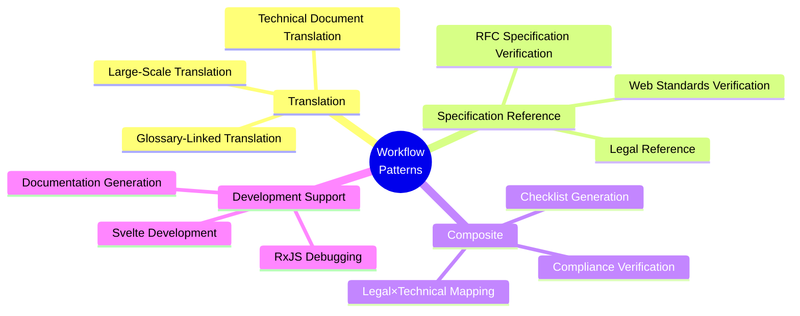

## Pattern 1: Technical Document Translation Workflow

### Overview

A high-quality translation flow combining DeepL + xCOMET.

### MCPs Used

- `deepl-mcp` - Translation execution
- `xcomet-mcp-server` - Quality evaluation

### Flow Diagram

This diagram shows the iterative process of translation, quality evaluation, and refinement:

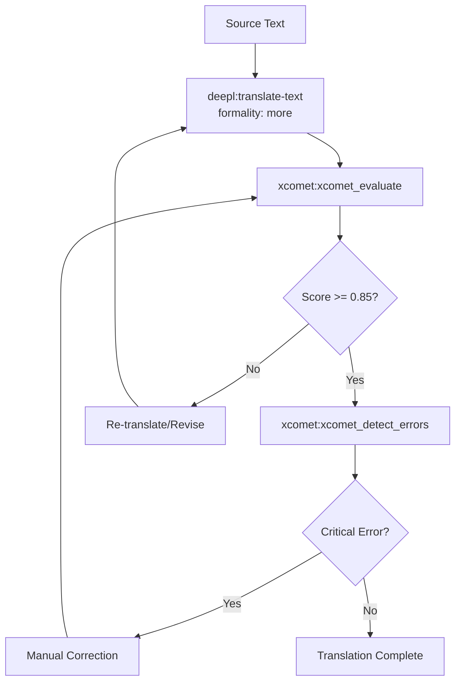

### Skill Definition Example

The following Skill complements this pattern by defining quality thresholds and error handling procedures:

```markdown
<!-- .claude/skills/translation-workflow/SKILL.md -->

# Technical Document Translation Workflow

## Quality Criteria

- Score 0.85 or above: Pass
- Score 0.70-0.85: Requires review
- Score below 0.70: Re-translate

## Error Handling

- critical: Must fix (meaning reversal, serious mistranslation)
- major: Recommended fix (unnatural expressions, terminology inconsistency)
- minor: Optional (style issues)

## Translation Settings

- formality: "more" (use formal tone for technical documents)
- Specify glossaryId if a glossary is available
```

### Results

This workflow has proven highly effective in practice:

- Completed 180-page technical document (1.5 million characters) in one day
- Cost: approximately $12 (less than 1/100th of traditional cost)

## Pattern 2: Large-Scale Translation Workflow (Batch Processing)

### Overview

A batch workflow for efficiently processing large volumes of translation pairs.

### Flow Diagram

This diagram shows how batch processing enables efficient evaluation and targeted refinement:

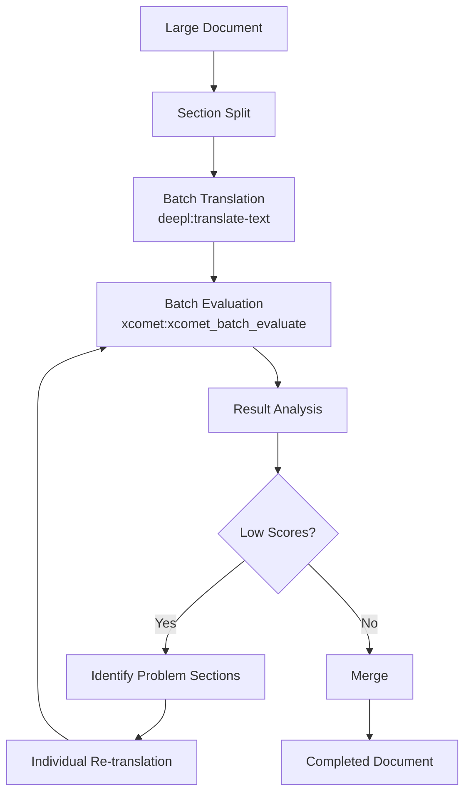

### Key Points

Follow these practices when implementing batch translation workflows:

- Use `xcomet:xcomet_batch_evaluate` for bulk evaluation
- Address only problematic sections individually
- Further acceleration possible with GPU usage

## Pattern 3: RFC Specification Verification Workflow

### Overview

A flow for structuring and understanding RFC specifications and verifying implementations.

### MCPs Used

- `rfcxml-mcp` - RFC analysis
- `w3c-mcp` - Web API verification (as needed)

### Flow Diagram

This workflow guides the process from requirements through implementation to compliance verification:

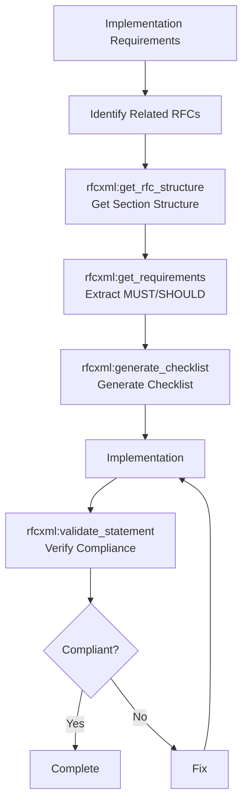

### Sub-Agent Definition Example

The following sub-agent specializes in RFC verification by limiting its tools to RFC-specific operations:

```markdown
<!-- .claude/agents/rfc-specialist.md -->

name: rfc-specialist
description: Specializes in RFC specification verification. Confirms whether implementations comply with RFCs.
tools: rfcxml:get_rfc_structure, rfcxml:get_requirements, rfcxml:get_definitions, rfcxml:generate_checklist, rfcxml:validate_statement
model: sonnet

You are an RFC specification expert.
Please work according to the following procedure:

1. First, use get_rfc_structure to understand the overall RFC structure
2. Extract MUST/SHOULD requirements with get_requirements
3. Verify terminology with get_definitions as needed
4. Generate an implementation checklist with generate_checklist
5. Confirm implementation compliance with validate_statement
```

### Results

This workflow has been used successfully to produce high-quality RFC work:

- Complete Japanese translation of RFC 6455 (WebSocket)
- Structured 75 MUST requirements and 23 SHOULD requirements

## Pattern 4: Legal × Technical Specification Mapping Workflow

### Overview

A flow for clarifying the correspondence between legal requirements and technical specifications.

### MCPs Used

- `hourei-mcp` - Japanese law reference
- `rfcxml-mcp` - Technical specification reference

### Flow Diagram

This workflow integrates legal and technical domains to identify gaps and alignment:

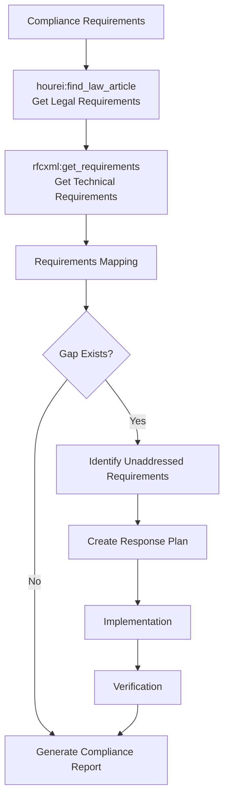

### Specific Example: Electronic Signature Act × RFC 3161

This specific example demonstrates how legal and technical requirements map to each other:

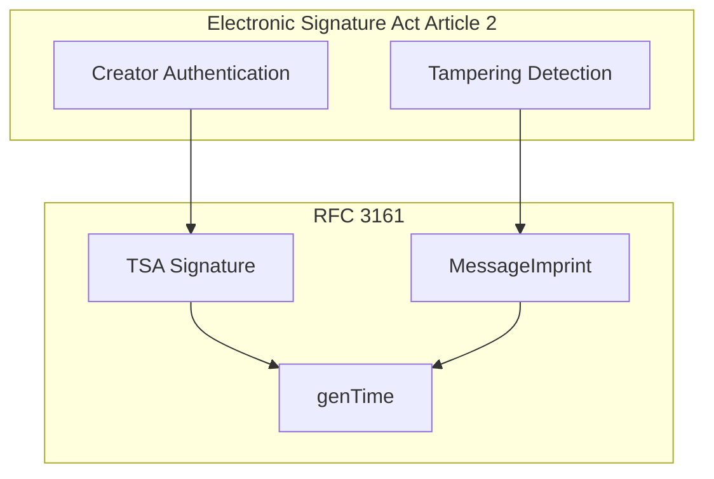

### Results

This approach has successfully enabled cross-domain analysis:

- Created correspondence table between Electronic Signature Act and RFC 3161
- Reflected in Notes-about-Digital-Signatures repository

## Pattern 5: Checklist Generation Workflow

### Overview

A flow for automatically generating implementation checklists from specifications.

### Flow Diagram

This workflow converts specification requirements into actionable checklists for different roles:

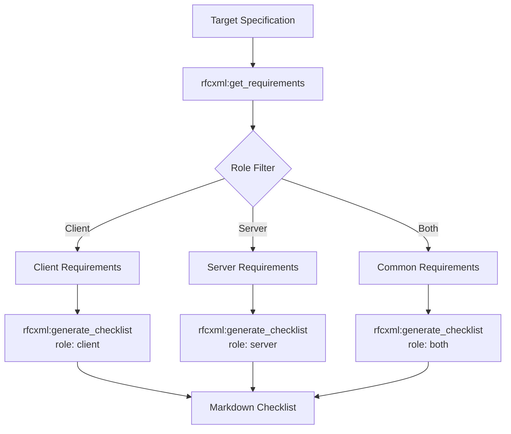

### Output Example

The following shows the type of output generated by this workflow:

```markdown
# RFC 6455 WebSocket Implementation Checklist (Client)

## MUST Requirements

- [ ] Client MUST reject any response from server other than HTTP 101
- [ ] Client MUST send Sec-WebSocket-Key header
- [ ] ...

## SHOULD Requirements

- [ ] Client SHOULD retry with exponential backoff on connection failure
- [ ] ...
```

## Pattern 6: RxJS Debugging Workflow

### Overview

A flow for verifying and debugging RxJS stream behavior.

### MCPs Used

- `rxjs-mcp-server` - Stream execution and analysis

### Flow Diagram

This workflow provides comprehensive analysis of RxJS code through multiple verification methods:

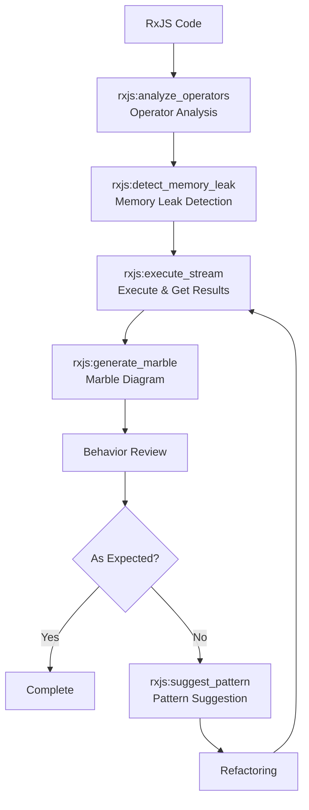

## Pattern 7: Documentation Generation Workflow

### Overview

A technical documentation generation flow combining multiple MCPs.

### MCPs Used

- `rfcxml-mcp` - Specification information
- `mermaid-mcp` - Diagram generation
- `deepl-mcp` - Multilingual support
- `xcomet-mcp` - Translation quality verification

### Flow Diagram

This workflow integrates specification content, visualization, and translation to create multilingual documentation:

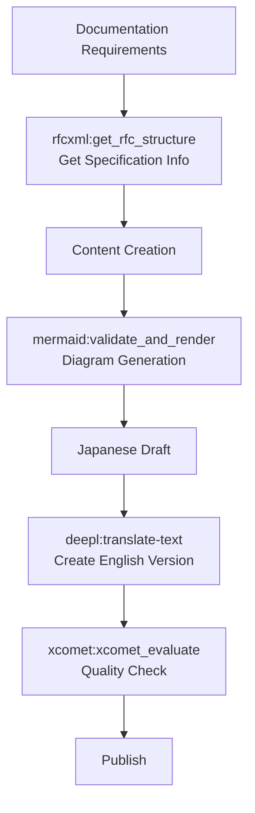

## Pattern 8: Multi-Agent Collaboration

### Overview

A pattern where multiple sub-agents collaborate on tasks.

### Configuration

The following diagram shows how multiple specialized agents work together under a main orchestrator:

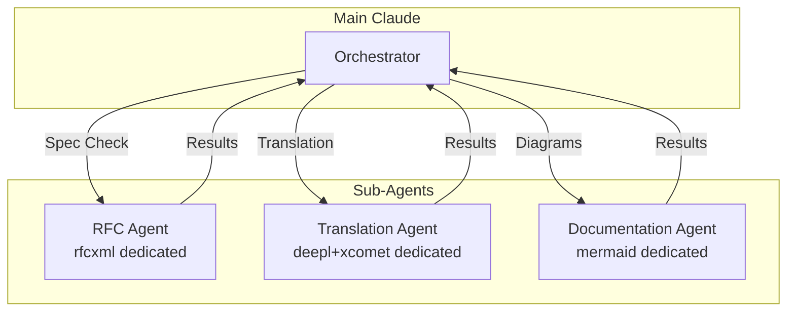

### Sub-Agent Definitions

The following examples show how to define sub-agents with specialized tool access:

```markdown
<!-- agents/rfc-specialist.md -->

name: rfc-specialist
tools: rfcxml:\*
model: sonnet
```

```markdown
<!-- agents/translation-specialist.md -->

name: translation-specialist
tools: deepl:translate-text, xcomet:xcomet_evaluate, xcomet:xcomet_detect_errors
model: sonnet
```

```markdown
<!-- agents/documentation-specialist.md -->

name: documentation-specialist
tools: mermaid:\*
model: sonnet
```

### Benefits

Multi-agent collaboration provides several advantages:

- **Context Isolation** - Each agent only recognizes its own MCPs
- **Enhanced Specialization** - Role-specific instructions
- **Parallel Processing** - Physical separation possible with Git worktrees

## Pattern 9: Glossary-Integrated Translation Workflow

### Overview

A workflow that automatically extracts terminology from specifications, builds a glossary, and produces translations with consistent terminology. An evolution of Pattern 1 (Technical Document Translation), this represents a **full integration pattern where a Skill orchestrates multiple MCPs**.

### MCPs / Skills Used

- `pdf-spec-mcp` - Structured extraction of specification terminology
- `deepl-mcp` - Glossary management and translation execution
- `xcomet-mcp-server` - Translation quality evaluation (optional)
- `deepl-glossary-translation` Skill - Defines the orchestration workflow for the above MCPs

### Flow Diagram

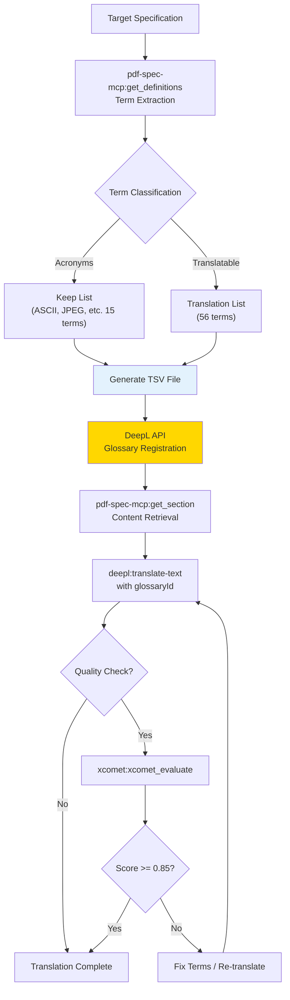

### Differences from Pattern 1

| Aspect | Pattern 1 (Basic Translation) | Pattern 9 (Glossary-Integrated) |
|---|---|---|
| Terminology consistency | May vary between translations | Enforced via glossary |
| Preparation | None required | Term extraction, classification, registration |
| Use case | General technical documents | **Specifications and standards** requiring strict terminology |
| MCP count | 2 (deepl + xcomet) | 3 (pdf-spec + deepl + xcomet) |
| Skill | Optional (manual flow possible) | **Required** (orchestrating complex steps) |

### Concrete Example: ISO 32000-2 Glossary

```
Keep (acronyms): ASCII, CFF, JPEG, PDF, TLS, URI, XML ... (15 terms)
Translate:
  cross-reference table → 相互参照テーブル
  content stream → コンテンツストリーム
  null object → nullオブジェクト  ← PDF spec uses lowercase null
  indirect object → 間接オブジェクト
  ... (56 terms)
```

The greatest value is enforcing domain-specific terminology rules via glossary — for example, ensuring "null object" becomes "nullオブジェクト" (lowercase, matching PDF's keyword) rather than inconsistent "NULLオブジェクト" or "Nullオブジェクト".

### Repository

See [shuji-bonji/deepl-glossary-translation](https://github.com/shuji-bonji/deepl-glossary-translation) for the full implementation. Also covered in the [Skill Showcase](../skills/showcase#deepl-glossary-translation).

## Workflow Selection Guide

Use this table to select the most appropriate workflow pattern for your use case:

| Purpose                        | Recommended Pattern | Primary MCPs                  |
| ------------------------------ | ------------------- | ----------------------------- |
| Technical Document Translation | Pattern 1/2         | deepl + xcomet                |
| Terminology-Consistent Translation | Pattern 9       | pdf-spec + deepl + xcomet     |
| Specification Understanding    | Pattern 3           | rfcxml                        |
| Compliance Verification        | Pattern 4           | hourei + rfcxml               |
| Implementation Check           | Pattern 5           | rfcxml                        |
| RxJS Debugging                 | Pattern 6           | rxjs                          |
| Documentation Creation         | Pattern 7           | Composite                     |
| Large-Scale Tasks              | Pattern 8           | Composite + Sub-agents        |
