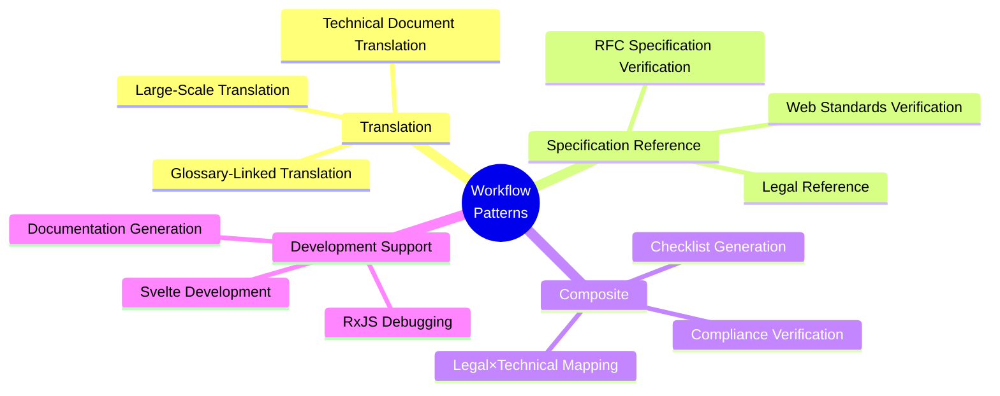

# Integration Patterns and Workflows

> A compilation of practical workflow patterns that combine multiple MCPs, Skills, and sub-agents.

## About This Document

MCPs demonstrate their true value when combined rather than used individually. This document organizes nine types of integration patterns that have proven effective in practice, grouping related patterns to show how they progressively build upon each other.

For example, to achieve the goal of "creating high-quality Japanese translations of RFCs," we can establish a workflow of deepl-mcp (translation) → xcomet-mcp-server (quality evaluation) → re-translation as needed, achieving equivalent or better quality at less than 1/100th of traditional translation costs. This document accumulates such practical knowledge as patterns.

## Workflow Pattern Overview

The following mindmap organizes the available workflow patterns by their primary use case domains:

```mermaid
mindmap
  root((Workflow<br/>Patterns))
    Translation
      Technical Document Translation
      Large-Scale Translation
      Glossary-Linked Translation
    Specification Reference
      RFC Specification Verification
      Web Standards Verification
      Legal Reference
    Composite
      Legal×Technical Mapping
      Checklist Generation
      Compliance Verification
    Development Support
      RxJS Debugging
      Svelte Development
      Documentation Generation
```

## Pattern Groups

Each pattern is grouped with related patterns, organized as progressively evolving workflows.

### Translation Workflows

Translation pipelines centered on DeepL + xCOMET. Progresses from basic translation through large-scale batch processing to glossary-integrated strict translation.

| Pattern | Overview | Primary MCPs | Status |
| --- | --- | --- | --- |
| Pattern 1: Technical Document Translation | Basic DeepL + xCOMET translation flow | deepl + xcomet | ✅ Verified |
| Pattern 2: Large-Scale Translation | Efficient batch processing for large volumes | deepl + xcomet | ✅ Verified |
| Pattern 9: Glossary-Integrated Translation | Terminology-consistent translation via glossary | pdf-spec + deepl + xcomet | ✅ Verified |

**Details:** [Translation Workflows](./patterns/translation.md)

### Specification Reference & Verification Workflows

From structural understanding of RFC specifications to automatic implementation checklist generation, supporting specification-compliant development.

| Pattern | Overview | Primary MCPs | Status |
| --- | --- | --- | --- |
| Pattern 3: RFC Specification Verification | Structured understanding and implementation verification | rfcxml (+w3c) | ✅ Verified |
| Pattern 5: Checklist Generation | Automatic implementation checklist from specifications | rfcxml | ✅ Verified |

**Details:** [Specification Reference & Verification Workflows](./patterns/specification-verification.md)

### Compliance Workflows

Clarifying the correspondence between legal requirements and technical specifications, systematically managing compliance.

| Pattern | Overview | Primary MCPs | Status |
| --- | --- | --- | --- |
| Pattern 4: Legal × Technical Mapping | Clarifying legal-technical requirement correspondence | hourei + rfcxml | ✅ Verified |

**Details:** [Compliance Workflows](./patterns/compliance.md)

### Development Support Workflows

Streamlining everyday development tasks such as RxJS stream verification and debugging.

| Pattern | Overview | Primary MCPs | Status |
| --- | --- | --- | --- |
| Pattern 6: RxJS Debugging | RxJS stream analysis and debugging | rxjs | ✅ Verified |

**Details:** [Development Support Workflows](./patterns/development-support.md)

### Documentation Generation Workflows

Automated technical documentation generation combining multiple MCPs. End-to-end processing from specification retrieval through multilingual output.

| Pattern | Overview | Primary MCPs | Status |
| --- | --- | --- | --- |
| Pattern 7: Documentation Generation | Spec retrieval → diagrams → multilingual output | rfcxml + mermaid + deepl + xcomet | ✅ Verified |

**Details:** [Documentation Generation Workflows](./patterns/documentation-generation.md)

### Multi-Agent Collaboration

Patterns where multiple sub-agents collaborate on large-scale tasks. Achieves high specialization and throughput through context isolation and parallel processing.

| Pattern | Overview | Primary MCPs | Status |
| --- | --- | --- | --- |
| Pattern 8: Multi-Agent Collaboration | Coordinated work by specialized sub-agents | Composite + Sub-agents | ✅ Verified |

**Details:** [Multi-Agent Collaboration](./patterns/multi-agent.md)

## Workflow Selection Guide

Use this table to select the most appropriate workflow pattern for your use case:

| Purpose                        | Recommended Pattern | Primary MCPs                  | Details Page |
| ------------------------------ | ------------------- | ----------------------------- | --- |
| Technical Document Translation | Pattern 1/2         | deepl + xcomet                | [Translation](./patterns/translation.md) |
| Terminology-Consistent Translation | Pattern 9       | pdf-spec + deepl + xcomet     | [Translation](./patterns/translation.md) |
| Specification Understanding    | Pattern 3           | rfcxml                        | [Spec Verification](./patterns/specification-verification.md) |
| Compliance Verification        | Pattern 4           | hourei + rfcxml               | [Compliance](./patterns/compliance.md) |
| Implementation Check           | Pattern 5           | rfcxml                        | [Spec Verification](./patterns/specification-verification.md) |
| RxJS Debugging                 | Pattern 6           | rxjs                          | [Dev Support](./patterns/development-support.md) |
| Documentation Creation         | Pattern 7           | Composite                     | [Doc Generation](./patterns/documentation-generation.md) |
| Large-Scale Tasks              | Pattern 8           | Composite + Sub-agents        | [Multi-Agent](./patterns/multi-agent.md) |
