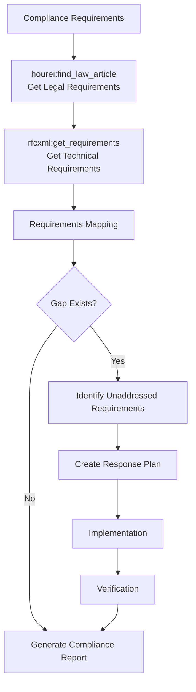
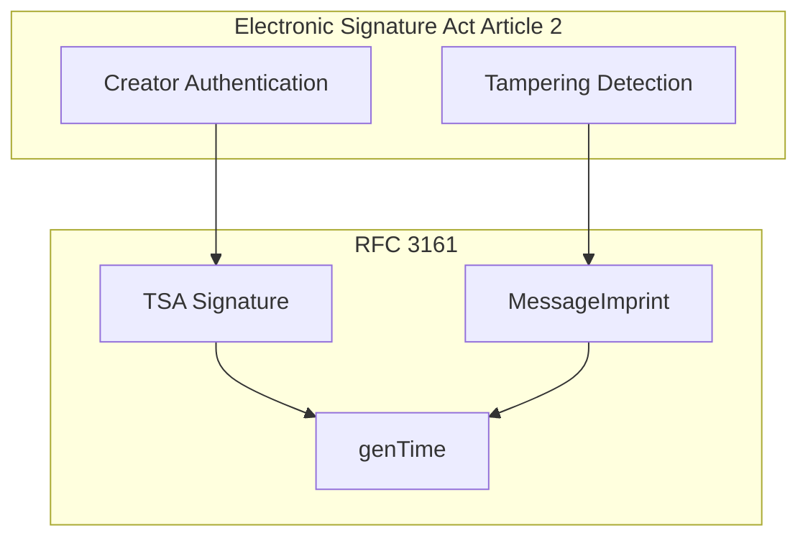

# Compliance Workflows

> Clarifying the correspondence between legal requirements and technical specifications, systematically managing compliance.

## Pattern 4: Legal × Technical Specification Mapping Workflow

### Overview

A flow for clarifying the correspondence between legal requirements and technical specifications. Cross-references requirements from different domains — law and technical specifications — to identify gaps and formulate response plans.

### MCPs Used

- `hourei-mcp` - Japanese law reference
- `rfcxml-mcp` - Technical specification reference

### Flow Diagram

This workflow integrates legal and technical domains to identify gaps and alignment:

### Specific Example: Electronic Signature Act × RFC 3161

This specific example demonstrates how legal and technical requirements map to each other:

### Results

This approach has successfully enabled cross-domain analysis:

- Created correspondence table between Electronic Signature Act and RFC 3161
- Reflected in Notes-about-Digital-Signatures repository

### Design Decisions and Failure Cases

- **Mapping granularity:** Mapping at the law "article" level to technical "MUST requirement" level is most practical. Going down to the law "paragraph" level often makes the technical correspondence ambiguous.
- **Failure case:** Since law amendments and specification updates are asynchronous, the temporal validity of mappings must always be verified. While `hourei-mcp` retrieves the latest law data via the e-Gov API, attention must also be paid to the difference between enactment and promulgation dates.
- **Extensibility:** Currently limited to Electronic Signature Act × RFC, but legal-technical mapping is applicable to many domains — for example, Personal Information Protection Act × OAuth/OIDC specifications, or Electronic Books Preservation Act × PDF/A specifications.
