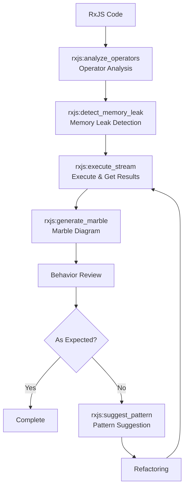

# Development Support Workflows

> Streamlining everyday development tasks such as RxJS stream verification and debugging.

## Pattern 6: RxJS Debugging Workflow

### Overview

A flow for verifying and debugging RxJS stream behavior. Provides end-to-end coverage from static code analysis through runtime execution to visualization.

### MCPs Used

- `rxjs-mcp-server` - Stream execution and analysis

### Flow Diagram

This workflow provides comprehensive analysis of RxJS code through multiple verification methods:

### Step Details

| Step | Tool | Purpose |
| --- | --- | --- |
| Operator Analysis | `analyze_operators` | Identify used operators, detect performance issues |
| Memory Leak Detection | `detect_memory_leak` | Identify subscription management problems |
| Stream Execution | `execute_stream` | Get actual emission results |
| Marble Diagram | `generate_marble` | Visualize emissions on a timeline |
| Pattern Suggestion | `suggest_pattern` | Recommend suitable patterns for the use case |

### Design Decisions and Failure Cases

- **Static analysis → runtime execution order:** Perform static analysis with `analyze_operators` and `detect_memory_leak` first, then execute with `execute_stream` only if no issues are found. Reversing the order risks executing code with memory leaks.
- **Failure case:** Streams dependent on async timing (e.g., those containing `debounceTime`) require attention to `execute_stream` timeout settings. The default 5 seconds may be insufficient.
- **Angular integration:** Using the `componentLifecycle: "angular"` option in `detect_memory_leak` enables detection of Angular-specific lifecycle issues (such as missing unsubscribe in `ngOnDestroy`).
