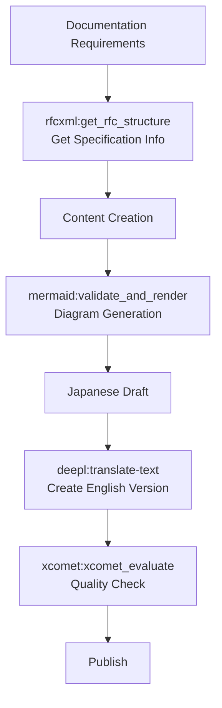

# Documentation Generation Workflows

> Automated technical documentation generation combining multiple MCPs. End-to-end processing from specification retrieval through multilingual output.

## Pattern 7: Documentation Generation Workflow

### Overview

A technical documentation generation flow combining multiple MCPs. Integrates four stages — specification retrieval, diagram generation, translation, and quality verification — to efficiently produce multilingual documentation.

### MCPs Used

- `rfcxml-mcp` - Specification information
- `mermaid-mcp` - Diagram generation
- `deepl-mcp` - Multilingual support
- `xcomet-mcp` - Translation quality verification

### Flow Diagram

This workflow integrates specification content, visualization, and translation to create multilingual documentation:

### Stage Responsibilities

| Stage | MCP | Input | Output |
| --- | --- | --- | --- |
| Spec Retrieval | rfcxml-mcp | RFC number | Section structure, requirements list |
| Diagram Generation | mermaid-mcp | Text description | SVG/PNG diagrams |
| Multilingual | deepl-mcp | Japanese draft | English documentation |
| Quality Check | xcomet-mcp | Source + translation | Quality score, error report |

### Design Decisions and Failure Cases

- **Japanese → English order:** This project adopts the flow of thinking and writing in Japanese, then translating to English. Creating high-quality content in one's native language before translation tends to produce better overall quality than writing in English first.
- **Failure case:** Mermaid diagram syntax errors can block the entire document generation. This can be avoided by pre-validating with `mermaid:validate_and_render`.
- **This repository as a living example:** The documentation in the ai-agent-architecture repository is created and translated based on this workflow.
