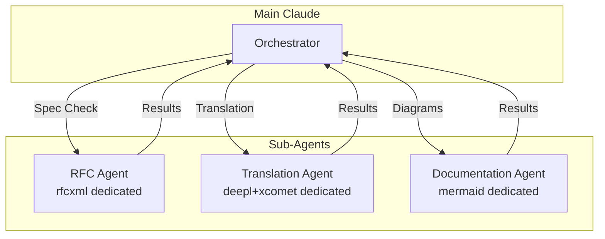

# Multi-Agent Collaboration

> Patterns where multiple sub-agents collaborate on large-scale tasks. Achieves high specialization and throughput through context isolation and parallel processing.

## Pattern 8: Multi-Agent Collaboration

### Overview

A pattern where multiple sub-agents collaborate on tasks. By having each agent handle only MCPs in its specialized domain, context bloat is prevented and highly specialized work can be executed in parallel.

### Configuration

The following diagram shows how multiple specialized agents work together under a main orchestrator:



### Sub-Agent Definitions

The following examples show how to define sub-agents with specialized tool access:

```markdown
<!-- agents/rfc-specialist.md -->

name: rfc-specialist
tools: rfcxml:\*
model: sonnet
```

```markdown
<!-- agents/translation-specialist.md -->

name: translation-specialist
tools: deepl:translate-text, xcomet:xcomet_evaluate, xcomet:xcomet_detect_errors
model: sonnet
```

```markdown
<!-- agents/documentation-specialist.md -->

name: documentation-specialist
tools: mermaid:\*
model: sonnet
```

### Benefits

Multi-agent collaboration provides several advantages:

- **Context Isolation** - Each agent only recognizes its own MCPs. Minimizes context consumption from tool definitions.
- **Enhanced Specialization** - Role-specific instructions improve the quality of each task.
- **Parallel Processing** - Physical separation possible with Git worktrees. Independent tasks run simultaneously.

### Design Decisions and Failure Cases

- **Agent splitting criteria:** Splitting by MCP is the most natural approach. Assigning more than 3 MCPs to a single agent diminishes the benefits of context isolation.
- **Failure case:** Insufficient information sharing between agents can break overall consistency. For example, if the Translation Agent translates without knowing terms extracted by the RFC Agent, terminology inconsistencies arise. Proper relay of intermediate results by the orchestrator is critical.
- **Cost considerations:** Each sub-agent launch consumes its own context window. For small-scale tasks, the overhead may outweigh the benefits, so it's important to gauge the scale at which parallel processing becomes effective.
