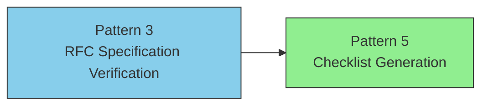
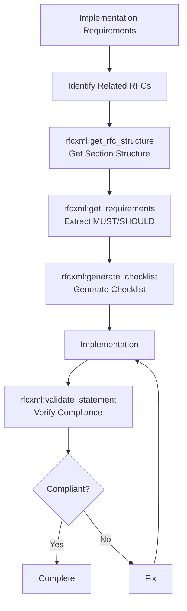
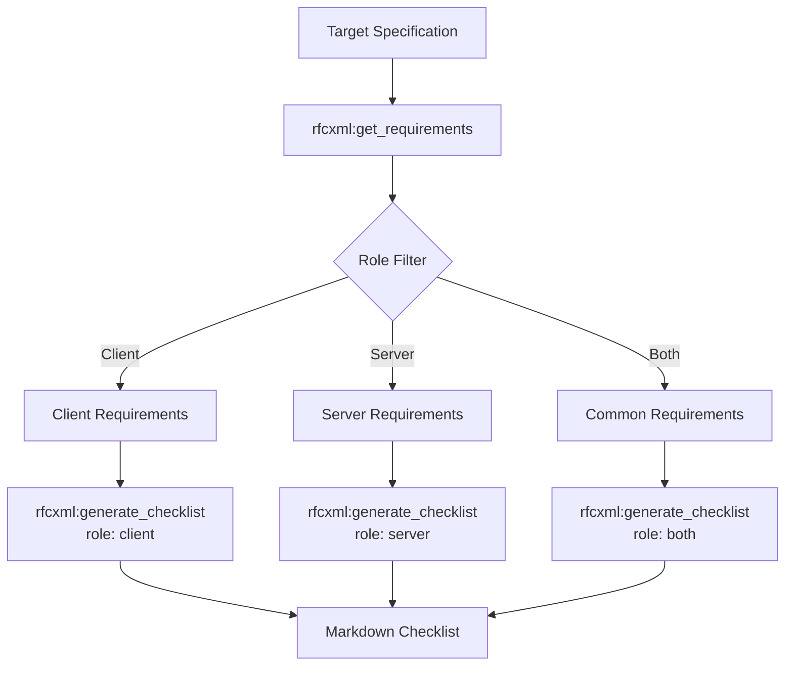

# Specification Reference & Verification Workflows

> From structural understanding of RFC specifications to automatic implementation checklist generation, supporting specification-compliant development.

## Overview

The specification reference and verification workflow consists of two patterns. Pattern 3 provides structural understanding of the entire specification, while Pattern 5 automatically generates implementation checklists from it.



| Pattern | Use Case | Output |
| --- | --- | --- |
| Pattern 3 | Understanding new RFCs / implementation verification | Structured specification understanding + compliance report |
| Pattern 5 | Pre-implementation task identification | Markdown checklist |

## Pattern 3: RFC Specification Verification Workflow

### Overview

A flow for structuring and understanding RFC specifications and verifying implementations.

### MCPs Used

- `rfcxml-mcp` - RFC analysis
- `w3c-mcp` - Web API verification (as needed)

### Flow Diagram

This workflow guides the process from requirements through implementation to compliance verification:



### Sub-Agent Definition Example

The following sub-agent specializes in RFC verification by limiting its tools to RFC-specific operations:

```markdown
<!-- .claude/agents/rfc-specialist.md -->

name: rfc-specialist
description: Specializes in RFC specification verification. Confirms whether implementations comply with RFCs.
tools: rfcxml:get_rfc_structure, rfcxml:get_requirements, rfcxml:get_definitions, rfcxml:generate_checklist, rfcxml:validate_statement
model: sonnet

You are an RFC specification expert.
Please work according to the following procedure:

1. First, use get_rfc_structure to understand the overall RFC structure
2. Extract MUST/SHOULD requirements with get_requirements
3. Verify terminology with get_definitions as needed
4. Generate an implementation checklist with generate_checklist
5. Confirm implementation compliance with validate_statement
```

### Results

This workflow has been used successfully to produce high-quality RFC work:

- Complete Japanese translation of RFC 6455 (WebSocket)
- Structured 75 MUST requirements and 23 SHOULD requirements

### Design Decisions and Failure Cases

- **MUST vs SHOULD priority:** During implementation, satisfying 100% of MUST requirements takes highest priority. SHOULD requirements should be addressed incrementally with prioritization to avoid project stalls.
- **Failure case:** Cross-RFC dependencies can be overlooked. For example, RFC 6455 depends on RFC 2616 (HTTP/1.1), so `get_rfc_dependencies` should be used to check dependencies first.

## Pattern 5: Checklist Generation Workflow

### Overview

A flow for automatically generating implementation checklists from specifications.

### Flow Diagram

This workflow converts specification requirements into actionable checklists for different roles:



### Output Example

The following shows the type of output generated by this workflow:

```markdown
# RFC 6455 WebSocket Implementation Checklist (Client)

## MUST Requirements

- [ ] Client MUST reject any response from server other than HTTP 101
- [ ] Client MUST send Sec-WebSocket-Key header
- [ ] ...

## SHOULD Requirements

- [ ] Client SHOULD retry with exponential backoff on connection failure
- [ ] ...
```

### Design Decisions

- **Importance of role filtering:** Full-stack developers tend to use `role: both`, but separating into client and server makes each team's responsibilities clearer.
- **Checklist granularity:** The list generated by `generate_checklist` is at the MUST/SHOULD level, but actual implementation tasks may need further decomposition. Use checklists primarily as a "coverage check" tool.
