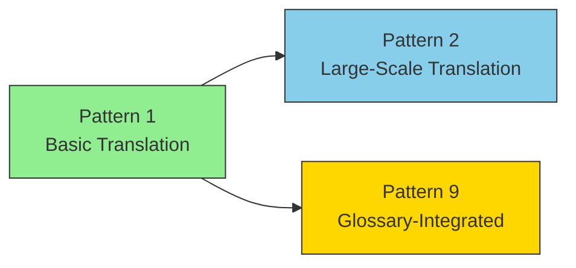
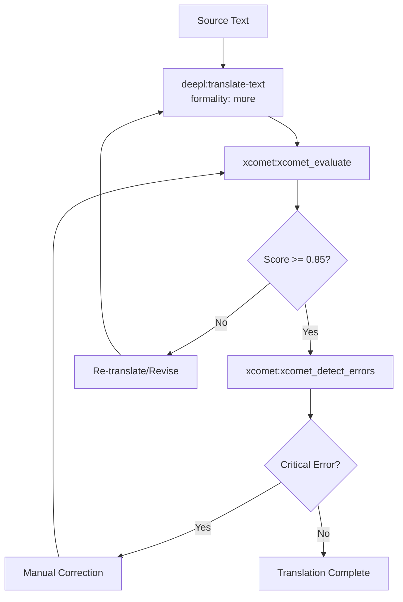
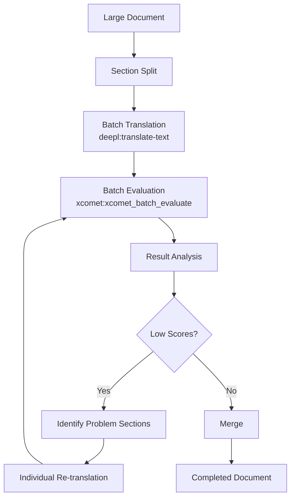
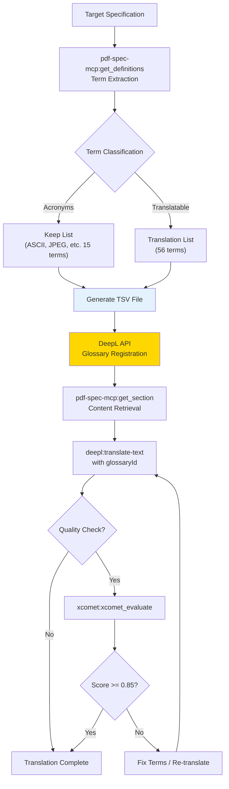

# Translation Workflows

> Translation pipelines centered on DeepL + xCOMET. Progresses from basic translation through large-scale batch processing to glossary-integrated strict translation.

## Overview

The translation workflow consists of three patterns, each building upon the previous one.



| Pattern | Use Case | Additional Element |
| --- | --- | --- |
| Pattern 1 | General technical documents | — |
| Pattern 2 | Documents exceeding 100 pages | Batch processing |
| Pattern 9 | Specifications/standards requiring strict terminology | Glossary management |

## Pattern 1: Technical Document Translation Workflow

### Overview

A high-quality translation flow combining DeepL + xCOMET.

### MCPs Used

- `deepl-mcp` - Translation execution
- `xcomet-mcp-server` - Quality evaluation

### Flow Diagram

This diagram shows the iterative process of translation, quality evaluation, and refinement:



### Skill Definition Example

The following Skill complements this pattern by defining quality thresholds and error handling procedures:

```markdown
<!-- .claude/skills/translation-workflow/SKILL.md -->

# Technical Document Translation Workflow

## Quality Criteria

- Score 0.85 or above: Pass
- Score 0.70-0.85: Requires review
- Score below 0.70: Re-translate

## Error Handling

- critical: Must fix (meaning reversal, serious mistranslation)
- major: Recommended fix (unnatural expressions, terminology inconsistency)
- minor: Optional (style issues)

## Translation Settings

- formality: "more" (use formal tone for technical documents)
- Specify glossaryId if a glossary is available
```

### Results

This workflow has proven highly effective in practice:

- Completed 180-page technical document (1.5 million characters) in one day
- Cost: approximately $12 (less than 1/100th of traditional cost)

### Design Decisions and Failure Cases

Care must be taken when setting quality thresholds.

- **Rationale for 0.85 threshold:** Analysis of xCOMET score distributions showed that scores above 0.85 were consistently judged "acceptable quality" by human reviewers.
- **Failure case:** Documents heavy with abbreviations or proper nouns may receive excessive penalties from xCOMET. In such cases, combining with glossary integration (Pattern 9) is effective.

## Pattern 2: Large-Scale Translation Workflow (Batch Processing)

### Overview

A batch workflow for efficiently processing large volumes of translation pairs.

### Flow Diagram

This diagram shows how batch processing enables efficient evaluation and targeted refinement:



### Key Points

Follow these practices when implementing batch translation workflows:

- Use `xcomet:xcomet_batch_evaluate` for bulk evaluation
- Address only problematic sections individually
- Further acceleration possible with GPU usage

### Design Decisions

- **Section split granularity:** Paragraph-level splitting provides the best balance. Sentence-level loses context, while chapter-level diminishes batch processing benefits.
- **Low score threshold:** Judge by individual section scores, not batch averages. Even if the average is high, any section below 0.70 requires attention.

## Pattern 9: Glossary-Integrated Translation Workflow

### Overview

A workflow that automatically extracts terminology from specifications, builds a glossary, and produces translations with consistent terminology. An evolution of Pattern 1 (Technical Document Translation), this represents a **full integration pattern where a Skill orchestrates multiple MCPs**.

### MCPs / Skills Used

- `pdf-spec-mcp` - Structured extraction of specification terminology
- `deepl-mcp` - Glossary management and translation execution
- `xcomet-mcp-server` - Translation quality evaluation (optional)
- `deepl-glossary-translation` Skill - Defines the orchestration workflow for the above MCPs

### Flow Diagram



### Differences from Pattern 1

| Aspect | Pattern 1 (Basic Translation) | Pattern 9 (Glossary-Integrated) |
|---|---|---|
| Terminology consistency | May vary between translations | Enforced via glossary |
| Preparation | None required | Term extraction, classification, registration |
| Use case | General technical documents | **Specifications and standards** requiring strict terminology |
| MCP count | 2 (deepl + xcomet) | 3 (pdf-spec + deepl + xcomet) |
| Skill | Optional (manual flow possible) | **Required** (orchestrating complex steps) |

### Concrete Example: ISO 32000-2 Glossary

```
Keep (acronyms): ASCII, CFF, JPEG, PDF, TLS, URI, XML ... (15 terms)
Translate:
  cross-reference table → 相互参照テーブル
  content stream → コンテンツストリーム
  null object → nullオブジェクト  ← PDF spec uses lowercase null
  indirect object → 間接オブジェクト
  ... (56 terms)
```

The greatest value is enforcing domain-specific terminology rules via glossary — for example, ensuring "null object" becomes "nullオブジェクト" (lowercase, matching PDF's keyword) rather than inconsistent "NULLオブジェクト" or "Nullオブジェクト".

### Repository

See [shuji-bonji/deepl-glossary-translation](https://github.com/shuji-bonji/deepl-glossary-translation) for the full implementation. Also covered in the [Skill Showcase](../../skills/showcase#deepl-glossary-translation).
