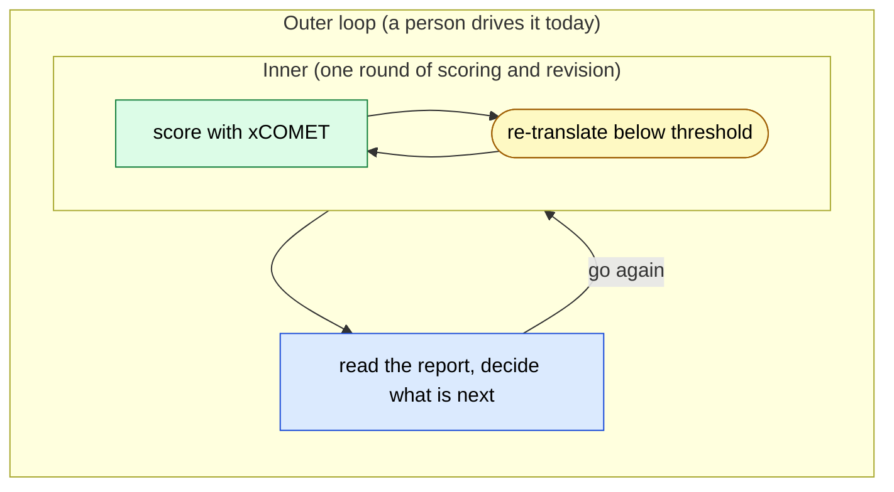
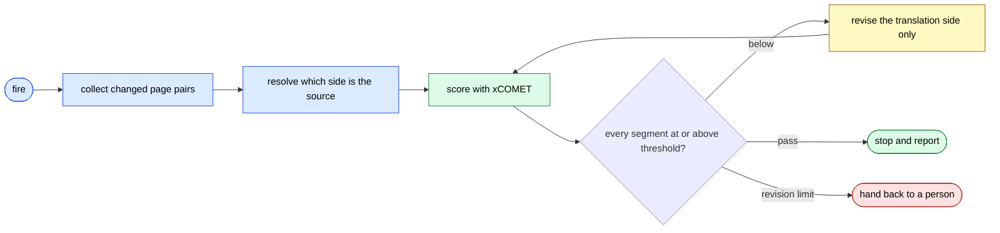

# The Translation Quality Gate as a Self-Driving Loop

> In a bilingual documentation site, take the checking and revising of translations out of human hands and make a deterministic score the stop condition.

## About This Document

> [!NOTE]
> This page is the second worked implementation of [Loop Engineering](../strategy/loop-engineering). Where the first, [Issue→Deploy autonomy](./autonomous-dev-meta-agent), covers a whole development pipeline, this one covers a single narrow loop: the translation quality gate. Being narrow is the point — what an unattended outer loop actually requires is visible at a glance.

> [!TIP]
> **In three lines**
>
> - A person used to sit in the outer loop: run `/check-translation`, read the report, revise the translation, run it again. That repetition is what moves into the system.
> - The checker is xCOMET, a deterministic outside scorer, so "is it done" never reduces to the model's own report.
> - The design turns on one prohibition: the loop may not move the gate to pass. The threshold and the source-language mapping live where the loop cannot reach them.

## What Is Being Automated

Updating a translation is two nested loops. The inner one is a single round of scoring and revision. The outer one is "still below threshold, so go again" — and a person has been sitting in it.



Once the outer loop is driven by the system, the shape is this.



## Why Translation Loops Cleanly

The hardest part of any self-driving loop is knowing when to stop. Treat "the model stopped calling tools" as "the work is finished" and you get "done, I made progress" while the tests are still failing. That is [Sycophancy](../glossary#structural-problems): a model grades its own output generously.

In a translation quality gate that difficulty is already settled, **because the model is not the one scoring**.

| Who checks | Usable as a stop condition |
| --- | --- |
| Ask the model "is this translation good?" | No. The maker is grading itself |
| A person reads the report | Yes, but the person stays in the outer loop |
| **An xCOMET score** | **Yes. An outside scorer that returns the same number for the same input** |

xCOMET takes a source and a translation and returns a score between 0 and 1 for each segment. "Every segment at 0.85 or above" is a condition a machine settles, with no room for the model's account of its own work. Maker and checker are separate parties from the start.

## Decide These First

Before the loop runs, push the judgment calls out into configuration. In this repository that is `.claude/translation.json`.

| Key | What it settles |
| --- | --- |
| `localeRoots` | How pairs are formed. `docs/ja/X` pairs with `docs/X`; the English side is `docs/` excluding `docs/ja/` |
| `filePairs` | Pairs that do not follow the directory rule, such as `README.ja.md` ↔ `README.md` |
| `exclude` | What is never scored: redirect stubs for old URLs, `.vitepress/` |
| `defaultSource` | Which side is the original by default. `ja` for this book |
| `sourceOverrides` | Globs for pages written in English first. These win over the default |
| `threshold` | The lowest score that counts as a pass |
| `maxFixRounds` | How many revisions before handing back to a person |

`defaultSource` and `sourceOverrides` are separate because the original differs from page to page. xCOMET compares a translation against its source; hand it the translated side as the source and the metric inverts, leaving numbers that cannot be read. Resolve the direction before scoring (**MUST**).

## The Four Hard Parts

The four difficulties named in [Loop Engineering](../strategy/loop-engineering) resolve here as follows.

| Hard part | How this loop settles it |
| --- | --- |
| When to stop | Every segment at or above `threshold`, or `maxFixRounds` reached. Both are machine-decidable |
| Context hygiene | One iteration handles only the changed pairs. The repository is never loaded whole |
| Tools that are safe to retry | Only the translation side is written. The source is fixed, so the same input can be re-scored |
| A party that can say no | xCOMET. The model does not get to set its own score |

> [!CAUTION]
> A self-driving loop MUST NOT touch `threshold` or `sourceOverrides`. Lower the threshold and every page passes. Loosening the configuration to reach a pass is not raising quality; it is removing the gate. If the score cannot be reached, the correct behavior is to say so and stop.

## Implementation

`.claude/loop.md` states what each iteration does, when to stop, and what is off limits. Claude Code uses that file as the default prompt for a bare `/loop`.

```
/loop            # self-paced; Claude picks the next delay, one minute to one hour
/loop 30m        # a fixed 30-minute interval
```

Edits to `loop.md` take effect on the next iteration, so the instructions can be tuned while the loop runs. That also makes it re-injection against [Instruction Decay](../glossary#structural-problems).

> [!WARNING]
> A scheduled fire runs only the skills the model may invoke on its own. A skill marked `disable-model-invocation: true` arrives as plain text instead of executing. Use that marking to keep a check under human invocation.

## What This Loop Does Not See

xCOMET measures how well a translated segment matches its source. The following are outside its remit.

- Terminology. Site-wide rules, such as keeping technical terms in English on both sides, need a separate check.
- Voice. The Japanese edition's plain style and the English edition's technical-book register do not show up in a score.
- Structural symmetry. Heading counts, navigation, and link targets are a different axis from translation quality.
- Errors in the source. If the original is wrong, no amount of revising the translation makes it right. A design that only edits the translation is deliberately powerless here.

So this loop moves only the **measurable part** of the outer loop into the system. A person keeps the rest — a small instance of what [Loop Engineering](../strategy/loop-engineering) says about understanding being the thing that cannot be transferred.

## Related Pages

- [Loop Engineering](../strategy/loop-engineering) — automating the outer loop. This page is one implementation of it
- [Issue→Deploy autonomy](./autonomous-dev-meta-agent) — the other implementation, covering a whole pipeline
- [Translation workflow](./patterns/translation) — the human-driven translation patterns that sit inside this loop
- [Sub-agent quality gate](../agents/subagent-quality-gate) — the general form of a party that can say no

## Going Deeper: Why an Unattended Loop Needs an Outside Scorer

- [understanding-llm / /loop and Self-Driving Sessions](https://shuji-bonji.github.io/understanding-llm-through-claude-code/08-session-management/loop-and-self-driving-sessions) — what an unattended loop amplifies, and the guards written into its specification
- [understanding-llm / Sycophancy](https://shuji-bonji.github.io/understanding-llm-through-claude-code/01-llm-structural-problems/sycophancy) — why a model grades its own output generously

## References

- Anthropic. "Run prompts on a schedule." Claude Code Docs. [code.claude.com](https://code.claude.com/docs/en/scheduled-tasks) — `/loop`, `loop.md`, and the stop and fallback rules
- Guerreiro, N. M. et al. (2023). "xCOMET: Transparent Machine Translation Evaluation through Fine-grained Error Detection." arXiv. [arXiv:2310.10482](https://arxiv.org/abs/2310.10482) — segment-level scores and error detection
- shuji-bonji. "xcomet-mcp-server." GitHub. [github.com/shuji-bonji/xcomet-mcp-server](https://github.com/shuji-bonji/xcomet-mcp-server) — the scoring MCP server this loop uses

---

**Last updated**: September 2026
