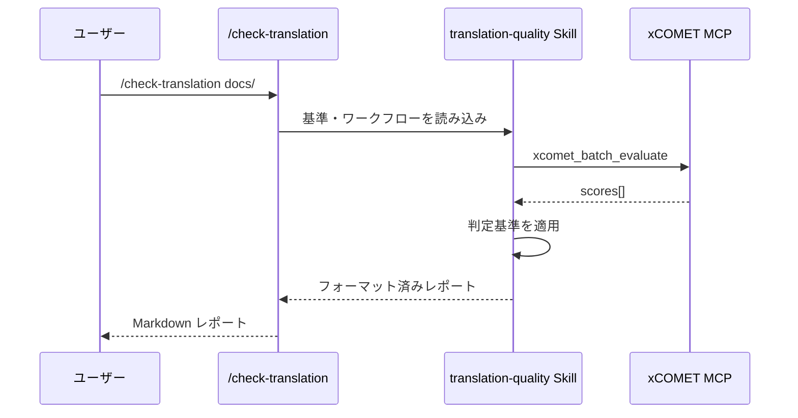

# Command テンプレート

このディレクトリには、Skills と MCP を統合するカスタムスラッシュコマンドを作成するためのテンプレートが含まれています。

## ファイル構成

```
templates/command/
├── README.md                  # 英語版
├── README.ja.md               # このファイル
├── COMMAND.md.template        # 基本コマンドテンプレート
└── SKILL.md                   # 例: translation-quality skill（/check-translation と対）
```

## Command とは？

Command（スラッシュコマンド）は、Skills と MCP を連携させるユーザー起動可能なアクションです。

```
/command-name → Skill（基準・ワークフロー）→ MCP（実行）→ Report
```

### Command vs Skill vs MCP

| コンポーネント | 役割                             | 配置場所            |
| -------------- | -------------------------------- | ------------------- |
| **Command**    | エントリーポイント、引数パース   | `.claude/commands/` |
| **Skill**      | 判定基準、ワークフロー、出力形式 | `.claude/skills/`   |
| **MCP**        | 実際のツール実行                 | MCP サーバー        |

## 使い方

### 1. テンプレートをコピー

```bash
cp templates/command/COMMAND.md.template .claude/commands/my-command.md
```

### 2. 必須項目を記入

- コマンド名（kebab-case）
- 引数とオプション
- ワークフローステップ
- 出力形式

### 3. 対応 Skill を作成（推奨）

```bash
cp templates/skill/SKILL.md.template .claude/skills/my-skill/SKILL.md
```

「Related」セクションでコマンドと Skill をリンクします。

## 例: 翻訳品質チェック

このディレクトリには完全な例が含まれています。

| ファイル               | 目的                                    |
| ---------------------- | --------------------------------------- |
| [SKILL.md](./SKILL.md) | xCOMET 基準を含む翻訳品質 Skill         |
| （対応コマンド）       | `.claude/commands/check-translation.md` |

### 連携の仕組み



## Command の配置場所

| 場所         | パス                      | 用途                     |
| ------------ | ------------------------- | ------------------------ |
| プロジェクト | `.claude/commands/*.md`   | プロジェクト固有コマンド |
| ユーザー     | `~/.claude/commands/*.md` | 個人用コマンド           |

## 関連ドキュメント

- [Skill テンプレート](../skill/README.ja.md) - 対応 Skill の作成
- [Skills 概要](../../docs/skills/overview.ja.md) - Skills の理解
- [ワークフローパターン](../../docs/workflows/patterns.ja.md) - 連携パターン
