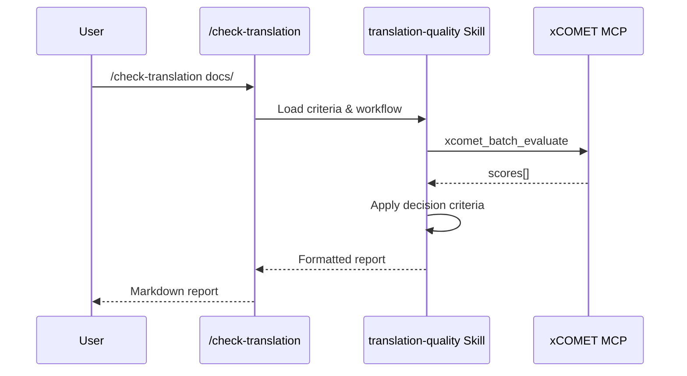

# Command Template

[日本語版 (Japanese)](./README.ja.md)

This directory contains templates for creating custom slash commands that integrate with Skills and MCPs.

## File Structure

```
templates/command/
├── README.md                  # This file
├── COMMAND.md.template        # Basic command template
└── SKILL.md                   # Example: translation-quality skill (paired with /check-translation)
```

## What Are Commands?

Commands (slash commands) are user-invokable actions that orchestrate Skills and MCPs together:

```
/command-name → Skill (criteria & workflow) → MCP (execution) → Report
```

### Command vs Skill vs MCP

| Component | Role | Location |
|-----------|------|----------|
| **Command** | Entry point, argument parsing | `.claude/commands/` |
| **Skill** | Decision criteria, workflow, output format | `.claude/skills/` |
| **MCP** | Actual tool execution | MCP servers |

## Usage

### 1. Copy the Template

```bash
cp templates/command/COMMAND.md.template .claude/commands/my-command.md
```

### 2. Fill in Required Fields

- Command name (kebab-case)
- Arguments and options
- Workflow steps
- Output format

### 3. Create Paired Skill (Recommended)

```bash
cp templates/skill/SKILL.md.template .claude/skills/my-skill/SKILL.md
```

Link the command to the skill in the "Related" section.

## Example: Translation Quality Check

This directory includes a complete example:

| File | Purpose |
|------|---------|
| [SKILL.md](./SKILL.md) | Translation quality skill with xCOMET criteria |
| (paired command) | `.claude/commands/check-translation.md` |

### How They Work Together



## Command Placement

| Location | Path | Use Case |
|----------|------|----------|
| Project | `.claude/commands/*.md` | Project-specific commands |
| User | `~/.claude/commands/*.md` | Personal commands |

## References

- [Skill Templates](../skill/) - Create paired skills
- [Skills Overview](../../docs/skills/overview.md) - Understanding skills
- [Workflow Patterns](../../docs/workflows/patterns.md) - Integration patterns
